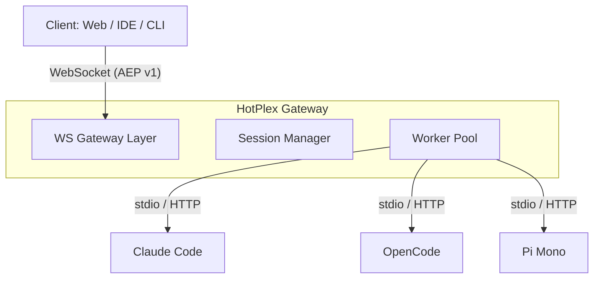

# HotPlex Worker Gateway

[](https://pkg.go.dev/hotplex-worker)
[](https://goreportcard.com/report/github.com/hrygo/hotplex-worker)
[](https://codecov.io/gh/hrygo/hotplex-worker)
[](https://opensource.org/licenses/Apache-2.0)

**HotPlex Worker Gateway** is a high-performance, unified access layer for managing AI Coding Agent sessions. It abstracts the differences between various agents (Claude Code, OpenCode CLI, etc.) and provides a standardized, stateful WebSocket interface.

## 🚀 Key Features

- **Unified Protocol**: Implements [AEP v1 (Agent Exchange Protocol)](docs/architecture/AEP-v1-Protocol.md) over WebSockets.
- **Session Management**: Full lifecycle management (Create, Resume, Terminate, GC) with SQLite persistence.
- **Process Isolation**: Secure execution using **PGID isolation** and built-in **WAF** for command injection protection.
- **Hot-Multiplexing**: Persistent worker processes with zero-cold-start session resume.
- **Pluggable Workers**: Support for Claude Code, OpenCode CLI, OpenCode Server, and more.
- **Admin API**: Real-time stats, health monitoring, and dynamic configuration hot-reload.
- **Cloud Native**: Built-in Prometheus metrics and OpenTelemetry tracing.

## 🏗 Architecture

HotPlex acts as a bridge between your clients (IDE, Web, CLI) and underlying AI agents.



For more details, see the [Architecture Overview](docs/architecture/Worker-Gateway-Design.md).

## 🛠 Quick Start

### Prerequisites

- Go 1.26+
- SQLite3

### Installation

```bash
# Clone the repository
git clone https://github.com/hrygo/hotplex-worker.git
cd hotplex-worker

# Install dependencies
go mod download

# Build the gateway
make build
```

### Running

```bash
# Start with default configuration
./bin/gateway --config configs/config.yaml

# Development mode (relaxed security)
./bin/gateway --dev
```

## 📖 Documentation

- [Architecture Design](docs/architecture/Worker-Gateway-Design.md)
- [AEP v1 Protocol Specification](docs/architecture/AEP-v1-Protocol.md)
- [Testing Strategy](docs/testing/Testing-Strategy.md)
- [Traceability Matrix](docs/SPECS/TRACEABILITY-MATRIX.md)

## 🤝 Contributing

We welcome contributions! Please see our [CONTRIBUTING.md](CONTRIBUTING.md) for guidelines on how to get started.

## 📜 License

HotPlex is released under the [Apache License 2.0](LICENSE).

---

*Built with ❤️ by the HotPlex Authors.*
