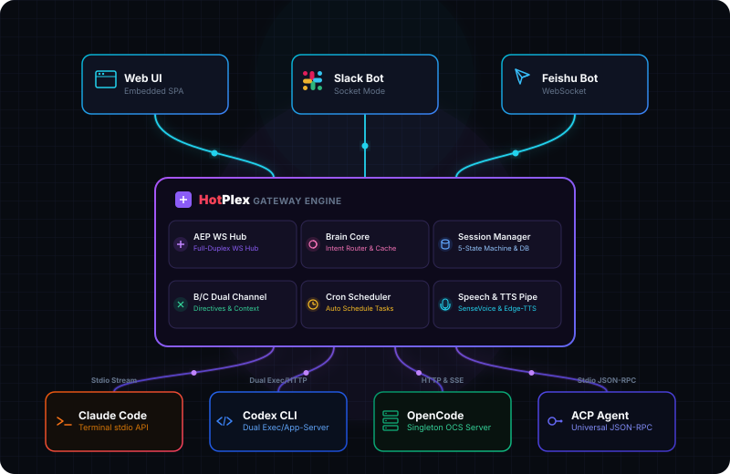

<h1 align="center">HotPlex Gateway</h1>

<p align="center">
  <strong>The Unified Bridge for AI Coding Agents</strong>
</p>

<p align="center">
  A high-performance Go gateway providing a single WebSocket interface<br>
  to access any AI Coding Agent across Web, Slack, and Feishu.
</p>

<p align="center">
  <a href="README_zh.md">简体中文</a> | <strong>English</strong>
</p>

<p align="center">
  <a href="https://github.com/hrygo/hotplex/actions/workflows/ci.yml"></a>
  
  <a href="https://github.com/hrygo/hotplex/blob/main/LICENSE"></a>
  
  
  <a href="https://github.com/hrygo/hotplex/stargazers"></a>
</p>

---

## ✨ Core Capabilities

### 🏗️ Core Architecture
- 🌐 **Universal AEP Gateway** — Abstract any AI Coding Agent behind a single WebSocket protocol (AEP v1) with backpressure-aware streaming, per-session monotonic sequencing, and automatic LLM retry with exponential backoff.
- 🔌 **Pluggable Worker Backends** — **Claude Code**, **OpenCode Server**, **ACP** (JSON-RPC 2.0 over stdio for any ACP-compatible agent), and **Codex CLI** behind a unified interface. Switch agents at any granularity with 5-level config fallback (bot → platform → env → messaging → default).
- 🔄 **Deterministic Sessions** — UUIDv5 session IDs for seamless reconnect across network drops. 5-state machine with per-user pool quotas, dual **SQLite/PostgreSQL** persistence, and background GC.

### 📱 Multi-Platform Delivery
- 🌍 **Write Once, Deploy Anywhere** — Bridge agents to **Slack** (Socket Mode), **Feishu** (WebSocket), and **Web** with zero agent code changes. Each adapter provides platform-native streaming, slash commands, and interaction management.
- ⏰ **AI-Native Cron Scheduler** — Agents autonomously create scheduled tasks from natural language ("remind me in 30m"). Supports cron expressions, fixed intervals, and one-shot schedules with lifecycle controls (`max_runs`, `expires_at`), attached session injection, and automatic result delivery.
- 💬 **Embedded Web Chat & Admin UI** — A single binary serves the AEP gateway, a Next.js SPA web chat, and an admin dashboard for bot management, API keys, and session monitoring — all out of the box.

### 🤖 Agent Intelligence
- 🎭 **B/C Dual-Channel Personality** — **B-channel** directives (SOUL/AGENTS/SKILLS) unconditionally override **C-channel** context (USER/MEMORY). Three-level per-bot fallback (global → platform → bot). META-COGNITION hardened with **XML Sanitizer** to block prompt injection.
- 🧠 **Brain LLM Orchestration** — Optional intelligence layer with intent routing (greetings bypass the coding agent), two-stage safety guard, context compression (8K token threshold), and cross-session user preference extraction.

### 🛡️ Security & Operations
- 🔒 **Enterprise-Grade Security** — Timing-safe API key authentication, SSRF protection with DNS rebinding defense, command/tool/model allowlists, environment isolation, and path traversal prevention.
- 📊 **End-to-End Observability** — 30+ Prometheus metrics, OpenTelemetry distributed tracing with W3C TraceContext propagation, and structured JSON logging.
- 🛠️ **Self-Contained CLI** — 13 subcommands in one binary: `gateway`, `service` (systemd/launchd/SCM), `onboard` (guided setup), `doctor` (25 diagnostic checks), `cron`, `slack`, `config`, `update` (self-update), `dev`, `status`, `security`, `install`, `version`.
- 🔄 **Hot-Reload Configuration** — YAML + env var configuration with runtime hot-reload, field-level audit trail, and versioned rollback — no restarts for most changes.

## ⚡ Quick Start

> **AI Agents:** Read https://github.com/hrygo/hotplex/blob/main/INSTALL.md and complete the HotPlex installation and configuration

### Install

**macOS / Linux (one-click binary):**

```bash
curl -fsSL https://raw.githubusercontent.com/hrygo/hotplex/main/scripts/install.sh | bash -s -- --latest
```

**Windows (PowerShell 5.1+):**

```powershell
Invoke-WebRequest -Uri https://raw.githubusercontent.com/hrygo/hotplex/main/scripts/install.ps1 -OutFile install.ps1
.\install.ps1 -Latest
```

**From source (requires Go 1.26+, pnpm, Node.js 22+):**

```bash
git clone https://github.com/hrygo/hotplex.git
cd hotplex
make quickstart
```

> **Tip (Claude Code):** After cloning, use `/hotplex-setup` for interactive environment setup and `.env` configuration.

**Docker (Experimental):**

```bash
cp configs/env.example .env  # edit with your API keys
docker compose up -d
```

### Configure

```bash
# Interactive setup wizard
hotplex onboard

# Or auto-generate all configs:
hotplex onboard --non-interactive --enable-slack --enable-feishu
```

### Run

```bash
# Development mode (foreground)
make dev

# Production mode (background daemon)
hotplex gateway start -d

# Stop / restart
hotplex gateway stop
hotplex gateway restart -d
```

### Install as System Service

```bash
hotplex service install              # user-level (no root)
sudo hotplex service install --level system  # system-wide
hotplex service start
hotplex service status
hotplex service logs -f

# Uninstall
hotplex service uninstall
```

Supports **systemd** (Linux), **launchd** (macOS), and **Windows SCM**.

### Services

| Service             | Address                  | Note                                   |
| :------------------ | :----------------------- | :------------------------------------- |
| Gateway (WebSocket) | `ws://localhost:8888/ws` | Main protocol endpoint                 |
| Admin API           | `http://localhost:9999`  | Management & Statistics                |
| Web Chat UI         | `http://localhost:8888`  | **Embedded SPA** (served from Gateway) |
| Dev Web Chat        | `http://localhost:3000`  | Next.js Dev Server (`make dev`)        |

## 🏗️ Architecture

HotPlex sits between frontend clients and backend AI coding agents, featuring a built-in **Meta-Cognition Core** that abstracts protocol differences into a unified **AEP v1** WebSocket layer.




## 🔗 SDKs & Libraries

|    Language    | Path                                                         | Features                                              |
| :------------: | :----------------------------------------------------------- | :---------------------------------------------------- |
|     **Go**     | [`client/`](client/)                                         | Full-featured, channel-based events, production-grade |
| **TypeScript** | [`examples/typescript-client/`](examples/typescript-client/) | Streaming, multi-turn chat, React compatible          |
|   **Python**   | [`examples/python-client/`](examples/python-client/)         | Asyncio, session resume, CLI ready                    |
|    **Java**    | [`examples/java-client/`](examples/java-client/)             | Enterprise AEP v1 implementation                      |

### Connect with Go SDK

```go
package main

import (
    "context"
    "fmt"
    client "github.com/hrygo/hotplex/client"
)

func main() {
    c, err := client.New(context.Background(),
        client.URL("ws://localhost:8888/ws"),
        client.WorkerType("claude_code"),
        client.APIKey("<your-api-key>"),
    )
    if err != nil {
        panic(err)
    }
    defer c.Close()

    c.SendInput(context.Background(), "Explain HotPlex architecture")

    for env := range c.Events() {
        if data, ok := env.AsMessageDeltaData(); ok {
            fmt.Print(data.Content)
        }
    }
}
```

## 🛠️ Configuration

| Key                         | Default                      | Description                                    |
| :-------------------------- | :--------------------------- | :--------------------------------------------- |
| `agent_config.enabled`      | `true`                       | Enable agent personality/context injection     |
| `tts.enabled`               | `true`                       | Enable Edge-TTS voice reply (voice-in → voice-out) |
| `brain.enabled`             | `false`                      | Enable Brain LLM orchestration (auto-discovers keys from worker configs)  |
| `webchat.enabled`           | `true`                       | Serve embedded webchat SPA from gateway        |
| `worker.auto_retry.enabled` | `true`                       | Intelligent LLM retry with exponential backoff |
| `gateway.addr`              | `localhost:8888`             | WebSocket gateway address                      |
| `admin.addr`                | `localhost:9999`             | Admin API address                              |
| `db.path`                   | `~/.hotplex/data/hotplex.db` | SQLite database path                           |
| `log.level`                 | `info`                       | Log level: debug, info, warn, error            |

> [!TIP]
> See [Configuration Reference](docs/reference/configuration.md) for the full list of environment variables and YAML settings.

## 📖 Documentation

HotPlex ships with **self-hosted documentation** — a Chinese-first docs portal built from Markdown sources, compiled into static HTML, and embedded directly into the gateway binary. Access it at `http://localhost:8888/docs` after starting the gateway.

| Area                | Guide                                                                                                              |
| :------------------ | :----------------------------------------------------------------------------------------------------------------- |
| **Getting Started** | [5-Minute Quick Start](docs/getting-started.md) · [Docs Portal](docs/index.md)                                    |
| **Tutorials**       | [Slack Integration](docs/tutorials/slack-integration.md) · [Feishu Integration](docs/tutorials/feishu-integration.md) · [AI Personality](docs/tutorials/agent-personality.md) · [Cron Tasks](docs/tutorials/cron-scheduled-tasks.md) |
| **Guides**          | [Remote Coding Agent](docs/guides/developer/remote-coding-agent.md) · [Enterprise Deployment](docs/guides/enterprise/deployment.md) · [Contributing](docs/guides/contributor/development-setup.md) |
| **Reference**       | [CLI Reference](docs/reference/cli.md) · [Configuration](docs/reference/configuration.md) · [Admin API](docs/reference/admin-api.md) · [AEP v1 Protocol](docs/reference/aep-protocol.md) |
| **Architecture**    | [Gateway Design](docs/architecture/Worker-Gateway-Design.md) · [Agent Config Design](docs/architecture/Agent-Config-Design.md) · [Meta-Cognition](internal/agentconfig/META-COGNITION.md) |
| **Security**        | [Security Policies](docs/reference/security-policies.md) · [Authentication](docs/security/Security-Authentication.md) · [SSRF Protection](docs/security/SSRF-Protection.md) |

> [!TIP]
> Build docs locally: `make docs-build`. Source files live in `docs/`, output goes to `internal/docs/out/` (embedded via `go:embed`).

## 👥 Contributing

We welcome contributions! Please see [CONTRIBUTING.md](CONTRIBUTING.md) for details.

1. Fork the repository
2. Create your feature branch (`git checkout -b feat/AmazingFeature`)
3. Commit with conventional messages (`git commit -m 'feat: add AmazingFeature'`)
4. Push to the branch (`git push origin feat/AmazingFeature`)
5. Open a Pull Request

> [!NOTE]
> All build/test/lint operations must use `make` targets. See `make help` for the full list.

## 🛡️ Security

If you discover a security vulnerability, please do NOT open a public issue. Report it via [SECURITY.md](SECURITY.md) or contact maintainers directly.

## 📜 License

Distributed under the [Apache License 2.0](LICENSE).
