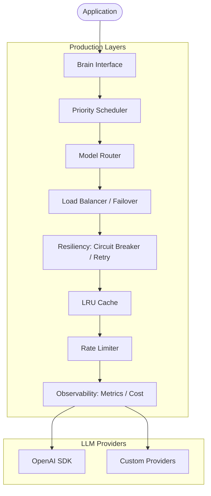

# Native Brain: Production-Grade LLM Intelligence

The `brain` package is the core intelligence engine of HotPlex. It provides a highly reliable, observable, and cost-effective interface for Large Language Model (LLM) reasoning.

## 🏛 Architecture Overview

The system is designed with a layered "Enhanced Brain" architecture. It decorates a base LLM client with multiple production-readiness middleware layers.



### Core Components

- **Brain Interface**: Unified API for high-level reasoning (`Chat`, `Analyze`) and streaming (`ChatStream`).
- **Resiliency Engine**: Implements exponential backoff retries and the Circuit Breaker pattern to handle transient failures and provider outages.
- **Dynamic Router**: Automatically selects the optimal model based on the scenario (e.g., Code vs. Chat) and configured strategies (Cost vs. Latency vs. Quality).
- **High Availability**: Multi-provider failover with automatic recovery (failback).
- **Resource Control**: Distributed rate limiting and token bucket management per model.
- **Budget Guardrails**: Multi-level token budget tracking (Daily/Weekly/Session) with hard and soft limits.

---

## 🛠 Developer Guide

### Interface Definitions

The package exports several interfaces to allow for granular usage of brain capabilities:

```go
// Base reasoning
type Brain interface {
    Chat(ctx context.Context, prompt string) (string, error)
    Analyze(ctx context.Context, prompt string, target any) error
}

// Specialized capabilities
type StreamingBrain interface { ChatStream(...) }
type RoutableBrain interface { ChatWithModel(...) }
type ObservableBrain interface { GetMetrics(...) }
type ResilientBrain interface { GetCircuitBreaker(...); GetFailoverManager(...) }
```

### Advanced Usage Scenarios & Patterns

#### 1. 🎬 Real-time Streaming (Live UI)
Best for large language outputs where low perceived latency is critical.

```go
func StreamAnswer(ctx context.Context, question string) {
    if sb, ok := brain.Global().(brain.StreamingBrain); ok {
        stream, err := sb.ChatStream(ctx, question)
        if err != nil {
            log.Fatal(err)
        }
        
        for token := range stream {
            fmt.Print(token) // Progressive rendering
        }
    }
}
```

#### 2. 🚦 Explicit Multi-Model Selection
Forces a specific model for specialized tasks (e.g., GPT-4o for complex reasoning).

```go
func SpecializedTask(ctx context.Context) {
    if rb, ok := brain.Global().(brain.RoutableBrain); ok {
        // High quality model override
        ans, _ := rb.ChatWithModel(ctx, "gpt-4o", "Deep technical analysis...")
        fmt.Println(ans)
    }
}
```

#### 3. 🎯 Intelligent Scenario Routing
Automatically detects task type (Code, Chat, or Analysis) and routes to the most cost-effective model configured in your strategies.

```go
func AutoRouteAction(ctx context.Context, userPrompt string) {
    // router selected based on StrategyBalanced/StrategyCostPriority
    // System automatically detects 'Write a Python script' as ScenarioCode
    resp, err := brain.Global().Chat(ctx, userPrompt)
    if err != nil {
        log.Printf("Routing error: %v", err)
    }
}
```

#### 4. 🏥 Resilience Management
Observing provider health and manually controlling the circuit state.

```go
func MonitorResilience() {
    if rb, ok := brain.Global().(brain.ResilientBrain); ok {
        cb := rb.GetCircuitBreaker()
        fm := rb.GetFailoverManager()
        
        fmt.Printf("Circuit State: %s | Failure Count: %d\n", 
            cb.GetState(), cb.GetStats().FailRequests)
            
        // Manual failover if we detect high latency on primary
        if fm.GetCurrentProvider().Name == "openai" {
            _ = fm.ManualFailover("dashscope") 
        }
    }
}
```

#### 5. 💰 Session Budget Guardrails
Tracking and enforcing financial limits for specific chat sessions.

```go
func ControlledSession(sessionID string) {
    if bb, ok := brain.Global().(brain.BudgetControlledBrain); ok {
        tracker := bb.GetBudgetTracker(sessionID)
        
        // Estimated cost check before heavy processing
        if allowed, _, _ := tracker.CheckBudget(0.05); !allowed {
            fmt.Println("Session budget exceeded. Stopping.")
            return
        }
    }
}
```

---

## 📊 Observability & Metrics

The system tracks enterprise-level metrics using OpenTelemetry:

- **Latency**: Detailed histogram of request durations.
- **Token Usage**: Granular tracking of input/output tokens.
- **Financials**: Real-time USD cost calculation based on model-specific pricing.
- **Reliability**: Error rates and circuit breaker state transitions.

| Metric                 | Type      | Description                 |
| :--------------------- | :-------- | :-------------------------- |
| `llm_request_duration` | Histogram | Latency per model/operation |
| `llm_tokens_total`     | Counter   | Total tokens consumed       |
| `llm_cost_usd`         | Gauge     | Cumulative cost in USD      |
| `llm_error_rate`       | Gauge     | Failure percentage          |

---

## ⚙️ Configuration Reference

| Variable                                | Description                               | Default  |
| :-------------------------------------- | :---------------------------------------- | :------- |
| `HOTPLEX_BRAIN_PROVIDER`                | Primary provider (openai/dashscope/etc)   | `openai` |
| `HOTPLEX_BRAIN_CIRCUIT_BREAKER_ENABLED` | Enable circuit breaker protection         | `false`  |
| `HOTPLEX_BRAIN_ROUTER_ENABLED`          | Enable scenario-based model routing       | `false`  |
| `HOTPLEX_BRAIN_FAILOVER_ENABLED`        | Enable automatic multi-provider switching | `false`  |
| `HOTPLEX_BRAIN_BUDGET_LIMIT`            | Hard USD limit for the period             | `10.0`   |

---

## 🧪 Testing

The package includes high-coverage unit tests and integration tests for providers.

```bash
go test -v ./brain/...
```

- **Unit tests**: Fast, mocks provider calls.
- **Integration tests**: Requires API keys, tests real connectivity.
- **Scenario tests**: Validates routing and budget logic under load.

---

**Package Status**: Production Ready (Phase 3)  
**Maintainer**: HotPlex Core Team
