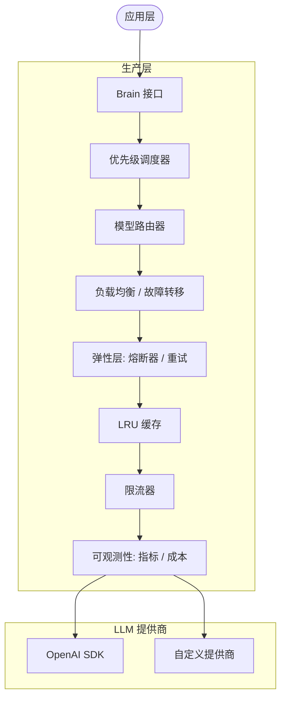

# Native Brain: 生产级 LLM 智能引擎

`brain` 包是 HotPlex 的核心智能引擎。它提供高可靠、可观测、高性价比的大语言模型 (LLM) 推理接口。

[English](README.md)

## 🏛 架构概览

系统采用分层 "增强大脑" 架构设计，通过多层生产级中间件装饰基础 LLM 客户端。



---

## 🧠 Native Brain 核心组件 (v0.22.0)

### 1. IntentRouter (意图路由器)

对传入消息进行分类，确定最佳处理路径。

```
┌─────────────┐     ┌──────────────┐
│ 用户消息    │────▶│ IntentRouter │
└─────────────┘     └──────┬───────┘
                           │
            ┌──────────────┼──────────────┐
            ▼              ▼              ▼
        [chat]        [command]       [task]
      Brain 处理     Brain 处理      Engine 处理
      闲聊对话       状态/配置       代码、调试
```

**意图类型**:
| 意图 | 描述 | 处理器 |
|------|------|--------|
| `chat` | 闲聊对话、问候语 | Brain 生成响应 |
| `command` | 状态查询、配置命令 | Brain 生成响应 |
| `task` | 代码操作、调试分析 | 转发至 Engine Provider |
| `unknown` | 模糊意图 | 默认转发 Engine 确保安全 |

**快速路径优化**: 明确的场景无需调用 Brain API：
- 问候语 ("hi", "hello") → `chat`
- 状态命令 ("ping", "status") → `command`
- 代码关键词 ("function", "debug") → `task`

```go
router := brain.NewIntentRouter(brainClient)
result, err := router.Classify(ctx, "写一个 Python 函数")
// result.Type == IntentTypeTask
```

### 2. ContextCompressor (上下文压缩器)

管理对话上下文，防止上下文窗口溢出，同时保留重要信息。

```
┌────────────────────────────────────────────────────────┐
│ 会话历史 (压缩前: 8000+ tokens)                         │
│ ┌─────┐ ┌─────┐ ┌─────┐ ┌─────┐ ┌─────┐ ┌─────┐       │
│ │Turn1│ │Turn2│ │ ... │ │Turn8│ │Turn9│ │Turn10│       │
│ └─────┘ └─────┘ └─────┘ └─────┘ └─────┘ └─────┘       │
└────────────────────────────────────────────────────────┘
                         │
                         ▼ 压缩触发 (达到阈值)
┌────────────────────────────────────────────────────────┐
│ 压缩后会话 (压缩后: ~2000 tokens)                       │
│ ┌─────────────────┐ ┌─────┐ ┌─────┐ ┌─────┐           │
│ │ Turn 1-7 摘要   │ │Turn8│ │Turn9│ │Turn10│           │
│ │ (~500 tokens)   │ └─────┘ └─────┘ └─────┘           │
│ └─────────────────┘                                   │
└────────────────────────────────────────────────────────┘
```

**压缩算法**:
1. 等待 token 数超过 `TokenThreshold` (默认: 8000)
2. 保留最近 `PreserveTurns` (默认: 5) 轮对话完整
3. 使用 Brain AI 对较早对话生成摘要
4. 用摘要替换旧对话，更新总 token 数

```go
compressor := brain.NewContextCompressor(brainClient, brain.CompressionConfig{
    Enabled:          true,
    TokenThreshold:   8000,
    PreserveTurns:    5,
    MaxSummaryTokens: 500,
})
compressed := compressor.Compress(ctx, sessionHistory)
```

### 3. SafetyGuard (安全卫士)

多层安全防护，负责输入验证和输出脱敏。

```
SafetyGuard
├── CheckInput()     → 模式扫描 → Brain 分析 → allow/block
├── CheckOutput()    → 模式匹配 → 脱敏处理 → allow
└── ParseConfigIntent() → Brain NLU → ExecuteConfigIntent()
```

**威胁检测流程**:
1. **快速路径**: 正则模式捕获明显攻击 (提示词注入、越狱)
2. **深度分析**: Brain AI 对隐蔽威胁进行置信度评分
3. **执行动作**: `allow` (安全)、`block` (威胁)、`sanitize` (脱敏敏感数据)

**默认拦截模式**:
- 提示词注入 (`ignore previous instructions`)
- 越狱尝试 (`DAN mode`、`developer mode`)
- 系统覆盖尝试 (`you are now admin`)

```go
guard := brain.NewSafetyGuard(brainClient, brain.DefaultGuardConfig())

// 输入验证
result := guard.CheckInput(ctx, userInput)
if result.Action == brain.GuardActionBlock {
    return errors.New("已拦截: " + result.Reason)
}

// 输出脱敏
sanitized := guard.CheckOutput(ctx, llmResponse)
```

---

### 核心组件 (续)

- **Brain 接口**: 高级推理统一 API (`Chat`、`Analyze`) 和流式输出 (`ChatStream`)
- **弹性引擎**: 指数退避重试和熔断器模式，处理瞬态故障和提供商宕机
- **动态路由器**: 基于场景（代码 vs 对话）和策略（成本 vs 延迟 vs 质量）自动选择最优模型
- **高可用**: 多提供商故障转移，支持自动恢复 (failback)
- **资源控制**: 分布式限流和每模型令牌桶管理
- **预算护栏**: 多级 token 预算追踪（日/周/会话），支持硬限制和软限制

---

## 🛠 开发指南

### 接口定义

包导出多个接口，支持细粒度使用 brain 能力：

```go
// 基础推理
type Brain interface {
    Chat(ctx context.Context, prompt string) (string, error)
    Analyze(ctx context.Context, prompt string, target any) error
}

// 专项能力
type StreamingBrain interface { ChatStream(...) }
type RoutableBrain interface { ChatWithModel(...) }
type ObservableBrain interface { GetMetrics(...) }
type ResilientBrain interface { GetCircuitBreaker(...); GetFailoverManager(...) }
```

### 高级使用场景与模式

#### 1. 🎬 实时流式输出 (动态 UI)
适用于大输出量、低感知延迟关键场景。

```go
func StreamAnswer(ctx context.Context, question string) {
    if sb, ok := brain.Global().(brain.StreamingBrain); ok {
        stream, err := sb.ChatStream(ctx, question)
        if err != nil {
            log.Fatal(err)
        }

        for token := range stream {
            fmt.Print(token) // 渐进式渲染
        }
    }
}
```

#### 2. 🚦 显式多模型选择
为特定任务强制指定模型（如复杂推理使用 GPT-4o）。

```go
func SpecializedTask(ctx context.Context) {
    if rb, ok := brain.Global().(brain.RoutableBrain); ok {
        // 高质量模型覆盖
        ans, _ := rb.ChatWithModel(ctx, "gpt-4o", "深度技术分析...")
        fmt.Println(ans)
    }
}
```

#### 3. 🎯 智能场景路由
自动检测任务类型（代码、对话、分析），路由到策略配置中最具性价比的模型。

```go
func AutoRouteAction(ctx context.Context, userPrompt string) {
    // 路由器基于 StrategyBalanced/StrategyCostPriority 选择
    // 系统自动将 "写一个 Python 脚本" 识别为 ScenarioCode
    resp, err := brain.Global().Chat(ctx, userPrompt)
    if err != nil {
        log.Printf("路由错误: %v", err)
    }
}
```

#### 4. 🏥 弹性管理
监控提供商健康状态，手动控制熔断器状态。

```go
func MonitorResilience() {
    if rb, ok := brain.Global().(brain.ResilientBrain); ok {
        cb := rb.GetCircuitBreaker()
        fm := rb.GetFailoverManager()

        fmt.Printf("熔断器状态: %s | 失败计数: %d\n",
            cb.GetState(), cb.GetStats().FailRequests)

        // 检测到主提供商高延迟时手动切换
        if fm.GetCurrentProvider().Name == "openai" {
            _ = fm.ManualFailover("dashscope")
        }
    }
}
```

#### 5. 💰 会话预算护栏
追踪并强制执行特定聊天会话的财务限制。

```go
func ControlledSession(sessionID string) {
    if bb, ok := brain.Global().(brain.BudgetControlledBrain); ok {
        tracker := bb.GetBudgetTracker(sessionID)

        // 重处理前估算成本检查
        if allowed, _, _ := tracker.CheckBudget(0.05); !allowed {
            fmt.Println("会话预算超限，停止处理。")
            return
        }
    }
}
```

---

## 🔧 客户端构建器模式 (Issue #217)

`llm` 子包提供流式 Builder API，用于组合中间件层。

### 包装顺序 (从内到外)

```
Metrics → Circuit → RateLimit → Retry → Cache → OpenAI
```

| 层级 | 用途 |
|------|------|
| Cache | LRU 响应缓存 |
| Retry | 指数退避重试 |
| Rate Limit | 令牌桶限流 |
| Circuit Breaker | 错误重复时快速失败 |
| Metrics | 可观测性和成本追踪 |

### 预设配置

```go
// 生产环境: 全部能力
client, _ := llm.ProductionClient(apiKey, "gpt-4")

// 开发环境: 最小开销
client, _ := llm.DevelopmentClient(apiKey, "gpt-4")

// 高吞吐: 激进缓存
client, _ := llm.HighThroughputClient(apiKey, "gpt-4")

// 最大可靠性: 激进重试
client, _ := llm.ReliableClient(apiKey, "gpt-4")
```

### 自定义配置

```go
client, _ := llm.NewClientBuilder().
    WithAPIKey(apiKey).
    WithEndpoint("https://api.deepseek.com/v1").
    WithModel("deepseek-chat").
    WithCache(5000).
    WithRetry(5).
    WithCircuitBreaker(llm.CircuitBreakerConfig{...}).
    WithRateLimit(100).
    WithMetrics().
    Build()
```

### 独立功能 (非构建器)

预算追踪和优先级调度是独立模块：

```go
// 预算控制
client, _ := llm.NewBudgetManagedClient(apiKey, "gpt-4", 10.0) // $10/天

// 优先级调度
scheduler, client := llm.PrioritySchedulerWithClient(5*time.Minute, nil)
client.Submit(ctx, "req-1", llm.PriorityHigh, func() error { ... })
```

### ObservableClient

提取运行时统计信息：

```go
obs := llm.AsObservable(client)
health := obs.GetClientHealth(ctx)
// health.CircuitState, health.CacheHitRate, health.TotalRequests
```

---

## 📊 可观测性与指标

系统使用 OpenTelemetry 追踪企业级指标：

- **延迟**: 请求耗时的详细直方图
- **Token 用量**: 细粒度的输入/输出 token 追踪
- **财务**: 基于模型定价的实时美元成本计算
- **可靠性**: 错误率和熔断器状态转换

| 指标                    | 类型      | 描述               |
| :--------------------- | :-------- | :----------------- |
| `llm_request_duration` | Histogram | 每模型/操作延迟    |
| `llm_tokens_total`     | Counter   | 总消耗 token 数    |
| `llm_cost_usd`         | Gauge     | 累计成本 (美元)    |
| `llm_error_rate`       | Gauge     | 失败百分比         |

---

## ⚙️ 配置参考

| 变量                                   | 描述                         | 默认值   |
| :------------------------------------- | :--------------------------- | :------- |
| `HOTPLEX_BRAIN_PROVIDER`               | 主提供商 (openai/dashscope等) | `openai` |
| `HOTPLEX_BRAIN_CIRCUIT_BREAKER_ENABLED`| 启用熔断器保护               | `false`  |
| `HOTPLEX_BRAIN_ROUTER_ENABLED`         | 启用场景模型路由             | `false`  |
| `HOTPLEX_BRAIN_FAILOVER_ENABLED`       | 启用自动多提供商切换         | `false`  |
| `HOTPLEX_BRAIN_BUDGET_LIMIT`           | 周期硬性美元限制             | `10.0`   |

---

## 🧪 测试

包包含高覆盖率单元测试和提供商集成测试。

```bash
go test -v ./brain/...
```

- **单元测试**: 快速，mock 提供商调用
- **集成测试**: 需要 API 密钥，测试真实连接
- **场景测试**: 验证负载下的路由和预算逻辑

---

**包状态**: 生产就绪 (Phase 3)
**维护者**: HotPlex Core Team
