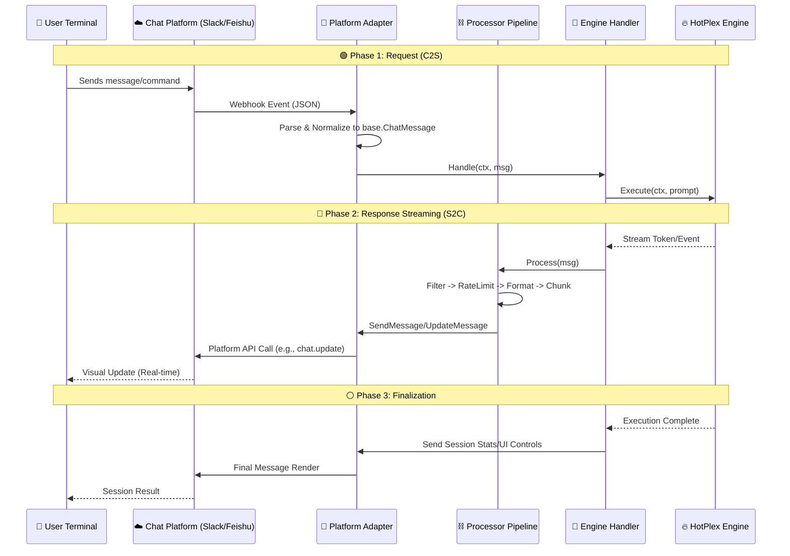

# ChatApps: Multi-Platform Connector

The `chatapps` package provides the bridge between HotPlex's core engine and various chat platforms (Slack, Feishu/Lark, Telegram, Discord, etc.). It normalizes platform-specific events and messages into a unified format for the engine to process.

## 🏛 Architecture Overview

HotPlex uses an **Adapter-based Pipeline** architecture to achieve platform neutrality and consistent behavior across different IM apps.

### 🔄 End-to-End Bidirectional Flow

From the client terminal's perspective, HotPlex operates as a reactive streaming system.



### Data Normalization (Event to Message Mapping)

The `chatapps` layer normalizes raw provider events into a standard "Chat Language" using the **`base.MessageType`** Go type. While the underlying values often share names with Engine events, they represent **UI Rendering Intents** documented in [base/types.go](file:///Users/huangzhonghui/HotPlex/chatapps/base/types.go).

| Provider/Engine Event | `base.MessageType` Constant    | UI Presentation                                  |
| :-------------------- | :----------------------------- | :----------------------------------------------- |
| `thinking`            | `MessageTypeThinking`          | [Status Only] Thinking indicators / Bubbles      |
| `tool_use`            | `MessageTypeToolUse`           | [Status Only] "Executing tool..." indicator      |
| `tool_result`         | `MessageTypeToolResult`        | [Silent Success] Status only; Errors show blocks |
| `answer`              | `MessageTypeAnswer`            | Standard Markdown text / Streaming output        |
| `error`               | `MessageTypeError`             | Red-themed alert block                           |
| `plan_mode`           | `MessageTypePlanMode`          | Planning phase indicator (Status + Text)         |
| `permission_request`  | `MessageTypePermissionRequest` | Interactive Allow/Deny buttons                   |
| `session_stats`       | `MessageTypeSessionStats`      | Usage summary (Tokens, Duration)                 |
| `danger_block`        | `MessageTypeDangerBlock`       | Critical warning with confirmation               |
|                       |                                |                                                  |

> [!NOTE]
> **Slack Free Plan Compatibility**: Some advanced features (Streaming, Status Bar) require a paid plan or [Developer Sandbox](https://api.slack.com/developer/program). See [docs/plans/slack_free_plan_compatibility.md](file:///Users/huangzhonghui/HotPlex/docs/plans/slack_free_plan_compatibility.md) for current tracking of fallback optimizations.

### Key Architectural Concepts
-   **`ProcessorChain`**: A middleware-style pipeline that processes messages before they are sent or after they are received. Standard processors include:
    -   **`Filter`**: [Black Hole] Silently drops noise events, unparsed raw outputs, and redundant user reflections within the integration layer.
    -   **`Thread`**: Manages thread state and caching for multi-step responses to maintain context.
    -   **`FormatConversion`**: Converts Standard Markdown to platform-specific formats (e.g., Slack Block Kit, Feishu Card).
    -   **`Chunking`**: Splits long messages to respect platform API limits.
-   **`Space Folding`**: A policy where high-volume tool outputs (>2KB) are automatically diverted to thread replies or collapsed, preventing main channel pollution while preserving "Geek Transparency".
-   **`EngineMessageHandler`**: The main business logic that connects normalized chat events to the HotPlex Engine.

---

## 🛠 Developer Guide

### 1. Implementing a New Platform Adapter

To add a platform (e.g., `whatsapp`), create a new package `chatapps/whatsapp` and follow these patterns:

#### Phase A: Core Interface (`base.ChatAdapter`)
The foundation of any adapter is the `ChatAdapter` interface.

```go
type WhatsAppAdapter struct {
    config  Config
    handler base.MessageHandler // Injected via SetHandler
    logger  *slog.Logger
}

func (a *WhatsAppAdapter) Platform() string { return "whatsapp" }

// Handle incoming platform events (e.g., from webhook)
func (a *WhatsAppAdapter) HandleMessage(ctx context.Context, msg *base.ChatMessage) error {
    if a.handler != nil {
        return a.handler(ctx, msg) // Delegate to Engine
    }
    return nil
}

// Send outgoing formatted messages
func (a *WhatsAppAdapter) SendMessage(ctx context.Context, sessionID string, msg *base.ChatMessage) error {
    // 1. Convert msg (Markdown/Blocks) to WhatsApp format
    // 2. Call WhatsApp Cloud API
}

func (a *WhatsAppAdapter) SetHandler(h base.MessageHandler) { a.handler = h }
```

#### Phase B: Webhook Support (`base.WebhookProvider`)
If the platform uses webhooks, implement this to register routes automatically under `/webhook/myplatform/`.

```go
func (a *WhatsAppAdapter) WebhookHandler() http.Handler {
    mux := http.NewServeMux()
    mux.HandleFunc("/events", func(w http.ResponseWriter, r *http.Request) {
        // 1. Parse signature & event
        // 2. Convert to base.ChatMessage
        // 3. Call a.HandleMessage(r.Context(), normalizedMsg)
    })
    return mux
}
```

#### Phase C: Advanced UI & Resiliency
Implement these optional interfaces to provide a premium experience:

-   **`base.StatusProvider`**: Handles "Thinking..." or "Running tool X..." visual indicators.
-   **`base.MessageOperations`**: Supports updating/deleting existing messages (critical for streaming and UI updates).
-   **`base.StreamWriter`**: A standard `io.Writer` interface for real-time token streaming.

### 2. Message Processor Pipeline

The `ProcessorChain` is a middleware system. You can add global or platform-specific processors.

```go
// Example: Custom Privacy Masking Processor
type PrivacyMasker struct {}
func (p *PrivacyMasker) Name() string { return "privacy_mask" }
func (p *PrivacyMasker) Order() int { return 12 } // Run between RateLimit and Aggregation

func (p *PrivacyMasker) Process(ctx context.Context, msg *base.ChatMessage) (*base.ChatMessage, error) {
    msg.Content = strings.ReplaceAll(msg.Content, "SECRET", "****")
    return msg, nil
}
```

### 3. Integration into `setup.go`

Once implemented, register your adapter in `chatapps/setup.go`:

```go
// 1. Add to setupPlatform calls
setupPlatform(ctx, "whatsapp", loader, manager, logger, func(pc *PlatformConfig) ChatAdapter {
    // return whatsapp.NewAdapter(...)
})

// 2. Ensure credentials are in .env or config.yaml
```

---

## 🏗 Interaction & Button Handling

For platforms supporting buttons (Slack Blocks, Feishu Cards), use the `InteractionManager`:

1.  **Define Action IDs**: Use a structured format `{action_name}:{session_id}` in buttons.
2.  **Handle Callbacks**: The adapter should capture button clicks and route them to `InteractionManager.HandleAction`.
3.  **UI Feedback**: Use `StatusProvider` to show "Processing..." while the action executes.

---

## 📊 Observability & Metrics
`HOTPLEX_CHATAPPS_CONFIG_DIR`: Path to platform-specific YAML configs.

---

**Status**: Active / Modular  
**Maintainer**: HotPlex Core Team
