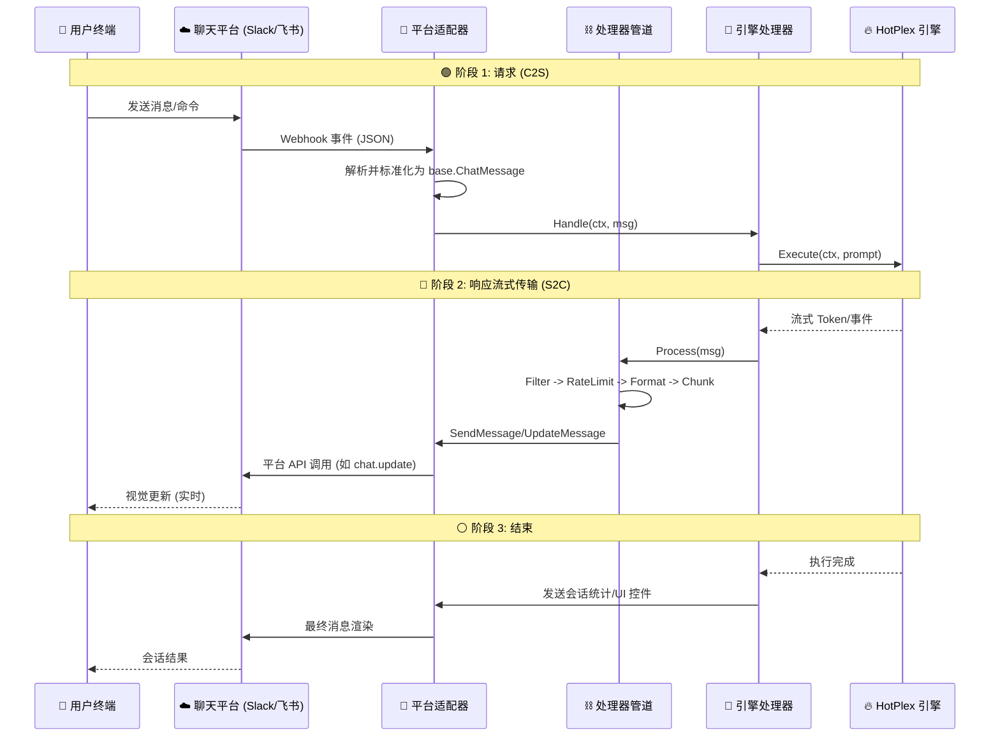
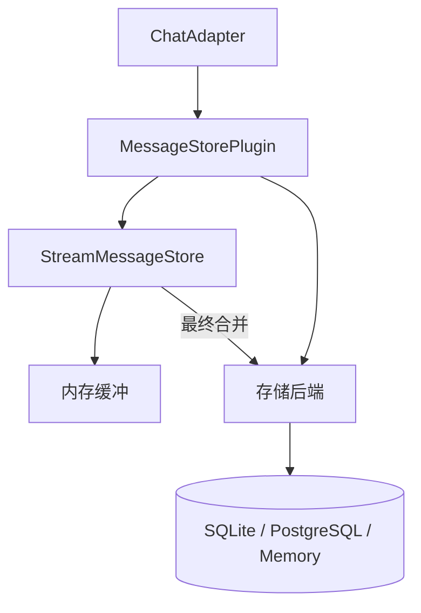

# ChatApps: 多平台连接器

`chatapps` 包提供 HotPlex 核心引擎与各聊天平台（Slack、飞书/Lark、Telegram、Discord 等）之间的桥梁。它将平台特定的事件和消息标准化为统一格式，供引擎处理。

[English](README.md)

## 🏛 架构概览

HotPlex 采用 **适配器-管道** 架构，实现平台中立性和跨 IM 应用的一致行为。

### 🔄 端到端双向流程

从客户端终端视角，HotPlex 作为响应式流系统运行。



### 数据标准化 (事件到消息映射)

`chatapps` 层使用 **`base.MessageType`** Go 类型将原始提供商事件标准化为标准"聊天语言"。虽然底层值常与引擎事件同名，但它们代表 [base/types.go](base/types.go) 中记录的 **UI 渲染意图**。

| 提供商/引擎事件   | `base.MessageType` 常量        | UI 呈现                    |
| :---------------- | :----------------------------- | :------------------------- |
| `thinking`        | `MessageTypeThinking`          | [仅状态] 思考指示器/气泡   |
| `tool_use`        | `MessageTypeToolUse`           | [仅状态] "执行工具..."指示 |
| `tool_result`     | `MessageTypeToolResult`        | [静默成功] 仅状态；错误显示块 |
| `answer`          | `MessageTypeAnswer`            | 标准 Markdown / 流式输出   |
| `error`           | `MessageTypeError`             | 红色主题警告块             |
| `plan_mode`       | `MessageTypePlanMode`          | 规划阶段指示 (状态+文本)   |
| `permission_request` | `MessageTypePermissionRequest` | 交互式 允许/拒绝 按钮      |
| `session_stats`   | `MessageTypeSessionStats`      | 使用摘要 (Token, 时长)     |
| `danger_block`    | `MessageTypeDangerBlock`       | 带确认的关键警告           |

> [!NOTE]
> **Slack 免费计划兼容性**: 部分高级功能（流式输出、状态栏）需要付费计划或 [开发者沙盒](https://api.slack.com/developer/program)。参见 [docs/plans/slack_free_plan_compatibility.md](../docs/plans/slack_free_plan_compatibility.md) 了解当前回退优化追踪。

### 关键架构概念
- **`ProcessorChain`**: 中间件风格管道，在消息发送前或接收后处理。标准处理器包括：
    - **`Filter`**: [黑洞] 在集成层静默丢弃噪声事件、未解析原始输出和冗余用户反射。
    - **`Thread`**: 管理线程状态和缓存，为多步响应维护上下文。
    - **`FormatConversion`**: 将标准 Markdown 转换为平台特定格式（如 Slack Block Kit、飞书卡片）。
    - **`Chunking`**: 分割长消息以遵守平台 API 限制。
- **`空间折叠`**: 高量工具输出（>2KB）自动分流到线程回复或折叠的策略，防止主频道污染同时保留"极客透明度"。
- **`EngineMessageHandler`**: 连接标准化聊天事件到 HotPlex 引擎的主要业务逻辑。

---

## 🗄️ 消息存储插件

消息存储插件提供跨平台持久化聊天历史的健壮系统，支持一次性消息和实时流，具有内存高效缓冲。

### 🏗️ 存储架构



**流处理流程：**
1. **用户消息**: 通过 `MessageStorePlugin` 立即存储。
2. **Bot 流**: 增量块在 `StreamMessageStore` (内存缓冲) 中累积。
3. **完成**: 合并内容持久化到后端；临时块被丢弃以防止数据库膨胀。

### 🔧 配置

在平台配置（如 `config.yaml`）中添加 `message_store` 块：

```yaml
message_store:
  enabled: true
  type: sqlite          # sqlite | postgres | memory
  sqlite:
    path: ~/.hotplex/chatapp_messages.db
    max_size_mb: 512
  streaming:
    enabled: true
    timeout: 5m
    storage_policy: complete_only # 仅存储最终合并响应
```

### 🚀 集成指南

1. **初始化插件**：
    ```go
    // 1. 创建存储后端
    store, _ := base.CreateStorageFromType("sqlite", map[string]any{
        "path": "~/.hotplex/messages.db",
    })

    // 2. 创建 MessageStorePlugin
    msgPlugin, _ := base.NewMessageStorePlugin(base.MessageStorePluginConfig{
        Store:          store,
        SessionManager: base.CreateSessionManager("hotplex"), // 注入用于查找
        Strategy:       base.CreateDefaultStrategy(),
        StreamEnabled:  true,
        StreamTimeout:  5 * time.Minute,
    })
    ```

2. **在 ChatAdapter 中启用**：
    ```go
    // 将插件和元数据注入平台适配器
    adapter.SetMessageStore(msgPlugin)
    adapter.SetSessionManager(sessionMgr)
    adapter.SetProviderType("anthropic")
    ```

---

## 🛡️ 可靠性与去重

HotPlex 通过专用中间件层确保消息传递和安全。

### 🔄 事件去重
`dedup` 包防止多次处理同一 IM 事件（如平台重试 webhook 时）。
- **脱敏**: 使用 `dedup.RedactSensitiveData` 在日志中自动遮蔽敏感数据（Slack/GitHub token、API 密钥）。

### 📨 消息队列与 DLQ
`MessageQueue` 提供带重试逻辑的异步投递：
- **自动重试**: 发送失败的消息自动重新入队（最多 3 次尝试）。
- **死信队列 (DLQ)**: 持久失败的消息移至 DLQ 供人工检查或恢复。

---

## 🛠 开发指南

### 1. 实现新平台适配器

添加平台（如 `whatsapp`），创建新包 `chatapps/whatsapp` 并遵循以下模式：

#### 阶段 A: 核心接口 (`base.ChatAdapter`)
任何适配器的基础是 `ChatAdapter` 接口。

```go
type WhatsAppAdapter struct {
    config  Config
    handler base.MessageHandler // 通过 SetHandler 注入
    logger  *slog.Logger
}

func (a *WhatsAppAdapter) Platform() string { return "whatsapp" }

// 处理传入平台事件（如来自 webhook）
func (a *WhatsAppAdapter) HandleMessage(ctx context.Context, msg *base.ChatMessage) error {
    if a.handler != nil {
        return a.handler(ctx, msg) // 委托给引擎
    }
    return nil
}

// 发送格式化的传出消息
func (a *WhatsAppAdapter) SendMessage(ctx context.Context, sessionID string, msg *base.ChatMessage) error {
    // 1. 将 msg (Markdown/Blocks) 转换为 WhatsApp 格式
    // 2. 调用 WhatsApp Cloud API
}

func (a *WhatsAppAdapter) SetHandler(h base.MessageHandler) { a.handler = h }
```

#### 阶段 B: Webhook 支持 (`base.WebhookProvider`)
如果平台使用 webhook，实现此接口以在 `/webhook/myplatform/` 下自动注册路由。

```go
func (a *WhatsAppAdapter) WebhookHandler() http.Handler {
    mux := http.NewServeMux()
    mux.HandleFunc("/events", func(w http.ResponseWriter, r *http.Request) {
        // 1. 解析签名和事件
        // 2. 转换为 base.ChatMessage
        // 3. 调用 a.HandleMessage(r.Context(), normalizedMsg)
    })
    return mux
}
```

#### 阶段 C: 高级 UI 与弹性
实现这些可选接口以提供优质体验：

- **`base.StatusProvider`**: 处理 "思考中..." 或 "正在执行工具 X..." 视觉指示。
- **`base.MessageOperations`**: 支持更新/删除现有消息（流式输出和 UI 更新关键）。
- **`base.StreamWriter`**: 实时 token 流的标准 `io.Writer` 接口。

#### 阶段 D: 存储与会话支持
通过实现这些钩子启用对话持久化：

```go
func (a *WhatsAppAdapter) SetMessageStore(s *base.MessageStorePlugin) { a.store = s }
func (a *WhatsAppAdapter) SetSessionManager(m session.SessionManager) { a.sess = m }
```

### 2. 消息处理器管道

`ProcessorChain` 是中间件系统。可以添加全局或平台特定处理器。

```go
// 示例: 自定义隐私脱敏处理器
type PrivacyMasker struct {}
func (p *PrivacyMasker) Name() string { return "privacy_mask" }
func (p *PrivacyMasker) Order() int { return 12 } // 在 RateLimit 和 Aggregation 之间运行

func (p *PrivacyMasker) Process(ctx context.Context, msg *base.ChatMessage) (*base.ChatMessage, error) {
    msg.Content = strings.ReplaceAll(msg.Content, "SECRET", "****")
    return msg, nil
}
```

### 3. 集成到 `setup.go`

实现后，在 `chatapps/setup.go` 中注册适配器：

```go
// 1. 添加到 setupPlatform 调用
setupPlatform(ctx, "whatsapp", loader, manager, logger, func(pc *PlatformConfig) ChatAdapter {
    // return whatsapp.NewAdapter(...)
})

// 2. 确保凭证在 .env 或 config.yaml 中
```

---

## 🏗 交互与按钮处理

对于支持按钮的平台（Slack Blocks、飞书卡片），使用 `InteractionManager`：

1. **定义 Action ID**: 在按钮中使用结构化格式 `{action_name}:{session_id}`。
2. **处理回调**: 适配器应捕获按钮点击并路由到 `InteractionManager.HandleAction`。
3. **UI 反馈**: 执行操作时使用 `StatusProvider` 显示 "处理中..."。

---

## 📊 可观测性与指标
`HOTPLEX_CHATAPPS_CONFIG_DIR`: 平台特定 YAML 配置的路径。

---

**状态**: 活跃 / 模块化
**维护者**: HotPlex Core Team
