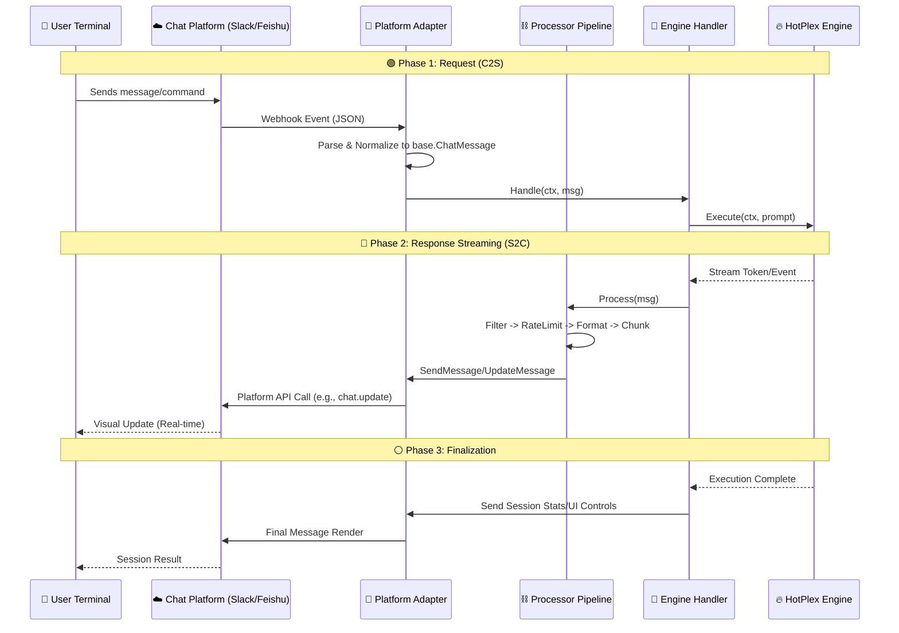

# ChatApps Reference

The `chatapps` package provides the bridge between HotPlex's core engine and various chat platforms. It normalizes platform-specific events and messages into a unified "Chat Language".

## 🔄 End-to-End Bidirectional Flow



## 🏛 Architecture Overview

HotPlex uses an **Adapter-based Pipeline** architecture.

### Data Normalization

The `chatapps` layer normalizes raw provider events into standard UI components.

| Provider Event       | `base.MessageType`             | UI Presentation     |
| :------------------- | :----------------------------- | :------------------ |
| `thinking`           | `MessageTypeThinking`          | Thinking bubbles    |
| `tool_use`           | `MessageTypeToolUse`           | Tool info block     |
| `tool_result`        | `MessageTypeToolResult`        | Collapsible output  |
| `answer`             | `MessageTypeAnswer`            | Markdown text       |
| `permission_request` | `MessageTypePermissionRequest` | Interactive buttons |

### Key Architectural Concepts

-   **`ChatAdapter`**: The platform-specific connector logic.
-   **`AdapterManager`**: Singleton for managing active connections.
*   **`ProcessorChain`**: Middleware-style pipeline for message styling and filtering.

---

## 🛠 Developer Guide

### 1. Implementing a New Platform Adapter

To add a platform (e.g., `discord`), implement the `base.ChatAdapter` interface:

```go
type DiscordAdapter struct {
    client  *discord.Client
    handler base.MessageHandler
}

func (a *DiscordAdapter) SendMessage(ctx context.Context, sessionID string, msg *base.ChatMessage) error {
    // Convert to Discord format and POST
}
```

---

## 🏗️ Connect More Platforms

<div class="audience-section">
  <div class="audience-card" style="padding: 24px; min-width: 200px;">
    <h3>Slack Guide</h3>
    <p>Step-by-step Slack bot creation and Block Kit setup.</p>
    <a href="/guide/chatapps-slack" class="audience-btn">View Slack</a>
  </div>
  <div class="audience-card" style="padding: 24px; min-width: 200px;">
    <h3>Engine Manual</h3>
    <p>Understand how messages are processed by the core.</p>
    <a href="/reference/engine" class="audience-btn">View Engine</a>
  </div>
</div>

> "Interfaces are the grammar of software architecture." — The HotPlex Core Team
