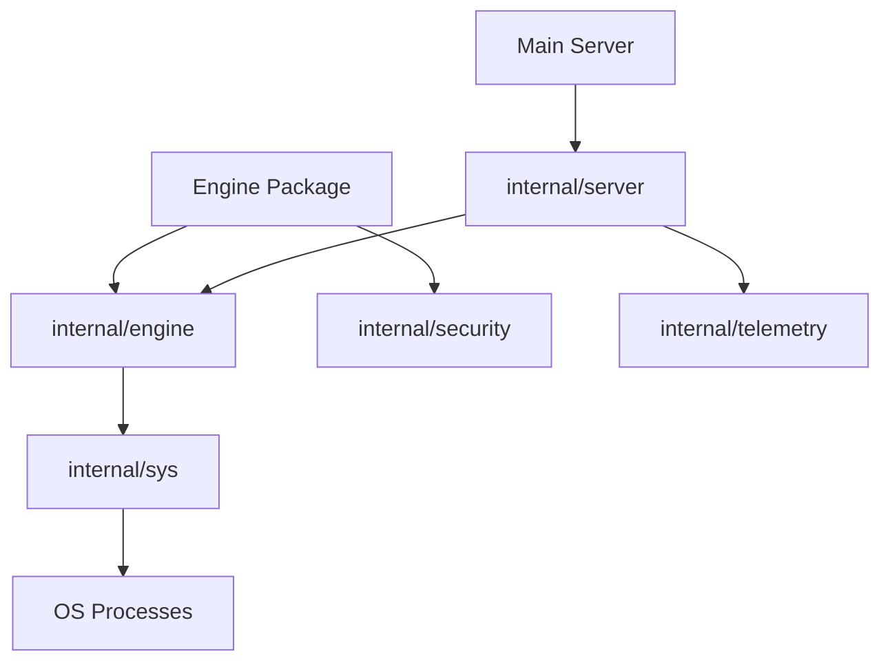

# HotPlex Internal Reference

The `internal` directory contains the foundational subsystems of HotPlex. These packages are not accessible outside of the HotPlex codebase, ensuring a clean boundary between public APIs and implementation details.

## 🏛 Architecture Overview

The `internal` layer provides the critical infrastructure that supports the Engine, ChatApps, and CLI providers.

### Key Subsystems

-   **`internal/engine` (Session Lifecycle)**: Handles the low-level management of hot-multiplexed processes, including process group (PGID) cleanup.
-   **`internal/security` (WAF & Audit)**: Features the **Danger Detector**, which uses high-performance regex matching to prevent destructive commands.
-   **`internal/server` (Transport Layer)**: Bridges web clients to the HotPlex Engine via HTTP/WebSocket.
-   **`internal/telemetry` (Observability)**: Manages Prometheus metrics and internal tracing.
-   **`internal/sys` (System Utils)**: Low-level OS utilities for terminal emulation and process management.

---

## 🛠 Developer Guide for Internal Packages

### 1. Modifying the Session Pool (`internal/engine`)

If you need to change how CLI processes are recycled or how stdout is parsed asynchronously:
1.  Look at `pool.go` for the `SessionPool` implementation.
2.  `session.go` handles individual process lifecycle and I/O wait-loops.

### 2. Updating Security Rules (`internal/security`)

To add new protection patterns to the regex firewall:
1.  Navigate to `internal/security/detector.go` or the relevant `rules/` subdirectory.
2.  Define a new detection regex and specify its severity (Warning vs. Block).

### 3. Adding New Metrics (`internal/telemetry`)

HotPlex uses Prometheus for real-time monitoring:
1.  Register new counters or histograms in `telemetry.go`.
2.  Invoke the tracking methods from the Engine or Internal Server.

---

## ⚙️ Design Principles

-   **Process Graceful Shutdown**: All internal components must respect contexts and termination signals.
-   **No Zombie Guarantee**: Ensures that CLI agents (and their children) are swept when a session times out.
-   **Zero Allocation Paths**: Performance-critical paths are optimized to minimize garbage collection overhead.
