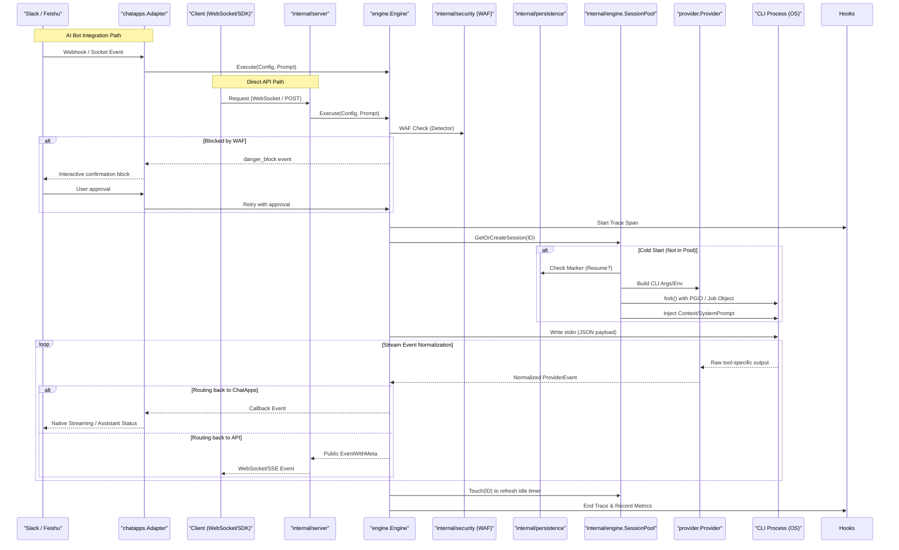

# HotPlex Core Architecture Documentation

*Read this in other languages: [English](architecture.md), [简体中文](architecture_zh.md).*

HotPlex is a high-performance **Agent Runtime** for AI CLI Agents, designed to transform one-off terminal-based AI tools (like Claude Code or OpenCode) into production-ready, long-lived interactive services. Its core philosophy is "Leverage vs Build"—by maintaining a persistent process pool with hardened security boundaries and a normalized full-duplex protocol layer, HotPlex eliminates the spin-up overhead of headless CLI environments and enables millisecond-level responsiveness.

**Version**: v0.17.0 | **Core Role**: AI Agent Engineering Protocol (Cli-as-a-Service)

---

## 1. Physical Layout & Clean Architecture

HotPlex follows a layered architecture with strict visibility rules, separating the public SDK from internal execution details and protocol adapters.

### 1.1 Directory Structure (Actual)

- **Root (`/`)**: SDK entry points. Contains `hotplex.go` (public aliases) and `client.go`.
- **`engine/`**: Public execution runner (`Engine`). Orchestrates prompt execution, security WAF, and event dispatching.
- **`provider/`**: Abstraction layer for diverse AI CLI agents. Contains the `Provider` interface and concrete implementations for `claude-code` and `opencode`.
- **`types/`**: Fundamental data structures (`Config`, `StreamMessage`, `UsageStats`).
- **`event/`**: Unified event protocol and callback definitions (`Callback`, `EventWithMeta`).
- **`chatapps/`**: **Platform Access Layer**. Connects HotPlex to social platforms with multi-adapter support:
  - **Slack Adapter** (`chatapps/slack/`): Block Kit UI, Socket Mode, Native Streaming, Assistant Status API
  - **Feishu Adapter** (`chatapps/feishu/`): Lark/Feishu custom bot support
  - Core components:
    - `engine_handler.go`: Bridges platform messages to Engine commands
    - `manager.go`: Lifecycle management for bot adapters
    - `processor_*.go`: Middleware chain for message formatting, rate limiting, thread management, chunking
    - `base/adapter.go`: Abstract base adapter with session management
- **`internal/engine/`**: Core execution engine. Manages `SessionPool` (thread-safe process multiplexing) and `Session` (I/O piping and state management).
- **`internal/persistence/`**: **Session Resiliency**. Manages `SessionMarkerStore` for detecting and resuming persistent CLI sessions after system restarts.
- **`internal/security/`**: Regex-based WAF (`Detector`) for command auditing and `danger_block` closed-loop security.
- **`internal/sys/`**: **Safety Primitives**. Cross-platform implementations for Process Group ID (PGID) management and signal cascading.
- **`internal/server/`**: Protocol adapters. Contains `hotplex_ws.go` (WebSocket) and `opencode_http.go` (REST/SSE).
- **`internal/config/`**: Configuration hot-reloading with file watchers.
- **`internal/strutil/`**: High-performance string manipulation and path cleaning.

### 1.2 Design Principles

1.  **Public Thin, Private Thick**: The root package `hotplex` provides a stable, minimal API surface.
2.  **Strategy Pattern (Provider)**: Decouples the engine from specific AI tools. `provider.Provider` allows switching backends without changing execution logic.
3.  **PGID-First Security**: Security is not an afterthought; every execution is wrapped in a dedicated process group to prevent orphan leaks.
4.  **IO-Driven State Machine**: `internal/engine` manages process states (Starting, Ready, Busy, Dead) using IO markers rather than fixed sleeps.
5.  **SDK-First**: All platform integrations use official SDKs (slack-go, etc.), no manual protocol implementation.

---

## 2. Core System Components

### 2.1 Engine & Runner (`engine/runner.go`)
*   **Engine Singleton**: Primary interface for users (`NewEngine`, `Execute`).
*   **Security Injection**: Dynamically injects global `EngineOptions` (like `AllowedTools`) into downstream sessions.
*   **Deterministic Session ID**: Uses UUID v5 to map conversation IDs to persistent sessions, ensuring high context cache hits.

### 2.2 Provider Adapter (`provider/`)
Standardizes diverse CLI protocols into a unified "HotPlex Event Stream":
*   **Provider Interface**: Handles CLI argument construction, input payload formatting, and event parsing.
*   **Factory & Registry**: `ProviderFactory` manages provider instantiation, while `ProviderRegistry` caches active instances for reuse.
*   **Supported Providers**: Claude Code (default), OpenCode.

### 2.3 Session Manager (`internal/engine/pool.go`)
*   **Hot-Multiplexing**: The `SessionPool` maintains a registry of active processes. Repeat requests to the same sessionID perform a "Hot Execution" (stdin injection).
*   **Slow Path Guard**: Accessing a session is thread-safe; simultaneous cold-start requests for the same ID are queued via a `pending` transition map to prevent redundant process forks.
*   **Graceful GC**: Uses a `cleanupLoop` to sweep idle processes based on `IdleTimeout`.

### 2.4 Security & Process Isolation (`internal/security/`, `internal/sys/`)
To prevent "zombie" processes when an agent spawns background tasks, HotPlex enforces group-level isolation:
*   **Unix**: Uses `setpgid(2)` on `fork()`. Termination sends `SIGKILL` to the negative PID (e.g., `kill -PID`), wiping the entire process tree.
*   **Windows**: Uses **Job Objects** (`CreateJobObjectW`). Adds the `JOB_OBJECT_LIMIT_KILL_ON_JOB_CLOSE` flag to ensure that when the primary Job handle closes, all associated sub-processes are guaranteed to be terminated by the OS.
*   **WAF Detector**: Scans input prompts for malicious command strings (e.g., `rm -rf /`) before they reach the provider.
*   **Danger Block Closed-Loop**: Interactive security confirmation blocks (`danger_block` events) with user approval workflow.

### 2.5 ChatApps Platform Adapters (`chatapps/`)
Multi-platform support with consistent architecture:

| Platform | Protocol | Key Features |
|----------|----------|--------------|
| **Slack** | Socket Mode + Web API | Block Kit, Native Streaming, Assistant Status, Slash Commands |
| **Feishu** | Custom Bot | Card messages, interactive callbacks |

#### Core Interfaces
- **ChatAdapter**: Base interface for all platform adapters
- **MessageOperations**: Platform-specific message operations (delete, update, stream)
- **SessionOperations**: Session lookup and management
- **StatusProvider**: AI status notification abstraction
- **StreamWriter**: Platform-agnostic streaming interface

### 2.6 Event Hooks & Observability (`hooks/`, `telemetry/`)
*   **Webhooks & Audit**: Asynchronously broadcasts payload events to external systems (Slack, Webhooks) without blocking the hot-execution path.
*   **Tracing & Metrics**: Pushes native OpenTelemetry spans and exposes `/metrics` for Prometheus scraping.

---

## 3. Session Lifecycle & Data Flow

---

## 4. Feature Matrix

### Core Capabilities
- [x] Clean Architecture with `internal/` isolation
- [x] Strategy-based Provider pattern (Claude Code, OpenCode)
- [x] Resilient Session Hot-Multiplexing
- [x] Multi-platform PGID management (Windows Job Objects / Unix PGID)
- [x] Regex-based Security WAF with Danger Block closed-loop
- [x] **Dual Protocol Gateway**: Native WebSocket and OpenCode-compatible REST/SSE API
- [x] **Multi-Platform Adapters**: Slack, Feishu
- [x] **Slack Native Features**: Block Kit UI, Streaming, Assistant Status, Slash Commands
- [x] **Event Hooks**: Plugin system for Webhooks and custom audit sinks
- [x] **Observability**: OpenTelemetry native tracing and Prometheus metrics (`/metrics`)
- [x] **Configuration Hot-Reload**: YAML-based config with file watchers

### Platform-Specific Features

| Feature | Slack | Feishu |
|---------|-------|--------|
| Block Kit UI | ✅ | - |
| Native Streaming | ✅ | - |
| Assistant Status | ✅ | - |
| Slash Commands | ✅ | - |
| Signature Verification | ✅ | ✅ |
| Interactive Buttons | ✅ | Card |

### Planned Enhancements
- **L2/L3 Isolation**: Integrating Linux Namespaces (PID/Net) and WASM sandboxing
- **Multi-Agent Bus**: Orchestrating multiple specialized agents behind a single namespace
