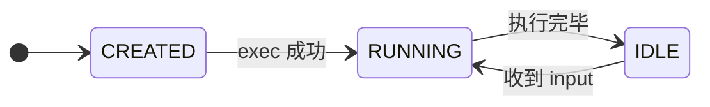

# AEP v1 Appendix

本文档为 [[architecture/Worker-Gateway-Design]] 和 [[architecture/AEP-v1-Protocol]] 的可视化补充，包含：

- 时序图（Sequence）— 含正常流和错误流
- 状态机（State Machine）— 含异常转换
- Trace 示例（含 AEP 转换映射）

---

## 1. Sequence Diagram（时序图）

### 1.1 基础执行流（无工具调用）

```
Client                Gateway                Worker
  |--- input ----------->|                      |
  |                      |--- send ----------->|
  |                      |                      |
  |                      |<-- message.delta ----|  (streaming)
  |<-- message.delta ----|                      |
  |<-- message.delta ----|                      |
  |                      |                      |
  |                      |<-- done -------------|
  |<-- done -------------|                      |
```

### 1.2 Tool Call（Autonomous 模式）

Worker 自行执行 tool，Client 仅收到通知。

```
Client                Gateway                Worker
  |--- input ----------->|                      |
  |                      |--- send ----------->|
  |                      |                      |
  |                      |<-- message.delta ----|
  |<-- message.delta ----|       "Sure..."      |
  |                      |                      |
  |                      |<-- tool_call --------|  [Worker 内部执行 tool]
  |<-- tool_call --------|                      |  ← 通知 Client（仅展示）
  |                      |                      |
  |                      |<-- tool_result ------|  [Worker 获得 tool 结果]
  |<-- tool_result ------|                      |  ← 通知 Client（仅展示）
  |                      |                      |
  |                      |<-- message.delta ----|
  |<-- message.delta ----|       "Here is..."   |
  |                      |                      |
  |                      |<-- done -------------|
  |<-- done -------------|                      |
```

### 1.3 Handshake（Init）

```
Client                                    Gateway
  |--- init ─────────────────────────────────>|
  |    { version, worker_type, session_id?,   |
  |      config?, client_caps }               |
  |                                          |
  |<--- init_ack ─────────────────────────────|
  |    { session_id, state, server_caps }     |
  |                                          |
  |    (双向通信开始)                          |
```

### 1.4 Reconnect / Resume

**成功场景**：

```
Client (old)        Gateway           Worker         Client (new)
     |                  |                |                |
     |--- disconnect -->|                |                |
     |                  | (session alive)|                |
     |                  |                |                |
     |                                      (new connect)
     |                  |<-------------------------------|
     |                  |<--- init (session_id) ----------|
     |                  |--- init_ack (state) ---------->|
     |                  |                |                |
     |                  |                |<--- resume ----|  (Worker 自身恢复上下文)
     |                  |                |--- output ---> |  (从 Worker 持久化恢复)
```

> **注意**：Gateway 不负责 event replay。Worker 通过自身持久化机制（如 Claude Code 的 `.jsonl` 文件）恢复上下文并继续输出。

**失败场景 — Worker 已死**：

```
Client (new)        Gateway           Worker
     |                  |                X  (已 crash)
     |--- init (session_id) ----------->|
     |<--- error (WORKER_CRASH) --------|
     |<--- done (success: false) -------|
     |<--- WS close --------------------|
```

**失败场景 — Session 已过期**：

```
Client (new)        Gateway
     |--- init (session_id) ----------->|
     |<--- error (SESSION_EXPIRED) -----|
     |<--- WS close --------------------|
```

### 1.5 Worker Crash（执行中断）

```
Client                Gateway                Worker
  |--- input ----------->|                      |
  |                      |--- send ----------->|
  |<-- message.delta ----|<-- message.delta ----|
  |                      |                      |
  |                      |                      X  (process crash)
  |                      |<-- EOF --------------|
  |<-- error(WORKER_CRASH)                      |
  |<-- done(false) ------|                      |
```

### 1.6 Init 失败

```
Client                Gateway
  |--- init (worker_type: "unknown") --->|
  |<-- error (PROTOCOL_ERROR) -----------|
  |<-- WS close -------------------------|
```

### 1.7 Session Busy（拒绝并发 Input）

```
Client                Gateway                Worker
  |--- input_1 -------->|--- send ----------->|
  |                      |                      |
  |--- input_2 -------->|                      |  (state = running)
  |<-- error(SESSION_BUSY)                     |
```

### 1.8 Heartbeat

```
Client                Gateway
  |--- ping ------------>|
  |                      |  (30s interval)
  |<--- pong(state:idle)-|
  |                      |
  |--- ping ------------>|
  |                      |  (no response)
  |--- ping ------------>|  (no response)
  |--- ping ------------>|  (no response × 3)
  |                      |
  |    (marked disconnected, session preserved)
```

### 1.9 Worker 启动失败

Runtime 启动阶段（`CREATED` 状态）进程立即 crash（binary 不存在 / 权限不足 / 环境错误）。

```
Client                Gateway                Worker
  |--- init -------------->|                      |
  |<--- init_ack(state:created)                   |
  |                      |--- fork+exec -------->|  X (immediate crash)
  |                      |<-- exit(1) -----------|
  |<-- state(terminated)-|                      |
  |<-- error(WORKER_START_FAILED) ---------------|
  |       { details: { exit_code: 1, stderr: "..." } }
  |<-- done(false) ------|                      |
```

> Session 直接从 `CREATED` → `TERMINATED`，不经过 `RUNNING`。

### 1.10 Worker 僵死超时

Worker 进程存在但长时间无输出（僵死）。Gateway 通过 `execution_timeout` 检测并强制终止。

```
Client                Gateway                Worker
  |--- input ----------->|--- send ----------->|
  |<-- state(running) ---|                    |
  |<-- message.delta ----|<-- delta ----------|  ... (output stops)
  |                      |                    |
  |                      | (execution_timeout exceeded)
  |                      |--- SIGTERM ------->|  (layered terminate)
  |                      |--- wait 5s ------->|
  |                      |--- SIGKILL ------->|  (forced)
  |                      |<-- exit(137) ------|
  |<-- error(EXECUTION_TIMEOUT)               |
  |       { details: { timeout_ms: 300000 } }
  |<-- done(false) ------|                    |
```

### 1.11 多 Tool 并行调用

Worker 在一轮执行中串行调用多个 tool（Claude Code 当前模型为串行，未来可能并行）。

```
Client                Gateway                Worker
  |--- input ----------->|--- send ----------->|
  |                      |                      |
  |<-- message.delta ----|<-- delta ------------|  "Analyzing..."
  |<-- tool_call(id:c1) -|<-- tool_use(c1) ----|  [executing read_file]
  |<-- tool_result(c1) --|<-- tool_result(c1) -|
  |<-- tool_call(id:c2) -|<-- tool_use(c2) ----|  [executing write_file]
  |<-- tool_result(c2) --|<-- tool_result(c2) -|
  |<-- message.delta ----|<-- delta ------------|  "Done!"
  |<-- done ------------>|<-- result ----------|
```

> **并行场景**：如果 Worker 支持并行 tool 调用，event 序列可能为 `tool_call(c1) → tool_call(c2) → tool_result(c1) → tool_result(c2)`。Client 通过 `tool_call_id` 关联配对，不应假设严格串行。

### 1.12 Admin 强制终止

Admin API 绕过正常终止流程，直接清理 session。

```
Admin                 Gateway                Worker
  |--- DELETE /admin/session/{id} ----------->|
  |                      |--- SIGKILL ------->|  (immediate, no grace)
  |                      |<-- exit(137) ------|
  |<-- 200 OK -----------|                    |
  |                      | (session → DELETED, cleanup DB)
```

> 如果有活跃 WS Client 连接，Gateway 在 DB 清理后发送 `error(PROCESS_SIGKILL)` + `done(false)` + WS close。

---

## 2. State Machine（状态机）

### 2.1 Session 状态机

#### 状态总览

```
5 个状态，3 类路径：

  活跃态（内部循环）          汇聚态                终态
  ┌──────────────────┐        ┌──────────┐        ┌─────────┐
  │ CREATED          │        │          │        │         │
  │   ↓ exec         │  异常  │          │  GC    │         │
  │ RUNNING ←→ IDLE  │ ────→  │TERMINATED│ ────→  │ DELETED │
  │                  │        │          │        │         │
  └──────────────────┘        └────┬─────┘        └─────────┘
           ↑                       │
           └──── resume ───────────┘

  管理快捷路径：RUNNING / IDLE ──admin kill──→ DELETED（绕过 TERMINATED）
```

#### Mermaid 图（Happy Path）



> **其余路径**：所有活跃态均可因异常→ `TERMINATED`；`TERMINATED` 可 resume 回 `RUNNING`；Admin 可直接将活跃态→ `DELETED`。详见下方转换表。

#### 完整状态转换表

| 从 | 触发 | 到 | 类别 |
|---|------|-----|------|
| `CREATED` | fork+exec 成功 | `RUNNING` | 正常 |
| `CREATED` | 启动失败（binary 不存在 / 权限不足） | `TERMINATED` | 异常 |
| `RUNNING` | 执行完毕 | `IDLE` | 正常 |
| `IDLE` | 收到新 input | `RUNNING` | 正常 |
| `RUNNING` | crash / timeout / kill | `TERMINATED` | 异常 |
| `IDLE` | timeout / GC / kill | `TERATED` | 异常 |
| `TERMINATED` | resume（重启 runtime） | `RUNNING` | 恢复 |
| `TERMINATED` | GC / 生命周期结束 | `DELETED` | 终态 |
| `RUNNING` / `IDLE` | admin force kill | `DELETED` | 管理操作 |

**幂等性**：
- `TERMINATED` 状态下重复 terminate → no-op
- `DELETED` 状态下重复 delete → no-op

> Worker 内部执行 tool 期间状态仍为 `RUNNING`，Client 通过 `tool_call` / `tool_result` 事件推断阶段。

### 2.2 Event 流状态（数据面）

```
START
  │
  ▼
state(running)
  │
  ▼
[ STREAMING ] ←─────────────────────┐
  │   ╲                              │
  │    ╲__ tool_call                  │
  │         │                        │
  │         ▼                        │
  │     tool_result ─────────────────┘
  │
  ▼
message (optional)
  │
  ▼
state(idle) (optional — v1.1 增强)
  │
  ▼
done ────────────────────────────→ END


全局终止弧（可从任何状态触发）：

  [ STREAMING / tool_call / tool_result ]
       │
       ↓ (Worker crash / timeout / kill)
     error
       │
       ↓
     done(success: false) ──────────→ END
```

**时序约束**：

| 约束 | 说明 |
|------|------|
| `state(running)` 必须是 turn 的第一个 event | 标志执行开始 |
| `done` 必须是 turn 的最后一个 event | 标志执行结束 |
| `error` 必须在 `done` 之前 | error 不终止 turn，done 才终止 |
| `tool_call` → `tool_result` 必须通过 `tool_call_id` 配对 | 支持并行 tool 调用 |
| `message.delta` → `message` 聚合约束 | message 是所有 delta 的完整聚合 |
| WS close 必须在 `done` 之后 | 协议层优雅关闭 |
| `done` 后可选发送 `state(idle)` | v1.1 增强：让 Client 无需依赖心跳感知 idle |

> **Error 全局性**：`error` 可从 `[STREAMING]`、`tool_call`、`tool_result` 任何节点触发，是 Event Flow 的全局终止弧。一旦触发，后续只能是 `done(false)`。

---

## 3. Real Trace 示例

### 3.1 Claude 风格 Trace（SDK 级 Agent）

```
event                       seq  data
──────────────────────────────────────────────────
state(running)              1    { state: "running" }
message.delta               2    { delta: { type: "text", text: "Sure..." } }
tool_call                   3    { id: "c1", name: "read_file", arguments: {...} }
tool_result                 4    { tool_call_id: "c1", result: "file content..." }
message.delta               5    { delta: { type: "text", text: "Here is..." } }
message                     6    { role: "assistant", content: [...] }
done                        7    { success: true, stats: { duration_ms: 5200, tool_calls: 1 } }
```

### 3.2 CLI Agent Trace（Raw Stdout Worker）

Worker 原始输出 → Worker Adapter 转换 → AEP Event：

```
Worker 原始输出                  AEP Event（seq）    kind
─────────────────────────────────────────────────────────────
stdout: "Analyzing project..."   1                  message.delta { delta: { type: "text", text: "Analyzing project..." } }
stdout: "Found bug"              2                  message.delta { delta: { type: "text", text: "\nFound bug" } }
stdout: "Fix applied"            3                  message.delta { delta: { type: "text", text: "\nFix applied" } }
(exit code 0)                    4                  done { success: true, stats: { duration_ms: 1200, tool_calls: 0 } }
```

> Worker Adapter 负责 raw stdout → `message.delta` 的转换。这是 Transport × Protocol 分层的核心职责。

#### 3.2.1 CLI Agent 非零退出（Normal Error，非 Crash）

```
Worker 原始输出                  AEP Event（seq）    kind
─────────────────────────────────────────────────────────────
stdout: "Running tests..."       1                  message.delta { delta: { type: "text", text: "Running tests..." } }
stdout: "2 tests failed"         2                  message.delta { delta: { type: "text", text: "\n2 tests failed" } }
(exit code 1)                    3                  done { success: false, stats: { duration_ms: 800, tool_calls: 0 } }
```

> Exit code 1 = 正常错误（应用层），**不**发送 `error` 事件。与 Trace 3.3 的 Worker Crash（SIGSEGV/SIGKILL）有语义区别。

### 3.3 Error Trace（Worker Crash）

```
event                       seq  data
──────────────────────────────────────────────────
state(running)              1    { state: "running" }
message.delta               2    { delta: { type: "text", text: "starting..." } }
error                       3    { code: "WORKER_CRASH", message: "exit code 139 (SIGSEGV)" }
done                        4    { success: false }
```

### 3.4 Session Busy Trace（拒绝并发 Input）

```
event                       seq  data
──────────────────────────────────────────────────
input                       —    { content: "first task" }
state(running)              1    { state: "running" }
message.delta               2    { delta: { type: "text", text: "Working..." } }
input                       —    { content: "second task" }   ← 发送时 state = running
error                       3    { code: "SESSION_BUSY", message: "session is running" }
```

> **控制面 vs 数据面**：`input` 无 seq（控制面消息），`error(SESSION_BUSY)` 有 seq（作为数据面 event 插入当前 turn stream）。Client 需区分 "turn 内 error"（如 WORKER_CRASH）和 "turn 外拒绝 error"（SESSION_BUSY）。

---

## 4. 竞态防护分析

### 4.1 Resume TOCTOU（Time-of-Check-Time-of-Use）

**场景**：Client 发 `init(session_id)` 检查 session 存活，但检查完成后 Worker 立即 crash。

```
Client                Gateway                Worker
  |--- init(sess_42) ->|--- check alive ----->|  ✓ (alive)
  |                    |                      X  (crash!)
  |                    |<-- EOF --------------|
  |                    | (init 仍在处理中)
  |<-- error(WORKER_CRASH) + done(false) ----|
  |<-- WS close -------|
```

**防护**：Gateway 在 **同一互斥锁临界区** 内完成 (1) session 存活检查 + (2) init_ack 发送。如果检查通过后 Worker crash 在同一临界区前被检测到，init 直接失败。

### 4.2 done 与 input 竞态

**场景**：Client 发 input 时，Worker 刚好发 `done`。

```
Client                Gateway                Worker
  |--- input ----------->|                    |
  |                      | (state check: idle → running)
  |                      |--- send ---------->|  (done already sent by worker!)
  |                      |<-- done <----------|
  |<-- state(running) ---|                    |
  |<-- done(success:true)|                    |  ← input 丢失
```

**防护**：input 处理和 state 转换在 **同一互斥锁** 内完成。Gateway 在收到 `done` 时先获取锁更新 state 为 `idle`，Client 的 `input` 同样需获取锁检查 state。两者串行化，不会并发。

### 4.3 Heartbeat 与 Reconnect 并存

**场景**：旧连接 heartbeat 超时，Client 建立 new connection，两个连接同时存在。

```
Client (old)     Gateway           Client (new)
  | (heartbeat timeout)             |
  |                    |<--- init(sess_42) ---|
  |--- ping (late) -->|               |
  |                    |-- init_ack --------->|
  |                    |-- (register new conn)|
  |<-- WS close ------|               |  (old conn evicted)
```

**防护**：Gateway 按 `session_id` 维护 **单一活跃连接**。新连接注册时自动降级（close）旧连接。旧连接的 heartbeat 响应直接被忽略。

---

## 5. 时序约束汇总

### 5.1 因果顺序约束

| 约束 | 来源 | 说明 |
|------|------|------|
| `init` 必须是 WS 连接的第一条消息 | §1.3 | 所有后续交互依赖 init 成功 |
| `state(running)` 必须是 turn 的第一个 S→C event | Trace 3.1 | seq=1 总是 state(running) |
| `done` 必须是 turn 的最后一个 S→C event | Trace 3.1/3.3 | turn 的终止符 |
| `error` 必须在 `done` 之前 | §1.5, Trace 3.3 | error 不终止 turn，done 才终止 |
| `tool_call` → `tool_result` 必须通过 `tool_call_id` 配对 | §1.2, Trace 3.1 | 支持并行 tool 调用 |
| `message.delta` → `message` 聚合约束 | Trace 3.1 | message 是所有 delta 的完整聚合 |
| WS close 必须在 `done` 之后 | §1.4, §1.6 | 协议层优雅关闭 |

### 5.2 时间约束

| 约束 | 值 | 来源 |
|------|-----|------|
| Heartbeat 间隔 | 30s（默认，可配置） | §1.8 |
| 断开检测阈值 | 3 次未响应 = 90s | §1.8 |
| Init 处理超时 | 30s（建议） | Gateway 实现 |
| SIGTERM 等待窗口 | 5s | Worker-Gateway-Design §12.5 |
| execution_timeout | 可配置（默认 300s） | Gateway 实现 |
| idle_timeout | 可配置（默认 1800s） | GC 策略 |
| max_lifetime | 可配置（默认 86400s） | GC 策略 |
