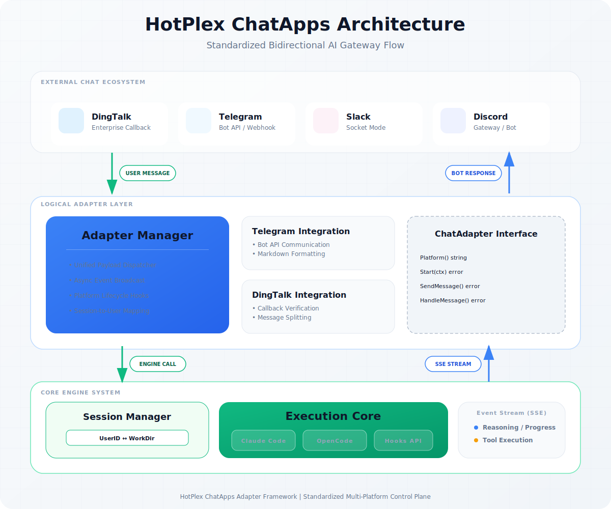

# ChatApps 接入层：架构协议与集成规范

HotPlex ChatApps 接入层是系统与外部通讯生态集成的核心协议层。它将 HotPlex 引擎的能力抽象为 **ChatApps-as-a-Service**，通过标准化的适配器模式与 **插件化消息处理流水线 (Processor Chain)** 实现不同平台（Slack, 飞书等）的无缝接入。

---

## 1. 架构概览 (System Architecture)

### 1.1 设计哲学
- **抽象解耦**：抽象统一的 `ChatAdapter` 接口，屏蔽各通讯平台 API 的巨大差异。
- **插件化流水线**：引入 `ProcessorChain`，将消息过滤、频率限制、聚合、格式转换等逻辑解耦为独立处理器。
- **状态隔离**：基于 `Platform-User-Session` 的三维隔离机制，确保多用户环境下 Agent 状态的绝对安全性。
- **流式响应**：深度适配 Agent 的流式输出，支持亚秒级的实时反馈与 UI 节流。

### 1.2 系统拓扑


### 1.3 关键组件定义

| 组件                 | 技术定位   | 核心职责                                                             |
| :------------------- | :--------- | :------------------------------------------------------------------- |
| **AdapterManager**   | 控制面中心 | 管理所有活跃适配器的生命周期，分发上行消息至引擎。                   |
| **ChatAdapter**      | 平台适配层 | 负责特定平台的协议封装（如 WebSocket Gateway vs Webhook）。          |
| **ProcessorChain**   | 逻辑流水线 | 顺序执行一系列处理器，完成从事件到平台特定消息转换的全过程。         |
| **EngineHandler**    | 事件订阅层 | 监听 Engine 事件流，生成标准化的 `ChatMessage` 并推入流水线。        |
| **Session Registry** | 状态管理器 | 维护外部平台 `UserID` 与内部 `SessionID` 及 `WorkDir` 的持久化映射。 |

---

## 2. 核心协议契约 (Protocol Contracts)

### 2.1 适配器接口规范 `ChatAdapter`
所有集成平台必须实现以下 Golang 物理接口：

```go
type ChatAdapter interface {
    Platform() string           // 返回平台全局唯一标识
    SystemPrompt() string       // 获取平台预设的系统提示词
    Start(ctx context.Context) error
    Stop() error
    
    // Message Exchange
    SendMessage(ctx context.Context, sessionID string, msg *ChatMessage) error
    HandleMessage(ctx context.Context, msg *ChatMessage) error
    SetHandler(MessageHandler)  // 设置上行消息处理器
}
```

### 2.2 统一消息模型 `ChatMessage`
```go
type ChatMessage struct {
    Type        MessageType       // 消息类型，用于渲染决策
    Platform    string            // 平台标识
    SessionID   string           // 系统生成的会话唯一 ID
    UserID      string           // 平台侧原生 UserID
    Content     string           // 标准化 Markdown 文本
    MessageID   string           // 平台消息回执 ID (用于 Reply-to 链)
    Timestamp   time.Time        // 消息生成时间
    Metadata    map[string]any   // 平台/处理器私有扩展字段
    RichContent *RichContent     // 多模态 UI 定义 (Blocks, Cards, Buttons, Reactions)
}
```

---

## 3. 消息处理流水线 (Message Processor Pipeline)

为了提供极致的交互体验并规避各平台的频率限制，消息在下行至适配器前会经过 `ProcessorChain`：

### 3.1 处理器顺序 (Processing Order)

| 处理器             | 职责           | 代表性逻辑                                                                        |
| :----------------- | :------------- | :-------------------------------------------------------------------------------- |
| **1. Filter**      | 噪音过滤       | [绝对黑洞策略] 丢弃 `raw`, `system`, `user`, `user_message_received` 等冗余事件。 |
| **2. RateLimit**   | 接入频率控制   | 确保同一会话的更新频率不超过平台阈值（如 Slack 1s/次）。                          |
| **3. ZoneOrder**   | 分区时序控制   | 强制消息按 `思考 -> 行动 -> 输出 -> 总结` 的顺序展示，防止流式输出乱序。          |
| **4. Thread**      | 线程上下文维护 | 自动关联 `thread_ts`，确保同一个 Turn 的消息聚类在一个回复链中。                  |
| **5. Aggregator**  | 智能聚合       | 将多个微小的工具调用（tool_use）聚合为一个 UI Block，避免消息刷屏。               |
| **6. RichContent** | 富文本增强     | 处理 Reaction 点赞、交互式按钮、附件图片等。                                      |
| **7. Format**      | 平台格式转换   | 将 Markdown 转换为 Slack mrkdwn 或 飞书格式。                                     |
| **8. Chunk**       | 长文本切片     | 突破平台单条消息长度限制（如 Slack 4000 字符），自动分段发送。                    |

### 3.2 区域化交互 (Zone-based Interaction)
下行消息依据 `ZoneIndex` 被划分为五个横跨会话生命周期的控制区：

- **Zone 0: Initialization (初始化区)** - 基于 `Assistant Status API` 提供即时反馈，Turn 结束或解答生成后复位。
- **Zone 1: Thinking (思维修炼区)** - 实时更新 `assistant_status`，仅在必要时通过 Context Block 展示轻量化推演。
- **Zone 2: Action (行动交互区)** - 半持久呈现 `tool_use`, `permission_request`, `danger_block`（高危审批）等，支持窗口滑动。
- **Zone 3: Output (最终展示区)** - 永久保留 `answer`, `ask_user_question`, `error` 的核心结论，支持 Native Streaming。
- **Zone 4: Summary (数据结算区)** - 作为 Turn 收尾标志的 `session_stats` 卡片，触发 UI 清理和时序复位。

---

| 平台         | 联通协议                  | 交互分级             | 架构优势                                                   |
| :----------- | :------------------------ | :------------------- | :--------------------------------------------------------- |
| **Slack**    | **Socket Mode**           | L3 (Block Kit)       | **旗舰体验**：支持流式局部更新、复杂交互组件与线程自动化。 |
| **Feishu**   | **Webhook / Callback**    | L3 (Message Card)    | **协同增强**：支持富文本消息卡片，深度集成企业工作流。     |

---

## 5. 安全架构与隔离 (Security & Isolation)

### 5.1 会话亲和性
系统通过以下公式生成全局会话 ID，确保跨平台唯一：
`UUID5(Platform + UserID + BotID + ChannelID)`

### 5.2 资源沙箱
1. **FS Chroot**：文件系统访问限制在由 `Session Registry` 分配的专用 `work_dir`。
2. **进程隔离**：每个 Session 对应独立的 Engine 实例，关键任务在隔离进程组运行。
3. **敏感审计**：所有下行消息均经过注入检测，防止敏感信息通过适配器泄漏给终端平台。

---

## 6. 事件类型映射 (Event Types)

HotPlex 定义了 21 种标准事件类型：

| 事件类型                | 渲染建议                                        |
| :---------------------- | :---------------------------------------------- |
| `session_start`         | Welcome Banner / Cold Start Info                |
| `engine_starting`       | Initialization Status Context                   |
| `thinking`              | Context Block + Loading Animation               |
| `plan_mode`             | Blockquotes / Collapsible                       |
| `tool_use`              | Code Snippet + Icon (e.g. 🛠️)                    |
| `tool_result`           | Log Container (Auto-scroll)                     |
| `permission_request`    | Header + Approve/Reject Buttons                 |
| `danger_block`          | Interactive Modal / Buttons                     |
| `command_progress`      | ProgressBar / Dynamic Context Block             |
| `command_complete`      | Success Icon + Execution Summary                |
| `step_start`            | Milestone Header (OpenCode)                     |
| `step_finish`           | Completion Milestone (OpenCode)                 |
| `answer`                | Main Message Body (Streaming)                   |
| `ask_user_question`     | Highlighted Question + Input Field              |
| `exit_plan_mode`        | Plan Summary + Confirmation Actions             |
| `error`                 | Warning Alert Block                             |
| `session_stats`         | Metadata Section (Small Text)                   |
| `user_message_received` | [绝对黑洞] 语义通过 Reaction 反馈，不再发送消息 |
| `system`                | [绝对黑洞] 内部日志，不干扰 UI                  |
| `user`                  | [绝对黑洞] 冗余反射，直接忽略                   |
| `raw`                   | [绝对黑洞] 未定义原始输出，直接忽略             |

---

## 7. 相关文档 (Reference)
- [Slack 接口映射规范](./chatapps-slack-architecture.md)
- [交互中心设计详情](./interaction-manager.md)
- [事件聚合算法规格](../engine/event-aggregation.md)
