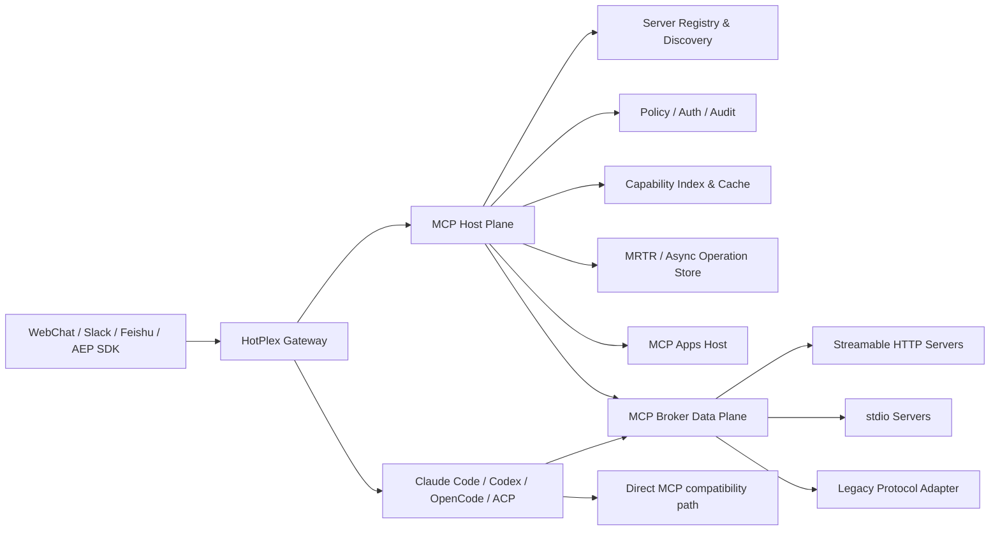

# MCP 2026 与 HotPlex 能力演进

> 文档状态：正式技术决策稿（v1.0）  
> 规范基线：MCP `2026-07-28`  
> 源码基线：HotPlex `main` @ `b1b3b610`（2026-07-29）

MCP `2026-07-28` 在 HotPlex 中的协议基线、目标架构、数据边界、建设序列、验收标准与投资决策以本稿为准。HotPlex 从 Worker 侧 MCP 配置桥接层演进为可治理、可恢复、可观测的 MCP 能力平台。

能力状态分为四类：

- **规范事实**：正式规范、Release 或稳定扩展定义的兼容性要求；
- **源码现状**：HotPlex 基线源码已经具备的能力；
- **目标架构**：本技术决策稿确定的建设边界；
- **受控实验**：未进入稳定生命周期的扩展，以 adapter 和 feature flag 隔离。

## 一、结论摘要

MCP 最新正式版本是 `2026-07-28`。GitHub Release 的发布时间是 `2026-07-28T16:47:49Z`，换算为北京时间是 2026-07-29 00:47:49。官方 Go SDK `v1.7.0` 已声明完整支持该核心协议，同时保留对 `2025-11-25` 及更早版本的兼容。

这次更新不是普通的字段增补，而是协议运行模型重构：

1. **协议级会话与初始化握手被移除**：不再使用 `Mcp-Session-Id`，也不再依赖 `initialize` / `notifications/initialized`；协议版本和客户端能力改为逐请求携带。
2. **能力发现标准化**：服务器必须实现 `server/discover`。
3. **服务器主动请求改为 MRTR**：Elicitation、旧 Sampling、旧 Roots 等需要额外输入的场景，通过 `input_required` 结果和重试原请求完成。
4. **变更通知统一为订阅流**：`subscriptions/listen` 取代独立 HTTP GET 和旧的资源订阅方法。
5. **恢复语义更明确**：SSE 不再提供协议级续传；响应流中断后，客户端必须使用新 request ID 重发请求。
6. **缓存、HTTP 路由和追踪成为一等约定**：新增 `ttlMs`、`cacheScope`、标准 MCP HTTP Headers 和 OpenTelemetry `_meta` 传播约定。
7. **扩展成为正式协商机制**：客户端和服务器通过 `extensions` 显式声明可选能力。

HotPlex 采用以下技术决策：

- 建立 **HotPlex MCP Capability Fabric**，将版本协商、发现、缓存、授权、策略、审计、任务和 UI Host 收敛到 Gateway。
- Worker 直连 MCP 的 direct mode 与 Gateway 托管的 brokered mode 长期并存，以兼容路径支撑灰度和回退。
- 核心协议基线覆盖 `server/discover`、逐请求元数据、MRTR、订阅、缓存隔离、HTTP Header 校验和 OTel 传播。
- WebChat 承载 MCP Apps；Slack 和飞书采用结构化卡片或安全链接降级，不执行第三方 iframe。
- `AsyncOperation` 是长任务内部真相源；Tasks 仅作为实验性协议 adapter，不承担平台可靠性基座。
- Skills over MCP、Interceptors、File Uploads、Triggers and Events、Primitive Grouping 与新增 Tool Annotations 保持受控实验状态，不进入核心依赖链。

## 二、版本与事实边界

### 2.1 状态基线

| 状态 | 权威来源 | 约束 |
| --- | --- | --- |
| 核心协议 | MCP 版本化正式规范、changelog、feature lifecycle | 决定 wire contract 与兼容语义 |
| 扩展 | `modelcontextprotocol` 官方组织仓库、Release、版本化扩展规范 | 按 Stable / Draft / Experimental 独立管理 |
| 孵化方向 | 官方 WG/IG charter 与 SEP 状态 | 不形成生产兼容承诺 |
| HotPlex 现状 | 基线源码和测试 | 只描述已实现能力 |
| HotPlex 目标 | 本技术决策稿的架构、数据、验收与投资决策 | 作为设计和交付边界 |

协议语义以版本化正式规范为准。官方材料存在冲突时采用更保守的生命周期分类，不以产品介绍页覆盖仓库中的稳定性声明。

### 2.2 关键工程边界

| 主题 | 工程边界 |
| --- | --- |
| Stateless | MCP 移除的是**协议级 session 和 handshake 状态**；stdio 进程仍可长期运行，`subscriptions/listen` 仍是长生命周期响应流。 |
| 断流重试 | 规范要求新 request ID 重发；非幂等或破坏性工具先进入 `unknown` / fenced 状态，禁止盲目重试。 |
| SDK 覆盖 | Go SDK `v1.7.0` 完整支持核心 `2026-07-28`；Tasks、Apps、Auth 独立协商，SDK Tier 不要求实现扩展。 |
| Tasks 生命周期 | 核心 changelog 称其为 official extension，`ext-tasks` README 仍称 Experimental / not official；HotPlex 按实验性互操作管理。 |
| Server identity | `server/discover` 是服务器自报元数据，不替代 TLS、OAuth、配置登记或管理员信任。 |
| Tool annotations | annotation 是不可信提示；授权和审批由 HotPlex 策略与调用上下文决定。 |
| Private cache | `cacheScope: private` 只表达缓存约束；缓存键仍绑定 tenant、subject、issuer、credential、scope 和配置版本。 |
| Connector 共享 | 连接只在认证、租户、进程环境和服务器状态一致时复用；stdio 和用户凭证连接默认隔离。 |
| 资源收益 | Cron 代码注释中的约 600 MB/Worker 不是 brokered mode 的收益结论；正式收益以生产基准为准。 |

## 三、MCP `2026-07-28` 核心能力

### 3.1 Sessionless 与 stateless

正式规范移除了 Streamable HTTP 的 `Mcp-Session-Id`，也移除了 `initialize` / `notifications/initialized`。每个请求通过 `_meta` 携带：

- `io.modelcontextprotocol/protocolVersion`
- `io.modelcontextprotocol/clientCapabilities`
- `io.modelcontextprotocol/clientInfo`（客户端 SHOULD 提供）

服务器在结果 `_meta` 中 SHOULD 返回 `io.modelcontextprotocol/serverInfo`。版本不兼容时返回 `UnsupportedProtocolVersionError`。

这带来三个直接影响：

1. 网关、中间代理和无状态横向扩容不再需要复制协议 session；
2. 需要跨调用保存状态的服务器，必须返回显式的 server-minted handle，并由客户端在后续工具参数中携带；
3. HotPlex 自己的 AEP Session、Worker Session、登录 Session 仍然存在，它们和 MCP 协议 session 是不同概念，不能一并删除。

server-minted handle 必须是不可猜测、可授权、可过期的业务句柄。HotPlex 的确定性 Session ID 不是 bearer secret，不能直接用作授权凭证。

### 3.2 `server/discover`

`2026-07-28` 服务器必须实现 `server/discover`，用于发布：

- 支持的协议版本；
- 核心 capabilities；
- 可选 extensions；
- 服务器身份描述。

客户端可以在首次业务请求前调用它，也可以在 stdio 场景中把它作为新旧协议探测。HotPlex 记录发现快照、协商版本、过期时间和配置 revision；服务器自报的名称或版本不参与安全身份判定。

协商顺序：

```text
连接或进程启动
  → 尝试 server/discover
  → 选择双方支持的最高版本
  → 校验 HotPlex 所需 capability / extension
  → 新协议：逐请求发送 _meta
  → 旧协议：由兼容 connector 回退 initialize
```

版本回退由通过 conformance 的官方 SDK 承担。HotPlex 只设置最大/最小版本、记录协商结果并执行平台策略。

### 3.3 `subscriptions/listen`

`subscriptions/listen` 是一个长生命周期 POST 响应流，统一承载客户端显式订阅的变化：

- `toolsListChanged`
- `promptsListChanged`
- `resourcesListChanged`
- `resourceSubscriptions`

服务器确认订阅后，用 `io.modelcontextprotocol/subscriptionId` 标记通知。请求级 `notifications/progress` 和 `notifications/message` 仍走原业务请求的响应流，而不是订阅流。

因此，HotPlex 的实现必须区分两类流：

| 流 | 生命周期 | 用途 |
| --- | --- | --- |
| 业务响应流 | 单个 request | 结果、progress、request-scoped message |
| `subscriptions/listen` | 长生命周期 | 工具、提示词、资源和任务等已订阅变化 |

订阅流断开后不假设遗漏通知可重放。HotPlex 重新建立订阅并对相关列表执行完整刷新，再恢复增量失效通知。

### 3.4 Multi Round-Trip Requests（MRTR）

新协议不再让服务器发起 `roots/list`、`sampling/createMessage` 或 `elicitation/create` 这类新的反向 JSON-RPC 请求。服务器改为返回：

```json
{
  "resultType": "input_required",
  "inputRequests": {
    "approval": {
      "method": "elicitation/create",
      "params": {}
    }
  }
}
```

客户端收集输入后，使用新的 request ID 重试原始调用，并在参数中附带 `inputResponses`。这是一种业务级多轮状态机，不是传输层续传。

所有新协议结果都必须有 `resultType`：

- `complete`：普通完成；
- `input_required`：等待额外输入。

兼容旧服务器时，如果结果没有 `resultType`，客户端必须按 `complete` 处理。

MRTR 将飞书卡片、Slack 交互和 WebChat 表单收敛为统一的 input request 模型。现有 `InteractionManager` 只在内存中保存 5 分钟待处理项，Gateway 重启后会丢失；目标架构以持久化 interaction 状态承载可靠 MRTR。

### 3.5 断流与重试语义

新规范移除了 `Last-Event-ID`、SSE event ID 和消息重投。响应流中断意味着当前 in-flight 请求结果未知，客户端必须使用新 request ID 重新发起调用。

HotPlex 在协议要求之上执行以下安全策略：

| 工具性质 | 中断后的默认动作 |
| --- | --- |
| 只读且可证明幂等 | 可以在预算内自动重试，保留原 correlation ID，生成新 MCP request ID |
| 显式幂等且带业务 idempotency key | 可以受控重试 |
| 修改、删除、发送、付款、部署等副作用调用 | 标记 outcome `unknown`，fence 后续冲突调用，查询外部状态或要求人工确认 |
| annotation 未声明或来源不可信 | 按潜在副作用处理 |

规范中的 `readOnlyHint`、`destructiveHint`、`idempotentHint` 和 `openWorldHint` 只能辅助分级，不能替代 HotPlex 管理员策略和工具专属验证器。

### 3.6 可缓存结果与确定性顺序

以下结果必须包含 `ttlMs` 和 `cacheScope`：

- `tools/list`
- `prompts/list`
- `resources/list`
- `resources/read`
- `resources/templates/list`

`ttlMs` 是 freshness hint，不是结果永远正确的保证；`cacheScope` 为 `public` 或 `private`。服务器还 SHOULD 以确定性顺序返回工具列表，以提升客户端缓存和 LLM prompt cache 命中率。

HotPlex 的缓存键至少包含：

```text
tenant + user/subject + server_config_revision + auth_issuer
+ credential_reference + granted_scopes + protocol_version
+ method + normalized_params
```

即使服务端声明 `public`，也只有管理员信任该声明且结果不含租户差异时，才允许跨主体共享。缓存失效来源包括 TTL、`subscriptions/listen`、配置热更新、凭证/Scope 变化和管理员主动 refresh。

### 3.7 标准 HTTP Headers

Streamable HTTP POST 请求新增标准头：

- `Mcp-Method`
- `Mcp-Name`
- `Mcp-Protocol-Version`
- 可选 `Mcp-Param-*`

工具 input schema 可以用 `x-mcp-header` 指示某个参数映射为 Header。Body 与 Header 不一致时应返回 `-32020 HeaderMismatch`。

这让负载均衡、WAF、审计和指标系统可以在不解析完整 JSON-RPC body 的情况下路由和观测请求。但 HotPlex 必须：

- 同时校验 body 与 header，拒绝不一致；
- 限制允许映射到 Header 的参数；
- 默认在访问日志中屏蔽 `Mcp-Param-*`，防止业务参数泄漏；
- 不根据客户端可伪造的 Header 单独做授权。

### 3.8 OpenTelemetry 传播

规范约定通过 `_meta` 传播 W3C Trace Context：

- `traceparent`
- `tracestate`
- `baggage`

HotPlex 已具备 OpenTelemetry Tracer/Meter，并会向 AEP metadata 注入 `trace_id` / `span_id`。MCP broker 边界采用以下追踪链路：

```text
AEP inbound span
  → MCP policy span
  → MCP transport span
  → upstream MCP server span
  → tool result / task / interaction span
  → AEP outbound span
```

`baggage` 只能传递经过 allowlist 的低敏感、低基数字段；用户输入、凭证、完整 Session ID 和工具参数不得进入 baggage 或 metric label。

### 3.9 Schema、授权与弃用

其他正式变化包括：

- `inputSchema` / `outputSchema` 支持任意 JSON Schema 2020-12 关键字；
- `structuredContent` 可以是任意 JSON 值；
- OAuth authorization response 中若有 `iss`，客户端必须校验 issuer；
- 持久化 client credentials 必须按 issuer 隔离，不能跨授权服务器复用；
- URL mode elicitation 移除 `elicitationId`，跨重试关联由服务器放入 `requestState`；
- Roots、Sampling、Logging、HTTP+SSE、部分 `includeContext` 值和 Dynamic Client Registration 已进入 Deprecated 生命周期。

新 connector 使用 Streamable HTTP，不采用已弃用能力；旧服务器的 HTTP+SSE 只存在于隔离的兼容适配器，并纳入移除计划。

迁移时需要逐项处理以下 wire-level 变化：

| `2025-11-25` 或更早行为 | `2026-07-28` 行为 | HotPlex 处理 |
| --- | --- | --- |
| `Mcp-Session-Id`、HTTP DELETE session | 已移除 | 新 connector 不发送；legacy adapter 隔离保留 |
| `initialize` / `notifications/initialized` | 已移除 | 新请求逐次携带版本、client info 和 capabilities |
| 独立 HTTP GET / `resources/subscribe` / `resources/unsubscribe` | 已移除 | 使用 `subscriptions/listen` |
| `ping` | 已移除 | 使用 transport health、业务探测和超时，不发送旧 RPC |
| `logging/setLevel` | 已移除 | 每请求使用 `_meta.io.modelcontextprotocol/logLevel`；未请求时服务器不得发送对应 message notification |
| `notifications/roots/list_changed` | 已移除 | 新实现不依赖 Roots；用工具参数、resource URI 或服务器配置传递范围 |
| `notifications/elicitation/complete` / URL `elicitationId` | 已移除 | MRTR 重试原请求；服务器在 `requestState` 中维护关联 |
| `Last-Event-ID` / SSE event ID | 已移除 | 新 request ID 重发；副作用调用先进入 unknown/fence |
| Dynamic Client Registration | Deprecated | 优先 Client ID Metadata Documents，旧授权服务器走兼容路径 |

## 四、扩展与孵化能力成熟度

### 4.1 状态矩阵

| 能力 | 2026-07-29 状态 | HotPlex 策略 |
| --- | --- | --- |
| MCP Apps `io.modelcontextprotocol/ui` | `2026-01-26` Stable 扩展规范 | WebChat 正式承载；其他渠道降级 |
| Enterprise-Managed Authorization | Stable auth extension | 纳入企业授权架构 |
| OAuth Client Credentials | Draft auth extension | 默认关闭，以 adapter 隔离 schema |
| Tasks `io.modelcontextprotocol/tasks` | 官方材料矛盾：core changelog 称 official extension，`ext-tasks` 仓库称 Experimental / not official | feature flag、适配层、不得作为默认任务真相源 |
| Skills over MCP | WG；SEP-2640 In Review，方向为 Resources-based extension | 内部 Skills 抽象受控预览，不公开稳定契约 |
| Interceptors | WG；SEP Draft，参考实现开发中 | 内部 policy hook 保持私有契约，不宣称协议兼容 |
| File Uploads | WG；SEP-2356 Draft | 统一为内部 AttachmentRef，不绑定 Draft wire format |
| Triggers and Events | WG；SEP Ideating | 不依赖其做可靠通知，继续使用现有渠道和轮询 |
| Primitive Grouping | IG；Active Exploration | 内部 capability index 可预留 grouping，不输出稳定 wire contract |
| 新 Tool Annotations | IG；多个 SEP Draft | 仅作风险提示，不作授权依据 |

扩展能力不属于官方 SDK Tier 的强制要求。即使 Go SDK 对核心协议达到完整支持，也必须逐项验证目标扩展的 SDK、服务器和客户端矩阵。

### 4.2 MCP Apps

MCP Apps 让工具通过 `_meta.ui.resourceUri` 引用 `ui://` 资源，Host 获取 HTML 后在 sandboxed iframe 中渲染，并通过 `postMessage` 上的 JSON-RPC 方言与应用通信。

HotPlex 场景包括：

- 交互式日志、链路和指标看板；
- 部署参数、Cron 和 Bot 配置表单；
- 审批、代码审查和批量处置工作台；
- PDF、图片、视频等富媒体查看器；
- MCP server 状态、能力和权限检查面板。

MCP Apps 不是“信任第三方 HTML”。WebChat Host 必须强制 sandbox、CSP、origin 校验、消息 schema 校验、工具 allowlist、用户确认和速率限制。摄像头、麦克风、下载、打开外链等能力默认拒绝，按 app/server/tenant 授权。

### 4.3 Tasks

Tasks 的目标模型包含：

- `taskId`；
- `working` / `input_required` / `completed` / `failed` / `cancelled`；
- `tasks/get` 轮询；
- `tasks/update` 提交中途输入；
- `tasks/cancel` 协作式取消；
- 通过 `subscriptions/listen` 订阅 `notifications/tasks`（若双方支持）。

Tasks 覆盖 CI、批处理、部署、长时间代码任务和人工审批。HotPlex 以内部稳定的 `AsyncOperation` 为真相源，通过 adapter 映射 Tasks，确保协议字段变化不穿透 AEP、数据库和前端。

### 4.4 Authorization Extensions

官方 auth 扩展仓库当前将 Enterprise-Managed Authorization 标为 Stable，将 OAuth Client Credentials 标为 Draft。

HotPlex 当前的 OAuth manager 管理的是 WebChat OIDC SSO，不是 MCP resource server 的客户端授权。两者必须分离：

- WebChat OIDC：回答“谁登录了 HotPlex”；
- MCP OAuth：回答“HotPlex 或某个用户能否访问某个 MCP Server”；
- Enterprise-Managed Authorization：由企业 IdP 和集中策略管理员工访问；
- Client Credentials：面向 Cron、Daemon、CI 等无人值守主体，目前仅 Draft。

## 五、HotPlex 能力基线

### 5.1 已由源码确认的能力

| 能力 | 当前实现 | 结论 |
| --- | --- | --- |
| MCP Server 配置 | `internal/config/config_types.go` 中 `MCPServerConfig` 仅含 `command`、`args`、`env`、`url` | 能表达 stdio/remote 入口，缺协议、认证、租户、策略和扩展配置 |
| Claude Code 注入 | `cmd/hotplex/gateway_run.go` 生成配置；`internal/worker/claudecode/worker.go` 通过临时文件传入 `--mcp-config` / `--strict-mcp-config` | MCP 生命周期主要由 Worker 管理 |
| ACP 注入 | `internal/worker/acp/worker.go` 解析并传入 `mcpServers` | 有跨 Worker 配置桥接，但不是 Gateway 原生 MCP Client |
| Codex MCP 控制 | `internal/worker/codexcli/manager.go` 具备 status、resource read、tool call、reload、OAuth login 方法；`commands.go` 暴露部分控制命令 | Worker 内能力较强，Gateway 只统一了少量控制面 |
| MCP 状态展示 | AEP `mcp_status`、`/mcp` / `$mcp`，Slack/飞书均可展示 | 统一控制面的既有入口 |
| Elicitation | AEP `ElicitationRequestData` / `ElicitationResponseData`，飞书、Slack、WebChat 可交互 | 当前模型带旧 `elicitationId`，未实现 MRTR 的 `inputRequests` / `inputResponses` |
| Interaction 管理 | `internal/messaging/interaction.go` 提供 claim / complete / release 和超时 | 只在内存中，重启不可恢复 |
| Tool 事件 | AEP `ToolCallData` / `ToolResultData` | `Output any` 可承载 JSON，但缺少 MCP `content`、`structuredContent`、resource links、UI 和 task 语义 |
| 输入可靠性 | `internal/execution` 有 payload hash、owner lease、fence 和 late convergence | 是 secret-free 输入投递账本，不保存任务结果或交互内容，不能直接充当 Tasks Store |
| Cleanup Outbox | `internal/session/cleanup_outbox.go` 有持久化租约、重试和去重 | 复用租约与重试模式，数据模型保持独立 |
| OpenTelemetry | `internal/observability` 和 Gateway forwarding 已有 span/metric 基础 | 尚无 Gateway 原生 MCP `_meta` 传播边界 |
| Tool 安全 | `internal/security/tool.go` 是静态已知工具 allowlist；另有 permission 和审计链 | 任意 MCP tool name 必须经过 namespaced policy，不自动注册为可信工具 |
| Skills | `internal/skills` 支持全局/工作区扫描、覆盖、安装和读取 | Skills over MCP 受控预览的内部数据源 |

此外，`go.mod` 当前没有官方 MCP Go SDK 依赖，说明 HotPlex Gateway 本身尚不是原生 MCP Host。

### 5.2 主要差距

```text
当前：HotPlex → 配置/控制 → Worker → MCP Server

缺少：
  统一 server registry / discover / version negotiation
  统一 capability index、TTL cache 与 subscription invalidation
  Gateway 级 OAuth、tenant isolation、tool policy 和审计闭环
  MRTR 持久化状态机
  Tasks adapter 与 durable async operation
  MCP Apps Host
  MCP structured content / resource link 的 AEP 保真传输
  MCP conformance 与真实服务器兼容矩阵
```

现有 tool audit 在收到 `tool_call` 时即记录 invocation success，尚未关联结果失败。Brokered MCP 审计完整记录 accepted、started、input_required、completed、failed、cancelled 和 unknown。

## 六、目标架构：HotPlex MCP Capability Fabric

### 6.1 总体结构



核心原则是控制面统一、数据面双路径：

- **Direct mode**：保持现有 Worker 直接连接 MCP，作为兼容和快速回退路径；
- **Brokered mode**：Worker 只连接 HotPlex 内部 MCP Broker，由 Broker 代表它访问上游服务器，统一实施发现、认证、缓存、策略、审计和追踪；
- **Native host mode**：WebChat 管理界面、诊断或平台自动化可以直接调用 Host Plane，不必伪装成某个 Worker。

### 6.2 双路径边界

不同 Worker 对 MCP 的支持版本和扩展能力并不一致。立即把所有流量切入 Broker 会同时放大协议兼容、工具命名、交互、OAuth 和性能风险。

双路径允许按 server / tenant / bot / workspace 灰度：

```yaml
worker:
  claude_code:
    mcp_servers:
      github:
        url: https://example.com
        mode: brokered       # direct | brokered
        protocol:
          min: "2025-11-25"
          max: "2026-07-28"
        auth_ref: mcp/github-prod
        policy: engineering-readwrite
        extensions:
          io.modelcontextprotocol/ui: true
          io.modelcontextprotocol/tasks: preview
```

上例属于目标 schema。现有 `command` / `args` / `env` / `url` 保持向后兼容；未配置 `mode` 时继续走 direct。

### 6.3 Connector 隔离与复用

Broker connector 的复用键至少包括：

```text
tenant + server_config_revision + transport
+ auth_issuer + credential_reference + subject + scopes
+ negotiated_protocol_version
```

复用规则：

- `2026-07-28` Streamable HTTP 可以无协议 session 地复用底层连接，但仍要按授权上下文隔离；
- stdio 进程如果携带用户环境变量、有可变进程状态或只允许单调用，不得跨用户复用；
- 旧协议连接继续由 legacy adapter 管理 `initialize` 和 session；
- server-minted handle 作为业务数据绑定 owner/tenant，不进入连接复用键，也不能泄漏给其他调用者。

工具名称采用稳定 namespace，例如 `server_name__tool_name`，同时在内部元数据中保留原始 server/tool identity。显示层使用友好名称；授权、审计和缓存使用不可歧义的规范名。

## 七、关键能力设计

### 7.1 Server Registry 与 Capability Index

新增 Gateway 级 registry，管理：

- 配置来源和 revision；
- transport、endpoint 或 stdio command；
- tenant / bot / workspace 可见范围；
- auth reference 与允许 scopes；
- min/max protocol version；
- direct / brokered mode；
- 发现快照、TTL、健康状态和 extensions；
- tool/resource/prompt policy；
- 熔断、超时、并发和重试预算。

Capability Index 以 `server/discover` 和 list endpoints 为事实来源，通过 TTL 与订阅通知更新。它服务于：

- Worker MCP 配置生成；
- WebChat 能力浏览和诊断；
- LLM 工具选择前的渐进式披露；
- 管理员策略审查；
- 缓存和 prompt cache 优化。

Primitive Grouping 仍是探索方向，因此首版索引只定义 HotPlex 内部 group/tag，不对外声称符合未来 MCP grouping extension。

### 7.2 MRTR 与统一 Interaction

内部交互模型定义为 `InteractionRequest`：

```text
id, operation_id, mcp_request_id, server_id, owner_id, tenant_id
kind, schema, request_state, status
created_at, expires_at, claimed_by, resolved_at
response_ref, error_code
```

状态机：

```text
pending → claimed → resolved
        ↘ expired
        ↘ cancelled
claimed → pending       # 投递失败释放，允许重试
```

敏感回答只在确有需要时加密持久化，凭证永不进入 interaction payload。超过阈值的输入存储为受控 resource reference；数据库仅存引用和完整性 hash。

渠道适配：

| 渠道 | MRTR 呈现 |
| --- | --- |
| WebChat | JSON Schema 表单、URL 跳转、文件选择（仅内部抽象或稳定协议） |
| 飞书 | 交互卡片；复杂 schema 降级为安全 WebChat 链接 |
| Slack | Block Kit；复杂 schema 降级为安全 WebChat 链接 |
| AEP SDK | 原样结构化事件，由客户端自行呈现 |

同一个 operation 可能经历多轮 `input_required`，不能把 interaction ID 等同于 operation ID。

### 7.3 Durable Async Operation 与 Tasks Adapter

`AsyncOperation` 使用独立 Store，不扩展 `internal/execution`。后者刻意只存 payload hash，以保护 prompt 和凭证；异步操作域负责长时间状态、输入请求、结果引用和过期策略。

内部稳定模型定义为：

```text
AsyncOperation
  operation_id
  external_task_id
  server_id / tenant_id / owner_id / session_id
  kind / status / status_message
  request_fingerprint / result_ref / error_code
  lease_owner / lease_until / attempts
  created_at / updated_at / expires_at / finished_at
```

内部状态至少支持：

```text
accepted → working → input_required → working → completed
                   ↘ failed
                   ↘ cancelled
                   ↘ unknown
```

实现时复用 `CleanupRunner` 的租约、claim、指数退避和多实例竞争设计，但使用独立 SQLite/PostgreSQL migration 和 Store 接口。

Tasks adapter 负责把实验性 `taskId`、`tasks/get`、`tasks/update`、`tasks/cancel` 映射为 `AsyncOperation`。当扩展未协商或字段变化时，内部状态机和 AEP 不受影响。

### 7.4 MCP Apps Host

WebChat 是 MCP Apps Host。独立 `MCPAppFrame` 隔离第三方 app，第三方内容不能直接访问现有 React 运行时或 Gateway cookie。

安全边界：

1. HTML 视为不可信内容，禁止 same-origin；
2. iframe sandbox 默认不包含 `allow-same-origin`、top navigation、popups 和 downloads；
3. 按 `_meta.ui.csp` 与 HotPlex 管理员 policy 求交集，而不是照单全收；
4. `postMessage` 校验 source、origin、JSON-RPC schema、大小和速率；
5. app 发起 `tools/call` 时重新经过 HotPlex auth/policy/approval，不能继承服务器声明的信任；
6. app 只能访问当前 operation 明确授权的数据；
7. 所有外链、剪贴板、摄像头、麦克风和下载单独确认；
8. 记录 app server、resource URI、tool call、用户决定和结果，不记录凭证。

Slack 和飞书收到 UI resource 时，默认生成摘要、结构化卡片或一次性 WebChat 深链，不执行 HTML。

### 7.5 Structured Content、Resources 与附件

现有 AEP `ToolResultData.Output any` 可以容纳 JSON，却不能区分 MCP 文本、图片、嵌入资源、resource link、structured content 和 UI metadata。目标结构以可选字段向后兼容扩展，不改变 `output` 语义：

```go
type MCPResultMetadata struct {
    ServerName       string
    ResultType       string
    Content          []MCPContent
    StructuredContent any
    ResourceLinks    []MCPResourceLink
    UIResourceURI    string
    OperationID      string
}
```

字段名和 JSON tag 在 AEP schema 评审中固化。任何 `pkg/events` 变更都必须同步 Go SDK、TypeScript/Python/Java 示例 SDK、AEP schema corpus、协议文档和双向兼容测试。

File Uploads 尚未稳定。HotPlex 以内部 `AttachmentRef` 隔离 Draft wire format：

```text
id, owner, tenant, media_type, size, sha256
storage_ref, expires_at, scan_status, source_channel
```

飞书、Slack、WebChat 和未来 MCP File Input 都映射到该抽象。禁止把本地绝对路径或任意 base64 直接作为跨边界默认格式；上传必须做大小、类型、恶意文件、压缩炸弹和 owner 校验。

### 7.6 OAuth 与凭证隔离

MCP Credential Broker 的凭证键为：

```text
tenant + subject + resource_server
+ authorization_server_issuer + client_id + granted_scopes
```

要求：

- 严格验证 `iss`，阻止 issuer mix-up；
- token 只存于系统钥匙串、KMS 或加密 secret store，配置和业务表只存 `auth_ref`；
- refresh token 与 client registration metadata 按 issuer 隔离；
- 不把当前 WebChat SSO token 直接转发给 MCP Server；
- Cron 使用独立 service principal；Client Credentials 扩展稳定前放在 feature flag 下；
- 企业托管授权与用户交互授权分别记录 actor、subject、tenant 和 policy source；
- 登出、撤权、scope 变化立即失效 connector 和 private cache。

### 7.7 Policy、审计与 Interceptor 预留

HotPlex 采用以下内部 policy chain：

```text
discover filter
  → argument validation
  → tenant/subject authorization
  → data classification
  → approval/MRTR
  → invocation
  → result validation/redaction
  → audit
```

每个 hook 使用稳定内部接口。Interceptors 扩展进入稳定生命周期后通过 adapter 接入；在此之前，内部 hook 不标记为 MCP Interceptor compatible。

审计事件至少覆盖：

- server discovery 与版本协商；
- capability list change；
- tool accepted / started / input_required / completed / failed / unknown；
- task/operation create、update、cancel 和 expiry；
- OAuth login、refresh、revoke 和 issuer mismatch；
- MCP App 权限请求、tool proxy 和外链；
- policy allow / deny / approval。

输入内容采取 allowlist 摘要、hash 和脱敏预览；结果默认不全文入审计库。

### 7.8 Skills over MCP 受控预览

HotPlex 复用全局和 workspace Skills 的扫描、覆盖、安装和读取能力，形成以下受控预览边界：

- 把 skill metadata 暴露为 Resources 列表；
- 把 `SKILL.md` 作为受权限保护的文本 resource；
- 用 workspace/tenant policy 控制可见性；
- 对安装包继续执行现有 zip-slip、大小和原子落盘防护；
- 不把远端 skill 自动安装到本地，不自动执行其中指令。

在 SEP-2640 接受和参考实现稳定前，不新增公开 AEP `skill/*` MCP 兼容承诺。

## 八、数据与接口边界

### 8.1 数据表

MCP 能力采用独立数据域：

| 表/Store | 主要内容 | 敏感性 |
| --- | --- | --- |
| `mcp_server_snapshots` | config revision、discover、capabilities、TTL、健康状态 | 低；服务器自报信息不得作为信任 |
| `mcp_async_operations` | 长任务状态、lease、result reference、expiry | 中；结果使用引用和最小化存储 |
| `mcp_interactions` | MRTR 请求状态、schema、owner、expiry、response reference | 高；敏感回答加密/短期保存 |
| `mcp_auth_bindings` | issuer/resource/subject/scope 到 secret ref 的映射 | 高；绝不存明文 token |
| `mcp_policy_bindings` | tenant/bot/workspace/server/tool 的 policy 引用 | 中 |

SQLite 与 PostgreSQL migration 必须成对增加，并覆盖多实例租约、条件更新、重启恢复和过期清理测试。

### 8.2 AEP 演进原则

事件演进优先使用可选字段和新的稳定 Kind，不破坏现有 `tool_call` / `tool_result` 客户端。目标事件包括：

| 目标事件 | 方向 | 用途 |
| --- | --- | --- |
| `mcp_capabilities` | S→C | 服务器、版本、tools/resources/prompts/extensions 快照 |
| `mcp_capabilities_changed` | S→C | 订阅驱动的失效提示，不承诺事件重放 |
| `operation_state` | S→C | 长操作状态和进度 |
| `interaction_request` | S→C | 统一 MRTR/approval/question 输入请求 |
| `interaction_response` | C→S | 回应单个 interaction |
| `mcp_app` | S→C | UI resource metadata；只有支持的 Host 渲染 |

具体 Kind 必须经过 AEP wire contract 评审。新增字段或事件时同步所有 SDK、示例、文档和双向协议测试。

### 8.3 管理与诊断接口

`/mcp` 与 Admin API 提供：

- server 列表、配置 revision、协商版本和 transport；
- core capability / extension 支持状态；
- discover/list cache 年龄和失效原因；
- connector 隔离键的脱敏摘要；
- subscription 状态与最后完整刷新时间；
- active operations / interactions；
- OAuth 状态但不返回 token；
- conformance/compatibility 结果；
- direct ↔ brokered 灰度切换和 rollback。

所有写操作必须经过管理员 scope 和审计，远程 URL 必须复用 HotPlex SSRF 防护。

## 九、建设序列与完成标准

### 建设阶段 0：运行时基线

交付状态：生产 Worker 与 MCP Server 的实际协商状态、资源开销和兼容性可查询、可度量。

- 新增只读 `hotplex mcp probe` 或 Admin 诊断；
- 记录 Worker 类型/版本、server endpoint、transport、协商协议、capabilities 和 extensions；
- 建立至少 Claude Code、Codex CLI、OpenCode、ACP 的真实兼容矩阵；
- 测量每 Worker MCP 内存、连接数、冷启动、list latency 和失败率；
- 不记录 tool input、token 或环境变量值。

完成标准：形成生产现场证据，不以 Worker 文档推测 `2026-07-28` 支持状态。

### 建设阶段 1：核心协议与控制面

交付状态：Gateway 具备原生 MCP Client、统一发现、版本协商、缓存和追踪能力。

- 引入官方 Go SDK `v1.7.0` 或更高的已验证稳定版本；
- 实现 registry、connector、`server/discover`、版本上限/下限；
- 新协议逐请求 `_meta`，旧协议隔离回退；
- 实现 deterministic capability index、TTL/private cache 和完整刷新；
- 接入 `_meta` Trace Context、标准 HTTP Headers 和 HeaderMismatch 校验；
- direct mode 默认不变，brokered mode 按 server 灰度。

完成标准：核心 conformance、旧版兼容、缓存隔离和 direct rollback 全部通过。

### 建设阶段 2：安全 Broker 与可观测闭环

交付状态：brokered mode 承载受控生产流量，认证、策略、审计和可观测性形成闭环。

- namespace tool identity；
- tenant/subject/scope 隔离；
- MCP Credential Broker；
- tool policy、approval、未知结果 fencing；
- tool result outcome 关联；
- subscription reconnect 后 full refresh；
- 指标、追踪、审计和熔断。

完成标准：跨租户、issuer mix-up、SSRF、Header spoof、blind retry 和日志泄密测试通过。

### 建设阶段 3：MRTR 与异步操作

交付状态：人工交互和长任务状态跨 Gateway 重启持续可用。

- 持久化 `InteractionRequest`；
- WebChat/飞书/Slack/AEP 统一 adapter；
- 独立 `AsyncOperation` Store、lease、recovery、expiry；
- MRTR 多轮重试；
- Tasks adapter 以 preview feature flag 上线；
- 轮询为默认，协商后才使用 task notifications。

完成标准：多实例竞争、重启恢复、重复响应、过期、cancel、late completion 和敏感数据留存测试通过。

### 建设阶段 4：MCP Apps 与富内容

交付状态：WebChat 原生承载互动工具 UI，Slack 和飞书具备一致的安全降级体验。

- AEP 保真传输 structured content、resources 和 UI metadata；
- sandboxed iframe Host 与 AppBridge；
- CSP/permission policy；
- Slack/飞书降级；
- resource cache、大小限制和恶意内容测试。

完成标准：跨 origin、postMessage、CSP、tool proxy 再授权、XSS 和权限降级测试通过。

### 建设阶段 5：实验扩展适配

交付状态：实验扩展与核心架构完全隔离，具备独立启停、兼容矩阵和删除路径。

- Skills over MCP 受控预览；
- 内部 policy hook 到 Interceptors adapter；
- AttachmentRef 到稳定 File Uploads adapter；
- Triggers、Grouping、Tool Annotations 仅在协议状态成熟后启用；
- 每项实验都有独立 feature flag、兼容矩阵和删除路径。

## 十、ROI 分析矩阵

### 10.1 评估口径与限制

正式财务 ROI 依赖生产环境的 Worker 并发、MCP 使用率、内存单价、人工审批耗时、故障损失和 WebChat 转化数据。建设阶段 0 完成前采用两层评估：

1. **相对 ROI**：用于比较实施顺序，不伪造金额和精确回收期；
2. **财务 ROI**：使用建设阶段 0 的现场基线计算。

短期相对 ROI 指数采用：

```text
相对 ROI = 业务价值 × 置信度 × 紧迫度
           ─────────────────────────
           实施投入 × 风险系数
```

| 维度 | 取值 | 含义 |
| --- | --- | --- |
| 业务价值 | 1–5 | 成本节约、可靠性、安全合规、用户体验和平台复用的综合价值 |
| 置信度 | 0.5 / 0.75 / 1.0 | 假设较多 / 有部分证据 / 已有规范和源码证据 |
| 紧迫度 | 1–3 | 可等待 / 应进入近期规划 / 是后续能力前置条件 |
| 实施投入 | 1–5 | 相对工程复杂度；不是人月或交付承诺 |
| 风险系数 | 1.0 / 1.25 / 1.5 | 低 / 中 / 高协议、安全或迁移风险 |

指数主要衡量**近期投入产出**。安全合规、协议底座和迁移前置能力即使指数不高，也可能是战略必需项，不能仅按分数淘汰。

### 10.2 能力投资组合矩阵

| 能力包 | 直接收益 | 主要可量化指标 | 投入 | 风险 | 置信度 | 相对 ROI | 战略价值 | 决策 |
| --- | --- | --- | --- | --- | --- | ---: | --- | --- |
| 建设阶段 0：运行时基线 | 用很小成本避免错误选型，为所有收益测算提供事实 | MCP 使用率、RSS/PSS、连接数、冷启动、错误率、人工耗时 | 1 | 低 | 1.0 | **12.0** | 高 | **立即实施** |
| 建设阶段 1：核心协议控制面 | 统一发现、版本协商、缓存和 OTel，减少重复适配 | discover 成功率、list P95、cache hit、协议兼容率 | 4 | 中 | 1.0 | **3.0** | 极高 | **优先建设** |
| Structured Content / Resources 保真传输 | 以较低改造成本改善所有渠道结果展示，为 Apps 和附件打底 | 结构化结果覆盖率、降级率、重复解析代码量 | 2 | 低 | 1.0 | **4.0** | 高 | **与建设阶段 1 并行** |
| MRTR 持久化 Interaction | 降低审批丢失和重复操作，复用现有多渠道交互优势 | 交互完成率、跨重启恢复率、平均等待时间、超时率 | 3 | 中 | 1.0 | **3.2** | 极高 | **优先建设** |
| 安全 MCP Broker | 集中认证、策略、审计、连接复用和未知结果 fencing | 每 Worker MCP 内存、重复连接、策略覆盖率、未知结果收敛率 | 5 | 高 | 0.75 | **1.5** | 极高 | **战略必需，分阶段灰度** |
| MCP Credential Broker / Enterprise Auth | 打开企业远程 MCP、Cron 和集中身份治理场景 | OAuth 成功率、凭证复用错误、企业接入周期、审计覆盖率 | 4 | 高 | 0.75 | **1.3** | 极高 | **企业场景前置** |
| MCP Apps WebChat Host | 形成互动看板、表单和审批工作台的产品差异化 | App 使用率、任务完成时长、WebChat 留存、渠道降级率 | 4 | 中 | 0.75 | **1.2** | 高 | **安全底座完成后受控上线** |
| Durable Async Operation + Tasks Adapter | 支持长任务、断线恢复和人工输入 | 长任务完成率、恢复率、轮询量、cancel 成功率 | 3 | 高 | 0.5 | **0.3** | 中高 | **内部模型先行，Tasks 仅预览** |
| Skills over MCP 受控预览 | 验证 Skill 远程发现和复用，保留生态期权 | 可发现 Skill 数、人工安装减少量、安全拒绝率 | 2 | 中 | 0.5 | **0.4** | 中 | **维持小规模预览** |
| Interceptors / File Uploads / Triggers / Grouping 等适配 | 获取未来协议期权 | SEP 稳定度、SDK 覆盖率、真实用户需求数 | 3 | 高 | 0.5 | **0.2** | 低至中 | **观察，不进入主路径** |

以上分数按 10.1 的口径计算并四舍五入。它们是方案排序工具，不是财务收益或项目 KPI。

计分参数可复核如下，其中 R 已换算为风险系数：

| 能力包 | 价值 V | 置信 C | 紧迫 U | 投入 E | 风险 R | 计算结果 |
| --- | ---: | ---: | ---: | ---: | ---: | ---: |
| 建设阶段 0：运行时基线 | 4 | 1.0 | 3 | 1 | 1.0 | 12.00 |
| 建设阶段 1：核心协议控制面 | 5 | 1.0 | 3 | 4 | 1.25 | 3.00 |
| Structured Content / Resources | 4 | 1.0 | 2 | 2 | 1.0 | 4.00 |
| MRTR 持久化 Interaction | 4 | 1.0 | 3 | 3 | 1.25 | 3.20 |
| 安全 MCP Broker | 5 | 0.75 | 3 | 5 | 1.5 | 1.50 |
| MCP Credential Broker / Enterprise Auth | 5 | 0.75 | 2 | 4 | 1.5 | 1.25 |
| MCP Apps WebChat Host | 4 | 0.75 | 2 | 4 | 1.25 | 1.20 |
| Durable Async Operation + Tasks Adapter | 3 | 0.5 | 1 | 3 | 1.5 | 0.33 |
| Skills over MCP 受控预览 | 2 | 0.5 | 1 | 2 | 1.25 | 0.40 |
| 其他实验扩展适配 | 2 | 0.5 | 1 | 3 | 1.5 | 0.22 |

### 10.3 价值—投入决策矩阵

| | 低至中投入 | 高投入 |
| --- | --- | --- |
| **高确定性价值** | 建设阶段 0、Structured Content、MRTR 持久化 | 核心协议控制面 |
| **高战略价值但依赖较多** | Enterprise Auth 的最小闭环 | 安全 MCP Broker、MCP Apps Host |
| **低确定性或协议未稳定** | Skills over MCP 受控预览 | Tasks 全量产品化、其他实验扩展 |

对应投资策略：

- **Now**：建设阶段 0、核心协议控制面、Structured Content、MRTR；
- **Next**：安全 Broker、Credential Broker，根据建设阶段 0 数据灰度；
- **Product bet**：MCP Apps，在 WebChat 真实使用场景中验证；
- **Option only**：Tasks 和其他实验扩展，以 adapter/feature flag 控制 sunk cost。

### 10.4 财务 ROI 回填模型

建设阶段 0 完成后，按以下模型计算年度收益：

```text
年度基础设施收益
  =（direct 模式单位负载资源成本 - brokered 模式单位负载资源成本）
    × 平均活跃负载 × 年运行时间

年度效率收益
  = Σ（单项节省时长_i × 年发生次数_i × 对应人员完全成本_i）

年度可靠性收益
  = 避免的重复副作用调用损失
    + 避免的交互丢失/任务失败损失
    + 减少的事故数 × 单次事故平均成本

年度产品收益
  = MCP Apps / 企业 MCP 带来的新增付费组织数
    × 单组织年度贡献毛利

年度总成本
  = 研发投入 + 新增基础设施 + 安全评审与运维 + 迁移和培训成本

财务 ROI
  =（年度总收益 - 年度总成本）/ 年度总成本

回收期（月）
  = 一次性建设成本 /（年度净收益 / 12）
```

只有年度净收益为正时，回收期才有意义；否则应记录为“当前情景不回收”，而不是输出负月份。

财务测算覆盖保守、基准、乐观三种情景，并对以下变量做敏感性分析：

| 变量变化 | ROI 影响 |
| --- | --- |
| 活跃 Worker 多、每个 Worker 重复加载相同 MCP Server | Broker 的基础设施 ROI 上升 |
| MCP 使用率低、Server 数少 | Broker 的短期 ROI 下降，可能只需控制面而不需要共享数据面 |
| 审批、Elicitation 和长任务频繁 | MRTR / Async Operation ROI 上升 |
| 主要用户在 Slack/飞书，WebChat 使用率低 | MCP Apps ROI 下降，应优先结构化卡片降级 |
| 企业远程 MCP、Cron、CI/CD 需求强 | Credential Broker 和 Auth ROI 上升 |
| Tasks 继续处于实验状态或客户端支持不足 | Tasks 产品化 ROI 下降，内部 AsyncOperation 价值不受影响 |
| 安全或合规事故成本高 | Broker、issuer 隔离和审计的风险调整收益显著上升 |

### 10.5 投资闸门

| 决策点 | 进入条件 | 不满足时的动作 |
| --- | --- | --- |
| 建设阶段 1 → Broker 灰度 | 已取得 direct 基线；至少一个高复用或高治理价值场景；隔离/回滚测试通过 | 仅保留统一控制面和 direct mode |
| Broker → 扩大生产流量 | 资源或治理指标有明确改善；错误率不劣于 direct；无跨租户泄漏 | 缩小灰度，修复 connector/policy，不强推共享 |
| MCP Apps → 产品化 | WebChat 有明确高频场景；安全测试通过；结构化降级可用 | 保持试点或仅提供普通 Web 页面 |
| Tasks → 默认启用 | 扩展状态和 SDK/客户端矩阵收敛；内部 AsyncOperation 已稳定 | 继续 feature flag + polling adapter |
| 实验扩展 → 正式路线 | SEP/扩展进入稳定状态，并有至少两个真实使用场景 | 保留内部抽象，停止扩大投入 |

每个建设阶段完成时执行 ROI 复盘。任何收益结论都必须绑定基线、样本窗口、负载和置信区间；实验室单机结果不得外推为生产年度收益。

## 十一、验证与验收矩阵

### 11.1 协议与兼容

- `2026-07-28` conformance client/server 适用用例通过；
- `server/discover` 成功、MethodNotFound、超时、错误和版本不交集均有测试；
- 新协议不发送 `Mcp-Session-Id`，不依赖 `initialize`；
- `2025-11-25` 及现网旧版本通过 legacy adapter；
- 缺失 `resultType` 的旧结果按 `complete`；
- 每个已支持 extension 都验证 client/server 双方显式协商。

### 11.2 可靠性

- 订阅断开后重新连接并 full refresh，不假设通知续传；
- 只读幂等重试生成新 request ID；
- 副作用工具中断进入 `unknown` / fenced，不自动重复执行；
- MRTR 支持至少三轮输入、重复提交、晚到响应和过期；
- operation lease 过期、多实例竞争、cancel 和 late terminal 能收敛；
- SQLite/PostgreSQL 行为一致。

### 11.3 安全

- `server/discover` 自报身份不参与授权；
- tool annotations 不能绕过 policy；
- private cache 不跨 tenant/subject/issuer/scope；
- `Mcp-Param-*` 默认脱敏，body/header mismatch 拒绝；
- OAuth `iss`、resource audience、redirect URI 和 credential binding 验证；
- App iframe、CSP、origin、postMessage、tool proxy 和权限请求全部负向测试；
- task/interaction ID 防枚举，owner 校验覆盖所有读写；
- 日志、审计、trace 和 metric label 无凭证和原始敏感输入。

### 11.4 AEP 与工程质量

- Go SDK、TypeScript/Python/Java 示例 SDK 与 AEP schema 同步；
- 新旧客户端双向 round-trip 和 unknown field 兼容；
- `go test -race` 覆盖 connector、cache、subscription、operation 和 interaction；
- Linux、macOS、Windows 三平台通过；
- `make docs-build` / `make docs-lint` 通过；
- direct mode 可一键 rollback，未配置新字段的行为不变。

## 十二、效益指标与度量口径

效益结论以生产度量为准：

| 指标 | 度量方法 |
| --- | --- |
| MCP 内存降低 | 同一组 server，比较 direct 每 Worker 与 brokered connector pool 的 RSS/PSS |
| 冷启动改善 | 记录 Worker ready、discover 完成、首次 tools/list 和首次 tool call 的 P50/P95 |
| Prompt token 降低 | 比较全量 tools list 与 capability index 渐进披露的输入 token |
| 缓存收益 | 统计 list/read hit ratio、stale refresh、subscription invalidation 和 private/public 分布 |
| 可靠性提升 | 统计 disconnect、unknown、fenced、duplicate prevented、late convergence |
| 人工交互成功率 | 统计 input_required 到 resolved 的耗时、超时、重复和跨重启恢复 |
| Apps 安全与体验 | CSP violation、被拒 tool proxy、渲染失败、渠道降级率 |

“节省约 600 MB”“显著降低延迟”或“零重复执行”等收益表述，只在建设阶段 0 和生产灰度数据支持时进入产品文档。

## 十三、技术决策

1. **建设起点**：建设阶段 0 建立运行时基线，建设阶段 1 交付 Gateway 原生 MCP 核心协议控制面。
2. **核心底座**：Brokered mode 统一认证、策略、审计、Trace Context、缓存隔离和安全重试。
3. **可靠性边界**：MRTR 持久化先于 Tasks adapter；实验协议不承担内部真相源职责。
4. **产品形态**：WebChat 是 MCP Apps Host；Slack 和飞书提供结构化降级体验。
5. **实验边界**：Skills、Interceptors、File Uploads、Triggers、Grouping 和新 annotations 只保留内部抽象与受控预览，直至扩展状态稳定。
6. **兼容策略**：Direct mode 是默认兼容路径，brokered mode 按 server/tenant 灰度，新配置保持旧行为。
7. **投资治理**：建设阶段 0 提供现场基线，Broker、Apps 和实验扩展按 ROI 闸门控制投资规模；短期分数不替代安全合规和架构前置判断。

HotPlex MCP Capability Fabric 将 Session、Worker、多渠道交互、可靠性账本、审计、OAuth 和可观测能力统一为 MCP 治理层，承载 `2026-07-28` 的无协议会话模型，并为 Apps、异步操作和扩展能力提供稳定的产品边界。

## 十四、官方来源

### 核心规范与 SDK

- [MCP `2026-07-28` Changelog](https://modelcontextprotocol.io/specification/2026-07-28/changelog)
- [MCP `2026-07-28` GitHub Release](https://github.com/modelcontextprotocol/modelcontextprotocol/releases/tag/2026-07-28)
- [MCP Deprecated Features Registry](https://modelcontextprotocol.io/specification/2026-07-28/deprecated)
- [MCP Feature Lifecycle](https://modelcontextprotocol.io/community/feature-lifecycle)
- [MCP Go SDK `v1.7.0`](https://github.com/modelcontextprotocol/go-sdk/releases/tag/v1.7.0)
- [MCP SDK Tiering System](https://modelcontextprotocol.io/community/sdk-tiers)

### 扩展

- [MCP Extensions Overview](https://modelcontextprotocol.io/extensions/overview)
- [MCP Apps Overview](https://modelcontextprotocol.io/extensions/apps/overview)
- [MCP Apps `2026-01-26` Stable Spec](https://github.com/modelcontextprotocol/ext-apps/blob/main/specification/2026-01-26/apps.mdx)
- [MCP Tasks Overview](https://modelcontextprotocol.io/extensions/tasks/overview)
- [MCP Tasks Repository](https://github.com/modelcontextprotocol/ext-tasks)
- [MCP Authorization Extensions](https://modelcontextprotocol.io/extensions/auth/overview)
- [Authorization Extensions Repository](https://github.com/modelcontextprotocol/ext-auth)

### 工作组与兴趣组

- [Skills over MCP WG](https://modelcontextprotocol.io/community/working-groups/skills-over-mcp)
- [Interceptors WG](https://modelcontextprotocol.io/community/working-groups/interceptors)
- [File Uploads WG](https://modelcontextprotocol.io/community/working-groups/file-uploads)
- [Triggers and Events WG](https://modelcontextprotocol.io/community/working-groups/triggers-events)
- [Primitive Grouping IG](https://modelcontextprotocol.io/community/interest-groups/primitive-grouping)
- [Tool Annotations IG](https://modelcontextprotocol.io/community/interest-groups/tool-annotations)
