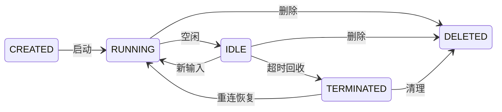

# WebSocket Gateway 对接指南

- [1. 快速上手：30 秒跑通](#1-快速上手30-秒跑通)
- [2. 核心概念](#2-核心概念)
- [3. 连接与认证](#3-连接与认证)
- [4. Init 握手详解](#4-init-握手详解)
- [5. Session 管理](#5-session-管理)
- [6. 消息收发](#6-消息收发)
- [7. 心跳保活](#7-心跳保活)
- [8. 断线重连](#8-断线重连)
- [9. 控制命令](#9-控制命令)
- [10. 用户交互](#10-用户交互)
- [11. 会话管理 REST API](#11-会话管理-rest-api)
- [12. 连接限制](#12-连接限制)
- [13. 错误码参考](#13-错误码参考)
- [14. 常见问题](#14-常见问题)
- [15. SSO 集成最佳实践](#15-sso-集成最佳实践)

---

## 1. 快速上手：30 秒跑通

```javascript
// 1. 连接
const ws = new WebSocket('ws://localhost:8888/ws');

ws.onopen = () => {
  // 2. 握手（必须作为第一帧）
  ws.send(JSON.stringify({
    version: 'aep/v1',
    id: crypto.randomUUID(),
    session_id: '', // 空字符串，自动派生
    seq: 0,
    timestamp: Date.now(),
    event: {
      type: 'init',
      data: {
        version: 'aep/v1',
        worker_type: 'claude_code',
        auth: { token: 'your-api-key' }
      }
    }
  }) + '\n');
};

ws.onmessage = (e) => {
  const msg = JSON.parse(e.data);
  const type = msg.event.type;

  if (type === 'init_ack') {
    // 3. 握手成功，可以发消息了
    console.log('Session:', msg.session_id, 'State:', msg.event.data.state);
    sendInput('你好，请介绍一下你自己');
  } else if (type === 'message.delta') {
    // 4. 流式输出（逐字到达）
    process.stdout.write(msg.event.data.content);
  } else if (type === 'message') {
    // 5. 完整回复（Turn 聚合）
    console.log('\n[完整回复]', msg.event.data.content);
  } else if (type === 'done') {
    // 6. Turn 结束，可以发下一条
    console.log('[Turn 完成]');
    // sendInput('下一个问题');
  }
};

function sendInput(text) {
  ws.send(JSON.stringify({
    version: 'aep/v1',
    id: crypto.randomUUID(),
    session_id: '', // 可选，Gateway 覆盖为权威值
    seq: 0,
    timestamp: Date.now(),
    event: {
      type: 'input',
      data: {
        content: text
      }
    }
  }) + '\n');
}
```

运行上面的代码，你就能看到 AI 的流式回复。以下是完整的工作原理。

> **官方示例**：[`quickstart.ts`](https://github.com/hrygo/hotplex/tree/main/examples/typescript-client/examples/quickstart.ts) · [`complete.ts`](https://github.com/hrygo/hotplex/tree/main/examples/typescript-client/examples/complete.ts) — 也可用 Python / Java SDK，见 `examples/` 目录。

---

## 2. 核心概念

### 2.1 通信模型

```
你的客户端  ◄──── WebSocket (全双工, NDJSON) ────►  HotPlex Gateway  ◄── stdio ──►  AI Worker
```

- **传输**：WebSocket，每条消息是一个 JSON 对象（NDJSON 格式）
- **协议**：AEP v1（Agent Event Protocol），统一信封格式
- **模式**：全双工，客户端和服务端可以同时发送消息

### 2.2 消息信封

所有消息都遵循相同的结构：

```json
{
  "version": "aep/v1",
  "id": "evt_550e8400-...",
  "session_id": "a1b2c3d4-...",
  "seq": 0,
  "timestamp": 1710000000000,
  "event": {
    "type": "input",
    "data": {
      "content": "你好"
    }
  }
}
```

| 字段         | 说明                                                   |
| ------------ | ------------------------------------------------------ |
| `version`    | 固定 `"aep/v1"`                                        |
| `id`         | 消息唯一 ID，任意 UUID 即可                            |
| `session_id` | 会话 ID（见下方 Session 章节）                         |
| `seq`        | 序列号，客户端发 `0`，Gateway 自动分配                 |
| `priority`   | 可选。`"control"` 绕过背压，`"data"`（默认）受背压约束 |
| `timestamp`  | Unix 毫秒时间戳                                        |
| `event.type` | 消息类型                                               |
| `event.data` | 消息载荷                                               |

### 2.3 一次完整对话的流程

```
客户端                            Gateway                         AI Worker
  │                                  │                               │
  │  ① WS 连接                       │                               │
  │─────────────────────────────────>│                               │
  │  ② init {auth, worker_type}      │                               │
  │─────────────────────────────────>│  创建 Session + 启动 Worker    │
  │  ③ init_ack {session_id, state}  │                               │
  │<─────────────────────────────────│                               │
  │                                  │                               │
  │  ④ input {content: "你好"}       │                               │
  │─────────────────────────────────>│  转发给 Worker ───────────────>│
  │                                  │                               │
  │  ⑤ message.start                 │                               │
  │<─ ⑥ message.delta (逐字)         │  Worker 流式输出 ◄────────────│
  │<─ ⑦ message.delta                │                               │
  │<─ ⑧ message.end                  │                               │
  │<─ ⑨ message {完整文本}            │                               │
  │<─ ⑩ done {success: true}         │                               │
  │<─────────────────────────────────│                               │
  │                                  │                               │
  │  可以继续发送下一条 input ...      │                               │
```

---

## 3. 连接与认证

### 3.1 连接端点

```
ws://<host>:<port>/ws
```

### 3.2 认证方式

#### API Key — 简单快速，适合单用户/内部服务

三种传递方式（优先级从高到低）：

1. **HTTP Header `X-API-Key`**（推荐，非浏览器客户端）：

```bash
curl -i --no-buffer \
  -H "X-API-Key: your-api-key" \
  -H "Upgrade: websocket" \
  -H "Connection: Upgrade" \
  http://localhost:8888/ws
```

2. **Query 参数 `api_key`**（简单场景）：

```
ws://localhost:8888/ws?api_key=your-api-key
```

3. **Init 信封延迟认证**（浏览器客户端，无法自定义 Header 时）：

```json
{
  "event": {
    "type": "init",
    "data": {
      "version": "aep/v1",
      "worker_type": "claude_code",
      "auth": {
        "token": "your-api-key"
      }
    }
  }
}
```

#### 多 Bot 隔离 -- Bot ID 路由

多 Bot 场景通过 `X-Bot-ID` Header 或 `bot_id` 查询参数指定 Bot 身份，实现 Bot 级别隔离：

```json
{
  "event": {
    "type": "init",
    "data": {
      "version": "aep/v1",
      "worker_type": "claude_code",
      "auth": {
        "token": "your-api-key"
      },
      "bot_id": "B12345"
    }
  }
}
```

或通过 HTTP Header 携带：

```bash
curl -i --no-buffer \
  -H "X-API-Key: your-api-key" \
  -H "X-Bot-ID: B12345" \
  -H "Upgrade: websocket" \
  -H "Connection: Upgrade" \
  http://localhost:8888/ws
```

对于需要区分用户身份的多用户场景，服务端管理员可为不同用户分配不同的 API Key。每个 API Key 对应独立的用户身份，实现用户级会话隔离（具体映射由服务端配置决定）。

> **关于 Bot ID**：`X-Bot-ID` 是可选的 session 标签，客户端可随意传递，服务端不做校验。对 WebSocket 客户端而言，Bot ID 不影响 session key 派生，也不参与 bot 配置路由（该功能仅在飞书/Slack 消息适配器中生效）。Bot ID 的唯一作用是重连时的一致性校验——重连时携带的 Bot ID 必须与 session 记录中的一致，否则拒绝连接。

#### 如何选择

| 场景              | 服务端配置                                 | 用户身份                |
| ----------------- | ------------------------------------------ | ----------------------- |
| 单用户 / 内部测试 | `api_keys` 配置一个 key                    | 全部 `api_user`（共享） |
| 多用户            | Admin UI 或 `api_key_users` 为每人创建 key | 每个 key 独立 userID    |

---

## 4. Init 握手详解

WebSocket 连接建立后，**必须在 30 秒内**发送 `init` 作为第一帧。

### 4.1 init 完整字段

```json
{
  "version": "aep/v1",
  "id": "evt_550e8400-...",
  "session_id": "sess_6ba7b810-...",
  "seq": 0,
  "timestamp": 1710000000000,
  "event": {
    "type": "init",
    "data": {
      "version": "aep/v1",
      "worker_type": "claude_code",
      "auth": {
        "token": "your-api-key",
        "bot_id": "B12345"
      },
      "config": {
        "work_dir": "/home/user/project",
        "allowed_tools": ["Bash", "Read", "Write"],
        "disallowed_tools": ["Edit"],
        "system_prompt": "...",
        "model": "claude-sonnet-4-6",
        "max_turns": 50,
        "metadata": {}
      },
      "client_caps": {
        "supports_delta": true,
        "supports_tool_call": true,
        "supported_kinds": ["message.delta", "tool_call"]
      }
    }
  }
}
```

| 字段                      | 必需 | 说明                                                |
| ------------------------- | ---- | --------------------------------------------------- |
| `version`                 | 是   | 固定 `"aep/v1"`                                     |
| `worker_type`             | 是   | Worker 类型（`claude_code`、`codex_cli`、`acp` 等） |
| `auth.token`              | 条件 | 无 API Key Header/Query 时必需                      |
| `auth.bot_id`             | 否   | 多 Bot 隔离，优先级低于 Header/Query                |
| `config.work_dir`         | 否   | 工作目录，安全校验                                  |
| `config.model`            | 否   | 模型白名单校验                                      |
| `config.allowed_tools`    | 否   | 允许的工具列表                                      |
| `config.disallowed_tools` | 否   | 禁用的工具列表                                      |
| `config.max_turns`        | 否   | 最大轮次                                            |
| `client_caps.*`           | 否   | 客户端能力声明                                      |

### 4.2 init\_ack 响应

成功时：

```json
{
  "session_id": "a1b2c3d4-e5f6-...",
  "state": "running",
  "server_caps": {
    "protocol_version": "aep/v1",
    "worker_type": "claude_code",
    "supports_resume": true,
    "supports_delta": true,
    "supports_tool_call": true,
    "supports_ping": true,
    "max_frame_size": 32768,
    "modalities": ["text", "code"]
  }
}
```

失败时：

```json
{
  "session_id": "sess_xxx",
  "error": "version mismatch",
  "code": "VERSION_MISMATCH"
}
```

| 错误码               | 原因                            |
| -------------------- | ------------------------------- |
| `VERSION_MISMATCH`   | version 不是 `aep/v1`           |
| `PROTOCOL_VIOLATION` | 第一帧不是 init                 |
| `INVALID_MESSAGE`    | JSON 格式错误或字段缺失         |
| `UNAUTHORIZED`       | 认证失败                        |
| `RATE_LIMITED`       | 握手频率过高                    |
| `CONFIG_INVALID`     | allowed_tools 或 model 校验失败 |

---

## 5. Session 管理

### 5.1 Session 是什么

Session 代表一个独立的对话上下文。每个 Session 绑定一个 Worker 进程，拥有独立的状态和对话历史。

### 5.2 Session ID 如何确定

Gateway 使用 **UUIDv5 确定性派生**，从四个维度生成唯一 ID：

```
Session ID = UUIDv5(userID | workerType | clientSessionID | workDir)
```

**clientSessionID 是什么**：你在 init 信封 `session_id` 字段传入的值。它**不是** Session ID 本身，只是派生函数的一个输入。该值会被 Gateway 持久化为 `client_key`（可通过 `GET /api/sessions` 的 `client_key` 字段取回，见 §11.1）。

### 5.3 三个关键规则

**规则 1：不传 clientSessionID → 自动获得固定会话**

```json
{
  "session_id": "",
  "event": {
    "type": "init",
    "data": {
      "version": "aep/v1",
      "worker_type": "claude_code"
    }
  }
}
```

相同的 (userID, workerType, "", workDir) → 永远同一个 Session ID。断线重连自动恢复。

**规则 2：传 clientSessionID → 多会话并行**

```javascript
// 每个浏览器 tab 生成独立 ID
const tabId = `sess_${crypto.randomUUID()}`;
// init 时传入 → 每个 tab 独立会话
```

**规则 3：重连时必须重传原始 clientSessionID**

```
首次:  init { session_id: "sess_tab-abc" }
       → 派生得到 "a1b2c3d4-..." → init_ack.session_id = "a1b2c3d4-..."

重连:  init { session_id: "sess_tab-abc" }     ← 重传同一个
       → 再次派生得到 "a1b2c3d4-..."（确定性！） → 自动恢复
```

> 如果错误地传 Gateway 返回的 `"a1b2c3d4-..."`，在 Session 被 GC 删除后，派生结果会变，导致创建全新会话、对话历史丢失。

**两个 ID 各自的用途**：

| ID                                        | 用在哪                                |
| ----------------------------------------- | ------------------------------------- |
| **clientSessionID**（你自己生成的）       | init 握手时传入，重连时重传。REST API 中以 `client_key` 字段返回（§11.1） |
| **Gateway Session ID**（init_ack 返回的） | REST API 调用（查询历史、删除会话等） |

### 5.4 Session 状态



| 状态         | 含义                  | 能发消息吗               |
| ------------ | --------------------- | ------------------------ |
| `running`    | Worker 正在执行       | 能                       |
| `idle`       | Worker 空闲，等新输入 | 能（自动切换到 running） |
| `terminated` | Worker 已终止         | 需重连恢复               |
| `deleted`    | 终态，已删除          | 不能                     |

### 5.5 会话恢复决策

init 握手时，Gateway 根据 Session 状态自动决策：

| 状态              | Gateway 行为                          |
| ----------------- | ------------------------------------- |
| Session 不存在    | 创建新会话 + 启动 Worker              |
| Worker 仍存活     | **Fast Reconnect** — 直接复用，零延迟 |
| idle / terminated | Resume — 恢复对话历史                 |
| Resume 失败       | 降级创建新会话                        |

> **GC 自动回收**：空闲超过 60 分钟的 session 会被 GC 回收（idle → terminated），最长存活 7 天（可配置）。Worker 僵死（30 分钟无 IO）也会被回收为 terminated。

### 5.6 会话隔离

Session ID 由四个维度派生，任何维度不同都会产生不同的 Session：

| 维度                | 说明                                       | 隔离效果             |
| ------------------- | ------------------------------------------ | -------------------- |
| **userID**          | API Key Resolver 映射（或默认 `api_user`） | 不同用户 -> 不同会话 |
| **workerType**      | `claude_code` 等                           | 不同引擎 → 不同会话  |
| **clientSessionID** | 客户端生成的 ID                            | 不同 tab → 不同会话  |
| **workDir**         | 工作目录                                   | 不同项目 → 不同会话  |

**多用户隔离**：使用 API Key 认证时所有用户默认都是 `api_user`，无法隔离。服务端管理员可为不同用户分配不同 API Key，实现用户级隔离：

```
Alice (key: ak-alice, resolver->userID: "alice") -> "alice|claude_code|tab-1|/project" -> Session A
Bob   (key: ak-bob,   resolver->userID: "bob")   -> "bob|claude_code|tab-1|/project"   -> Session B
```

`ListSessions` API 按 userID 过滤，每个用户只看到自己的会话。

**多 Tab 隔离**：每个 tab 生成独立的 clientSessionID：

```javascript
// 每个 tab 独立 ID
const tabId = `sess_${crypto.randomUUID()}`;
```

如果两个 tab 用相同的 clientSessionID，后加入的 tab 接管会话，先前的不再收到消息。

---

## 6. 消息收发

### 6.1 发送用户输入

```json
{
  "version": "aep/v1",
  "id": "evt_...",
  "session_id": "",
  "seq": 0,
  "timestamp": 1710000001000,
  "event": {
    "type": "input",
    "data": {
      "content": "请帮我分析这段代码"
    }
  }
}
```

> `session_id` 由 Gateway 覆盖为 init_ack 返回的 Gateway Session ID，`seq` 覆盖为 per-session 单调递增序列号——客户端填空字符串、真实 ID 或省略该字段效果完全相同。`session_id` 仅在 init 握手时有语义（参与 Session ID 派生），后续所有消息中该字段被忽略。

**限制**：Session 必须处于 Active 状态（created / running / idle），非 Active 状态下发送 input 返回 `SESSION_BUSY` 或 `SESSION_TERMINATED` 错误。

### 6.2 接收流式响应

一个完整 Turn 的事件序列（理想模型）：

```
message.start     ← 开始输出
message.delta × N ← 逐字流式（高频，可能被丢弃）
message.end       ← 结束输出
message           ← 完整文本聚合
done              ← Turn 终止符
```

> **注意**：实际事件序列因 Worker 类型而异。ClaudeCode Worker 只产出 `message.delta` + `done`；CodexCLI Worker 产出 `message.start` + `message.delta` + `message.end` + `done`。客户端应兼容处理，不依赖特定事件的出现。

#### 6.2.1 message.delta — 增量文本

```json
{
  "event": {
    "type": "message.delta",
    "data": {
      "message_id": "msg_1",
      "content": "根据"
    }
  }
}
{
  "event": {
    "type": "message.delta",
    "data": {
      "message_id": "msg_1",
      "content": "代码分析"
    }
  }
}
```

拼接所有 delta 即可获得流式效果。delta 可能因背压被丢弃，详见 §6.4。

#### 6.2.2 message — 完整文本

```json
{
  "event": {
    "type": "message",
    "data": {
      "id": "msg_1",
      "role": "assistant",
      "content": "根据代码分析，主要瓶颈在...",
      "content_type": "text",
      "metadata": {}
    }
  }
}
```

`content_type` 和 `metadata` 为可选字段。**如果 delta 被丢弃，以 message 为准。**

#### 6.2.3 done — Turn 结束

```json
{
  "event": {
    "type": "done",
    "data": {
      "success": true,
      "stats": {
        "usage": {
          "input_tokens": 1234,
          "cache_read_input_tokens": 78,
          "output_tokens": 90
        },
        "total_cost_usd": 0.012,
        "_session": {
          "turn_count": 5,
          "tool_call_count": 12,
          "duration_seconds": 754.5,
          "total_input_tok": 50000,
          "total_output_tok": 15000,
          "context_pct": 15.0,
          "total_cost_usd": 0.12,
          "model_name": "Sonnet"
        }
      }
    }
  }
}
```

收到 `done` 后可以发送下一条 input。如果期间有 delta 被丢弃，`dropped` 字段为 `true`。

> **stats 结构**：`stats` 包含两部分 —— Worker 原始统计（`usage`、`total_cost_usd` 等）和 Gateway 注入的 `_session` 累计统计。不同 Worker 类型的原始 stats 字段可能不同，但 `_session` 格式统一。

### 6.3 辅助事件

Worker 执行过程中还可能产生：

| 事件            | 说明                           | 何时出现                    |
| --------------- | ------------------------------ | --------------------------- |
| `tool_call`     | 调用工具（读文件、执行命令等） | Worker 使用工具时           |
| `tool_result`   | 工具执行结果                   | 工具完成后                  |
| `tool_update`   | 工具调用中间状态（ACP）        | ACP Worker 工具执行过程中   |
| `reasoning`     | 推理过程                       | Worker 思考时（取决于配置） |
| `step`          | 执行步骤                       | Worker 分步执行时           |
| `plan`          | 计划/TODO 更新（ACP）          | ACP Worker 更新计划时       |
| `mode_update`   | Agent 模式切换（ACP）          | ACP Worker 切换模式时       |
| `context_usage` | 上下文使用量                   | Worker 上报上下文消耗       |
| `skills_list`   | Gateway 技能列表               | `/skills` 命令响应          |
| `mcp_status`    | Worker MCP 状态                | `/mcp` 命令响应             |

### 6.4 背压与丢弃

当客户端消费速度跟不上 Worker 输出时：

| 事件类型                    | 策略                          |
| --------------------------- | ----------------------------- |
| `message.delta`             | **可丢弃** — 通道满时静默丢弃 |
| `raw`                       | **可丢弃**                    |
| 所有其他事件（含 ACP 扩展） | **保障送达** — 阻塞等待       |

保障送达的事件包括但不限于：`state`、`done`、`error`、`message`、`message.start`、`message.end`、`tool_call`、`tool_result`、`permission_request`、`question_request`、`elicitation_request`、`tool_update`、`plan`、`mode_update`、`context_usage`。

**客户端处理**：收到 `done` 时检查 `dropped` 字段，如果为 `true`，用 `message` 中的完整文本替代拼接的 delta。背压丢弃由 Gateway 静默处理，不会通知客户端具体丢弃了哪些 delta。

---

## 7. 心跳保活

| 项目             | 值                                                                |
| ---------------- | ----------------------------------------------------------------- |
| Server Ping 间隔 | 54 秒（WebSocket Ping 帧）                                        |
| Pong 超时        | 60 秒未回复计为一次 Miss                                          |
| 连续 Miss 上限   | 3 次，达到后断连（纯静默场景最坏 ~180 秒断连）                    |
| 客户端主动 Ping  | 可发 AEP `ping` 事件，Gateway 回复 `pong`（含当前 session state） |

```json
// 客户端 → Gateway
{
  "version": "aep/v1",
  "id": "evt_...",
  "session_id": "",
  "seq": 0,
  "timestamp": 1710000005000,
  "event": {
    "type": "ping",
    "data": {}
  }
}

// Gateway → 客户端（seq=0，不消耗序列号）
{
  "event": {
    "type": "pong",
    "data": {
      "state": "running"
    }
  }
}
```

---

## 8. 断线重连

### 8.1 重连步骤

1. WebSocket 断开后，等待指数退避时间（1s, 2s, 4s, 8s...最大 60s）
2. 重新建立 WebSocket 连接
3. 发送 init，**携带与首次完全相同的参数**（clientSessionID、auth、workDir）
4. Gateway 派生出相同的 Session ID → 自动恢复

### 8.2 完整重连示例

```javascript
class HotPlexClient {
  constructor(url, auth, workDir) {
    this.url = url;
    this.auth = auth;
    this.workDir = workDir;

    // clientSessionID: 持久化保存，重连时重传以恢复同一会话
    this.clientSessionId = localStorage.getItem('hp_sid')
      || `sess_${crypto.randomUUID()}`;
    localStorage.setItem('hp_sid', this.clientSessionId);

    // gatewaySessionId: init_ack 返回，用于 REST API
    this.gatewaySessionId = null;

    this.reconnectAttempts = 0;
    this.maxReconnectAttempts = 10;
  }

  connect() {
    this.ws = new WebSocket(`${this.url}/ws`);
    this.ws.onopen = () => this.sendInit();
    this.ws.onmessage = (e) => {
      const env = JSON.parse(e.data);
      if (env.event.type === 'init_ack') {
        if (env.event.data.error) { console.error('Init failed:', env.event.data.code); return; }
        this.gatewaySessionId = env.session_id;  // 保存用于 REST API
        this.reconnectAttempts = 0;
      }
      this.onMessage?.(env);
    };
    this.ws.onclose = () => this.scheduleReconnect();
  }

  sendInit() {
    this.ws.send(JSON.stringify({
      version: 'aep/v1',
      id: `evt_${crypto.randomUUID()}`,
      session_id: this.clientSessionId,  // ← 重传保存的 clientSessionID
      seq: 0, timestamp: Date.now(),
      event: { type: 'init', data: {
        version: 'aep/v1', worker_type: 'claude_code',
        auth: { token: this.auth },
        config: { work_dir: this.workDir }
      }}
    }) + '\n');
  }

  sendInput(content) {
    this.ws.send(JSON.stringify({
      version: 'aep/v1',
      id: `evt_${crypto.randomUUID()}`,
      session_id: '',
      seq: 0,
      timestamp: Date.now(),
      event: {
        type: 'input',
        data: {
          content
        }
      }
    }) + '\n');
  }

  scheduleReconnect() {
    if (this.reconnectAttempts >= this.maxReconnectAttempts) return;
    const delay = Math.min(1000 * 2 ** this.reconnectAttempts, 60000);
    this.reconnectAttempts++;
    setTimeout(() => this.connect(), delay);
  }
}
```

---

## 9. 控制命令

### 9.1 客户端发送的控制命令

通过 `control` 事件管理会话：

```json
{ "event": { "type": "control", "data": { "action": "terminate" } } }
{ "event": { "type": "control", "data": { "action": "reset" } } }
{ "event": { "type": "control", "data": { "action": "delete" } } }
{ "event": { "type": "control", "data": { "action": "gc" } } }
{
  "event": {
    "type": "control",
    "data": {
      "action": "cd",
      "details": {
        "path": "/new/dir"
      }
    }
  }
}
```

| Action      | 效果             | 说明                           |
| ----------- | ---------------- | ------------------------------ |
| `terminate` | 终止 Worker 进程 | Session 进入 terminated 状态   |
| `delete`    | 删除会话         | 直接删除，跳过 terminated 状态 |
| `reset`     | 重置上下文       | Session 重置为 running         |
| `gc`        | 回收会话资源     | 终止 Worker 并归档             |
| `cd`        | 切换工作目录     | 需带 `details.path` 参数       |

### 9.2 服务端发送的控制命令

Gateway 会主动推送以下控制命令：

| Action            | 说明                           |
| ----------------- | ------------------------------ |
| `reconnect`       | 要求客户端重连（Session 恢复） |
| `session_invalid` | Session 已失效，需重新 init    |
| `throttle`        | 请求被限流                     |

### 9.3 斜杠命令

在消息平台（飞书/Slack）中，也可在 `input.content` 中用快捷命令：

| 命令         | 效果           | 等价 Action          |
| ------------ | -------------- | -------------------- |
| `/reset`     | 重置会话上下文 | `reset`              |
| `/new`       | 重置会话上下文 | `reset`              |
| `/gc`        | 回收空闲会话   | `gc`                 |
| `/park`      | 回收空闲会话   | `gc`（等同于 `/gc`） |
| `/cd <path>` | 切换工作目录   | `cd`                 |

### 9.4 Skills 列表查询

客户端可通过 `worker_command` 向 Gateway 查询当前可用的 Skills 列表。

**发送请求**：

```json
{
  "version": "aep/v1",
  "session_id": "sess_xxx",
  "event": {
    "type": "worker_command",
    "data": {
      "command": "skills",
      "args": ""
    }
  }
}
```

`args` 可选填 skill 名称前缀进行过滤，留空返回全部。

**接收响应**：

Gateway 返回 `skills_list` 事件：

```json
{
  "version": "aep/v1",
  "session_id": "sess_xxx",
  "event": {
    "type": "skills_list",
    "data": {
      "skills": [
        { "name": "brainstorming", "description": "Collaborative design brainstorming", "source": "global" },
        { "name": "systematic-debugging", "description": "Structured bug diagnosis", "source": "project" }
      ],
      "total": 2
    }
  }
}
```

`SkillEntry` 字段说明：

| 字段          | 类型     | 说明                                    |
| ------------- | -------- | --------------------------------------- |
| `name`        | string   | Skill 名称，全局唯一标识                |
| `description` | string   | Skill 功能描述                          |
| `source`      | string   | 来源：`global`（用户级）或 `project`（项目级） |

**完成后 Gateway 自动发送 `done` 事件**，客户端应据此清除 `isRunning` 状态。

**缓存建议**：

- `name` 可作为唯一键做客户端缓存和去重
- Skills 列表变化频率低（取决于文件系统变更），建议使用 session 级或 localStorage 缓存
- 合并多次获取结果时，以 `name` 去重，保留有 `description` 的条目覆盖空描述的 stub

---

## 10. 用户交互

Worker 执行过程中可能需要用户参与。三种交互类型都遵循相同的模式：**Gateway 发送请求 → 客户端通过 input 响应**。

### 10.1 权限确认 — Worker 请求执行工具

```json
// Gateway → 客户端
{
  "event": {
    "type": "permission_request",
    "data": {
      "id": "perm_1",
      "tool_name": "Bash",
      "input_raw": "{\"command\":\"rm -rf /tmp/*\"}"
    }
  }
}

// 客户端 → Gateway（允许）
{
  "event": {
    "type": "input",
    "data": {
      "content": "yes",
      "metadata": {
        "permission_response": {
          "request_id": "perm_1",
          "allowed": true
        }
      }
    }
  }
}

// 客户端 → Gateway（拒绝）
{
  "event": {
    "type": "input",
    "data": {
      "content": "",
      "metadata": {
        "permission_response": {
          "request_id": "perm_1",
          "allowed": false,
          "reason": "不允许"
        }
      }
    }
  }
}
```

### 10.2 问答请求 — Worker 需要用户选择

```json
// Gateway → 客户端
{
  "event": {
    "type": "question_request",
    "data": {
      "id": "q_1",
      "questions": [
        {
          "question": "选择环境",
          "header": "环境",
          "options": [
            { "label": "staging", "description": "预发布" },
            { "label": "production", "description": "生产" }
          ],
          "multi_select": false
        }
      ]
    }
  }
}

// 客户端 → Gateway
{
  "event": {
    "type": "input",
    "data": {
      "content": "staging",
      "metadata": {
        "question_response": {
          "id": "q_1",
          "answers": {
            "选择环境": "staging"
          }
        }
      }
    }
  }
}
```

### 10.3 MCP 输入请求 — MCP Server 需要用户信息

```json
// Gateway → 客户端
{
  "event": {
    "type": "elicitation_request",
    "data": {
      "id": "el_1",
      "mcp_server_name": "github",
      "message": "请输入 GitHub Token"
    }
  }
}

// 客户端 → Gateway
{
  "event": {
    "type": "input",
    "data": {
      "content": "",
      "metadata": {
        "elicitation_response": {
          "id": "el_1",
          "action": "accept",
          "content": {
            "token": "ghp_xxx"
          }
        }
      }
    }
  }
}
```

**超时**：所有交互默认 5 分钟，超时后自动拒绝（auto-deny）。

---

## 11. 会话管理 REST API

所有 REST API 需要认证（`X-API-Key` Header 或同源 Cookie），且自动按认证身份过滤——用户只能访问自己的会话。

### 11.1 会话列表 — `GET /api/sessions`

返回当前用户的所有会话。适合构建会话列表 UI（侧边栏、历史记录页）。

```bash
curl -H "X-API-Key: your-key" \
  "http://localhost:8888/api/sessions?limit=20&platform=webchat"
```

**参数**：

| 参数       | 类型   | 默认      | 说明                                                  |
| ---------- | ------ | --------- | ----------------------------------------------------- |
| `limit`    | int    | 100       | 每页数量，最大 500                                     |
| `offset`   | int    | 0         | 翻页偏移                                              |
| `platform` | string | `webchat` | 按平台过滤。`webchat` / `slack` / `feishu` / `all`   |

**响应**：

```json
{
  "sessions": [
    {
      "id": "a1b2c3d4-...",
      "user_id": "u_12345",
      "worker_type": "claude_code",
      "state": "idle",
      "title": "代码审查",
      "client_key": "550e8400-e29b-41d4-a716-446655440000",
      "platform": "webchat",
      "work_dir": "/home/user/project",
      "created_at": "2026-06-03T10:00:00Z",
      "updated_at": "2026-06-03T10:05:00Z",
      "expires_at": "2026-06-10T10:00:00Z"
    }
  ],
  "limit": 20,
  "offset": 0,
  "platform": "webchat"
}
```

**关键字段说明**：

| 字段          | 说明                                                                |
| ------------- | ------------------------------------------------------------------- |
| `id`          | Session ID（init_ack 返回的权威 ID），用于历史查询、重连等          |
| `client_key`  | 客户端 init 时传入的原始 `session_id`，即 §5.2 中的 **clientSessionID**。重连时需要此值恢复同一会话 |
| `state`       | `created` / `running` / `idle` / `terminated`（见 §5.4）           |
| `title`       | 用户定义的会话名称（WebChat 传入，用于 Session Key 派生）           |
| `work_dir`    | 工作目录（影响 Session Key 派生，重连时需一致）                     |

> **`client_key` = `clientSessionID`**：这两个名称指向同一个值。你在 init 信封 `session_id` 字段传入的 clientSessionID，会被 Gateway 持久化并在本接口以 `client_key` 返回。重连时需要传回此值（见 §8 断线重连）。如果客户端丢失了本地保存的 clientSessionID，可以从本接口的 `client_key` 字段取回。

### 11.2 Turn 级别 — 聊天记录

适合展示对话列表（一句提问一句回答）。

```bash
curl -H "X-API-Key: your-key" \
  "http://localhost:8888/api/sessions/{session_id}/history?limit=50"
```

**参数**：`limit`（1-200，默认 50）、`before_id`（游标翻页，使用 turn 的 `id` 字段）

**响应**：

```json
{
  "records": [
    {
      "id": 123,
      "seq": 15,
      "role": "user",
      "content": "解释这个函数",
      "created_at": 1710000000000
    },
    {
      "id": 124,
      "seq": 28,
      "role": "assistant",
      "content": "这个函数的作用是...",
      "model": "Sonnet",
      "success": true,
      "tools": {
        "Read": 1,
        "Bash": 1
      },
      "tool_call_count": 2,
      "tokens_in": 1200,
      "tokens_out": 350,
      "duration_ms": 3200,
      "cost_usd": 0.012,
      "created_at": 1710000003000
    }
  ],
  "has_more": false
}
```

**翻页**：`has_more` 为 `true` 时，用最后一条的 `id` 请求下一页：

```bash
curl "http://localhost:8888/api/sessions/{id}/history?limit=20&before_id=123"
```

### 11.3 Event 级别 — 原始事件流

适合调试、审计、回放完整会话状态。

```bash
curl -H "X-API-Key: your-key" \
  "http://localhost:8888/api/sessions/{session_id}/events?limit=200&direction=latest"
```

**参数**：`limit`（1-1000）、`cursor`（seq 值）、`direction`（`latest` / `before` / `after`）

**响应**：

```json
{
  "events": [
    {
      "seq": 1,
      "type": "state",
      "data": { "state": "running" },
      "direction": "outbound"
    },
    {
      "seq": 2,
      "type": "input",
      "data": { "content": "你好" },
      "direction": "inbound"
    },
    {
      "seq": 3,
      "type": "message.delta",
      "data": { "content": "你好！" },
      "direction": "outbound"
    },
    {
      "seq": 42,
      "type": "done",
      "data": { "success": true },
      "direction": "outbound"
    }
  ],
  "oldest_seq": 1,
  "newest_seq": 42,
  "has_older": false
}
```

**三种翻页**：

```bash
direction=latest&cursor=0     # 初始加载：最新 N 条
direction=before&cursor=5     # 向前翻页：seq < 5
direction=after&cursor=42     # 向后追赶：seq > 42
```

### 11.4 如何选择

| 场景             | 用哪个                              |
| ---------------- | ----------------------------------- |
| 聊天界面展示对话 | `/history`                          |
| Token 用量统计   | `/history`（assistant turn 已聚合） |
| 调试/审计/回放   | `/events`                           |
| 加载更多历史     | `/history` + `before_id`            |

---

## 12. 连接限制

### 12.1 客户端相关

| 项目             | 值     | 说明                               |
| ---------------- | ------ | ---------------------------------- |
| 最大消息大小     | 32 KB  | 超过会被拒绝                       |
| Init 握手超时    | 30 秒  | 连接后必须在此时间内发送 init      |
| Pong 检测超时    | 60 秒  | 每次 Miss 的等待时间               |
| Server Ping 间隔 | 54 秒  | 服务端自动发送 Ping 帧             |
| 连续 Miss 上限   | 3 次   | 纯静默场景最坏 ~180 秒断连         |
| 交互确认超时     | 5 分钟 | 权限/问答/elicitation 超时自动拒绝 |

### 12.2 服务端配置（可能影响你的请求）

| 项目                   | 默认值 | 说明                        |
| ---------------------- | ------ | --------------------------- |
| 最大并发 Session       | 1000   | 超出返回 `GATEWAY_OVERLOAD` |
| 全局最大活跃 Worker    | 100    | 超出需等待空闲槽位          |
| 每用户最大空闲 Session | 5      | 超出触发最早 session 回收   |

---

## 13. 错误码参考

### 13.1 握手阶段

| 错误码               | 说明           | 建议                       |
| -------------------- | -------------- | -------------------------- |
| `VERSION_MISMATCH`   | 协议版本不匹配 | 检查 version 字段          |
| `PROTOCOL_VIOLATION` | 首帧非 init    | 首帧必须是 init            |
| `INVALID_MESSAGE`    | 消息格式错误   | 检查 JSON 结构和必需字段   |
| `UNAUTHORIZED`       | 认证失败       | 检查 API Key               |
| `RATE_LIMITED`       | 握手频率过高   | 退避重试                   |
| `CONFIG_INVALID`     | 配置校验失败   | 检查 allowed_tools / model |

### 13.2 会话阶段

| 错误码                | 说明           | 建议           |
| --------------------- | -------------- | -------------- |
| `SESSION_NOT_FOUND`   | Session 不存在 | 重新 init      |
| `SESSION_BUSY`        | Session 非活跃 | 等待或重连     |
| `SESSION_EXPIRED`     | 已过期         | 创建新会话     |
| `SESSION_TERMINATED`  | Session 已终止 | 重连恢复或新建 |
| `SESSION_INVALIDATED` | Session 已失效 | 重新 init      |
| `RECONNECT_REQUIRED`  | 服务端要求重连 | 执行重连       |

### 13.3 Worker 阶段

| 错误码                | 说明              | 建议               |
| --------------------- | ----------------- | ------------------ |
| `WORKER_CRASH`        | Worker 崩溃       | Gateway 自动恢复   |
| `WORKER_START_FAILED` | Worker 启动失败   | 检查 Worker 配置   |
| `WORKER_TIMEOUT`      | Worker 响应超时   | 简化任务或增加超时 |
| `WORKER_OOM`          | Worker 内存溢出   | 减少上下文长度     |
| `PROCESS_SIGKILL`     | Worker 被强制终止 | 检查系统资源       |
| `EXECUTION_TIMEOUT`   | 执行超时          | 简化任务           |
| `WORKER_OUTPUT_LIMIT` | Worker 输出超限   | 减少输出量         |
| `RESUME_RETRY`        | Resume 重试       | Gateway 自动重试   |

### 13.4 其他

| 错误码             | 说明           | 建议                   |
| ------------------ | -------------- | ---------------------- |
| `INTERNAL_ERROR`   | 服务端内部错误 | 查看日志               |
| `GATEWAY_OVERLOAD` | Gateway 过载   | 退避重试               |
| `AUTH_REQUIRED`    | 需要认证       | 提供 API Key           |
| `TURN_TIMEOUT`     | 单轮超时       | 简化任务               |
| `NOT_SUPPORTED`    | 不支持的操作   | 检查 Worker 类型兼容性 |

---

## 14. 常见问题

**多个浏览器 tab 消息串了？**
每个 tab 生成独立的 `clientSessionID`（`crypto.randomUUID()`），UUIDv5 会派生出不同的 Session ID。

**ListSessions 返回所有用户的会话？**
联系服务端管理员为你的用户分配独立 API Key。纯 API Key 认证且未做用户映射时，所有请求共享 `api_user` 身份，无法区分用户。

**重连后对话历史丢失？**
重连时必须重传与首次完全相同的参数：clientSessionID、auth token、workDir。参数不同会派生出不同的 Session ID。

**收到 `dropped: true`？**
delta 事件被背压丢弃。用 `message` 事件中的完整文本替代拼接的 delta。

**Worker 崩溃了？**
Gateway 自动处理：尝试 Resume → 失败则 Fresh Start → 通知客户端。客户端只需正常处理 `error` 事件。

**如何查看历史记录？**
Turn 级别用 `GET /api/sessions/{id}/history`，Event 级别用 `GET /api/sessions/{id}/events`。详见 §11 会话管理 REST API。

---

## 15. SSO 集成最佳实践

当你的系统使用 SSO（如 OAuth2、SAML、CAS）登录，需要集成 HotPlex 会话管理时，核心挑战是：**HotPlex 使用 API Key 认证，而 SSO 使用用户身份 token，两者需要映射**。

### 15.1 架构概览

推荐使用 **BFF（Backend For Frontend）代理模式**：你的后端持有 HotPlex API Key，前端通过 SSO session 与后端通信，后端负责 credential 注入。前端全程不接触 API Key。

```
┌─────────┐   SSO Login    ┌──────────────┐  注入 API Key   ┌──────────────────┐
│  用户    │ ────────────→ │  你的后端     │ ─────────────→ │  HotPlex Gateway  │
│ (浏览器) │ ←──────────── │  (BFF 代理)   │ ←───────────── │  (api_key_users)  │
└─────────┘  Session       └──────────────┘                 └──────────────────┘
              Cookie         持有 API Key
             (不含 API Key)   存储在 BFF DB
```

**两种方案对比**：

| 维度       | 方案 A：BFF 代理（推荐）                  | 方案 B：API Key 下发                     |
| ---------- | ------------------------------------------ | ---------------------------------------- |
| 安全性     | 前端不接触 API Key，无泄漏风险             | API Key 经过前端，存在 XSS/日志泄漏风险  |
| 复杂度     | 需要后端代理 WebSocket 和 REST             | 后端仅负责登录时下发，前端直连 Gateway   |
| WebSocket  | BFF 代理升级请求并注入凭证                 | 前端在 init 信封中传入 API Key           |
| 适用场景   | 生产环境、多用户 SSO                       | 快速原型、内部工具                       |

### 15.2 方案 A：BFF 代理模式（推荐）

#### 认证流程

1. 用户通过 SSO 登录你的系统
2. BFF 后端完成 SSO 认证后，查询本地数据库获取该用户的 HotPlex API Key
3. 若无 Key，调用 Admin API 创建并**在 BFF 本地存储原始 Key**
4. BFF 向前端下发 SSO session cookie（不含 API Key）
5. 前端所有 HotPlex 请求（WebSocket、REST）都通过 BFF 代理，BFF 负责注入 API Key

> **重要**：Admin API 的 `GET /admin/api-keys` 返回的是 **masked** Key（如 `hpk_a1b2****f6`），仅用于展示。BFF 必须在创建 Key 时缓存原始值到自己的数据库，不能依赖列表接口获取可用 Key。

#### BFF 后端示例

```python
# BFF 后端（Python Flask 示例）

@app.route("/sso/callback")
def sso_callback():
    sso_user = verify_sso_token(request.args["code"])
    user_id = f"sso_{sso_user['id']}"

    # 从 BFF 本地数据库查询已缓存的 API Key
    api_key = db.get_hotplex_key(user_id)

    if not api_key:
        # 首次登录：调用 Admin API 创建 Key
        resp = requests.post(
            "http://hotplex:8888/admin/api-keys",
            headers={"Authorization": f"Bearer {ADMIN_TOKEN}"},
            json={
                "user_id": user_id,
                "description": f"SSO: {sso_user['email']}"
                # api_key 省略，由 Gateway 自动生成 hpk_ 前缀密钥
            }
        )
        api_key = resp.json()["api_key"]  # 仅创建接口返回原始 Key
        db.save_hotplex_key(user_id, api_key)  # 缓存到 BFF 数据库

    # 下发 SSO session cookie（不含 API Key）
    response = redirect("/")
    response.set_cookie("session", create_session_token(user_id),
                        httponly=True, secure=True, samesite="Strict")
    return response
```

#### WebSocket 代理

浏览器无法在 WebSocket 升级请求中设置自定义 HTTP 头（如 `X-API-Key`），BFF 代理需通过 query param 或第一帧 init 传递凭证：

```python
# BFF 代理 WebSocket 连接（Python 示例，使用 websockets 库）

@app.route("/chat/ws")
async def chat_ws():
    user_id = verify_session(request.cookies["session"])
    api_key = db.get_hotplex_key(user_id)

    # BFF 代理：带上 API Key 连接 HotPlex Gateway
    async with websockets.connect(
        f"ws://hotplex:8888/ws?api_key={api_key}"
    ) as upstream:
        # 双向转发：浏览器 <-> BFF <-> HotPlex
        await asyncio.gather(
            relay_upstream(upstream),   # 浏览器 → HotPlex
            relay_downstream(upstream)  # HotPlex → 浏览器
        )
```

#### REST API 代理

```python
@app.route("/api/sessions")
def list_sessions():
    user_id = verify_session(request.cookies["session"])
    api_key = db.get_hotplex_key(user_id)

    # BFF 注入 API Key，代理到 HotPlex
    resp = requests.get(
        "http://hotplex:8888/api/sessions",
        headers={"X-API-Key": api_key},
        params=request.args
    )
    return resp.json()
```

### 15.3 方案 B：API Key 下发模式

此方案适用于快速集成或内部工具场景。BFF 在 SSO 登录后将 API Key 下发给前端，前端直连 HotPlex Gateway。

> **注意**：此方案中 API Key 会经过前端。仅在可信网络环境中使用，生产环境推荐方案 A。

#### SSO 登录下发

```python
@app.route("/sso/callback")
def sso_callback():
    sso_user = verify_sso_token(request.args["code"])
    user_id = f"sso_{sso_user['id']}"

    # 从 BFF 本地数据库获取缓存的 API Key（不使用列表接口）
    api_key = db.get_hotplex_key(user_id)
    if not api_key:
        resp = requests.post(
            "http://hotplex:8888/admin/api-keys",
            headers={"Authorization": f"Bearer {ADMIN_TOKEN}"},
            json={"user_id": user_id, "description": f"SSO: {sso_user['email']}"}
        )
        api_key = resp.json()["api_key"]
        db.save_hotplex_key(user_id, api_key)

    # 通过一次性接口返回 API Key（不要存入长期 Cookie）
    response = redirect("/")
    response.set_cookie("hotplex_api_key", api_key,
                        httponly=True, secure=True, samesite="Strict",
                        max_age=3600)  # 短期有效
    return response
```

#### 前端直连 Gateway

```javascript
// 前端从 HttpOnly Cookie 读取需要后端接口辅助
// 这里假设后端提供了 /api/hotplex-config 接口返回 API Key
const { api_key } = await fetch('/api/hotplex-config', {
  credentials: 'include'  // 携带 session cookie
}).then(r => r.json());

// WebSocket：通过 init 信封传递 API Key（浏览器无法设置 WS 自定义头）
const ws = new WebSocket('ws://localhost:8888/ws');
ws.onopen = () => {
  ws.send(JSON.stringify({
    version: 'aep/v1',
    id: crypto.randomUUID(),
    session_id: crypto.randomUUID(),
    seq: 0,
    timestamp: Date.now(),
    event: {
      type: 'init',
      data: {
        version: 'aep/v1',
        worker_type: 'claude_code',
        auth: { token: api_key }
      }
    }
  }) + '\n');
};

// REST API
const sessions = await fetch('/api/sessions', {
  headers: { 'X-API-Key': api_key }
});
```

#### 会话恢复

```javascript
// 获取该用户的会话列表
const { sessions } = await fetch('/api/sessions?state=idle&limit=20', {
  headers: { 'X-API-Key': api_key }
}).then(r => r.json());

// 重连时使用 client_key 恢复会话
const target = sessions[0];
ws.send(JSON.stringify({
  version: 'aep/v1',
  id: crypto.randomUUID(),
  session_id: target.client_key,  // 从列表接口获取原始 clientKey
  seq: 0,
  timestamp: Date.now(),
  event: {
    type: 'init',
    data: {
      version: 'aep/v1',
      worker_type: 'claude_code',
      auth: { token: api_key },
      config: { work_dir: target.work_dir }
    }
  }
}) + '\n');
```

### 15.4 Admin API Key 管理接口

完整的 API Key CRUD 通过 Admin API 提供（需要 Admin Token 认证）：

| 操作   | 方法   | 路径                        | 说明                                            |
| ------ | ------ | --------------------------- | ----------------------------------------------- |
| 列表   | GET    | `/admin/api-keys`           | 返回 **masked** Key，仅用于展示，不可用于认证   |
| 创建   | POST   | `/admin/api-keys`           | 返回原始 Key（唯一获取时机），建议立即缓存      |
| 查询   | GET    | `/admin/api-keys/{id}`      | 按 DB ID 查询单条，Key 为 masked                |
| 更新   | PATCH  | `/admin/api-keys/{id}`      | 更新 user_id/description，Key 创建后不可变      |
| 删除   | DELETE | `/admin/api-keys/{id}`      | 删除映射                                        |

> **创建接口的响应包含原始 API Key**，是唯一获取可用密钥的时机。`api_key` 字段可省略，Gateway 自动生成 `hpk_` 前缀的随机密钥。BFF 必须在此时将原始 Key 存入自己的数据库，后续无法从 Admin API 获取。

### 15.5 安全注意事项

1. **HTTPS/WSS**：生产环境必须启用，防止 API Key 被截获
2. **BFF 缓存 Key 的安全**：BFF 数据库中的 API Key 应加密存储，使用 KMS 或环境变量管理加密密钥
3. **Admin Token 隔离**：Admin API 的 Bearer Token 仅在 BFF 后端使用，永远不要暴露给前端
4. **user_id 隔离**：确保每个 SSO 用户映射到唯一的 `user_id`（≤128 字符），HotPlex 使用此值隔离会话空间
5. **API Key 轮换**：删除旧 Key → 创建新 Key → 更新 BFF 缓存。无需重启 Gateway
6. **WebSocket 认证限制**：浏览器无法在 WebSocket 升级请求中设置自定义 HTTP 头。对于方案 B，只能通过 init 信封的 `auth.token` 字段传递 API Key；对于方案 A，BFF 可通过 query param 或代理注入
