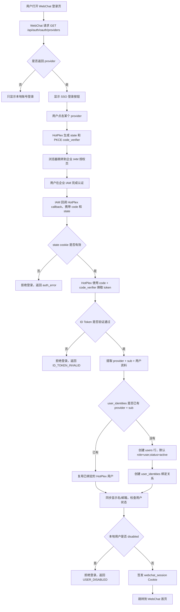

# 企业 OAuth/SSO IAM 对接指南

本文面向企业管理员、IAM 管理员和 HotPlex 运维人员，目标是让没有 HotPlex
经验的用户也能完成 WebChat 企业单点登录（SSO）对接。

HotPlex WebChat 通过标准 OpenID Connect（OIDC）接入企业 IAM/IDaaS。
认证流程采用 OAuth2 Authorization Code flow + PKCE，并验证 OIDC ID Token。
这是一种主流企业 SSO 对接方式，适用于 Keycloak、Okta、Microsoft Entra ID、
Google Workspace、Authing、TOPIAM 以及多数支持 OIDC 的企业 IAM 系统。

HotPlex 当前不直接实现 SAML 或 CAS。如果企业 IAM 只提供 SAML/CAS，请使用
IAM 产品自带的 OIDC 桥接能力，或在前面部署 Keycloak 等身份代理，将
SAML/CAS 转换为标准 OIDC 后再接入 HotPlex。

## 快速结论

完成对接需要做 3 件事：

1. 在企业 IAM 中创建一个 OIDC Web/confidential client。
2. 在 HotPlex `oauth.providers[]` 中填写 issuer、client id、client secret。
3. 打开 WebChat 登录页，确认出现 SSO 按钮并完成登录。

最小配置如下：

```yaml
oauth:
  external_url: "https://hotplex.example.com"
  providers:
    - name: "keycloak"
      display_name: "企业 SSO"
      issuer: "https://sso.example.com/realms/main"
      client_id: "${OAUTH_KEYCLOAK_CLIENT_ID}"
      client_secret: "${OAUTH_KEYCLOAK_CLIENT_SECRET}"
      scopes: ["openid", "profile", "email"]
```

其中 `oauth.external_url` 应填写用户浏览器访问 HotPlex 的公网地址。

## 概念说明

| 名称 | 说明 |
|------|------|
| IAM / IDaaS | 企业身份系统，例如 Keycloak、Okta、Microsoft Entra ID、Authing、TOPIAM |
| OIDC | OpenID Connect，在 OAuth2 基础上增加身份层，HotPlex 使用它确认用户身份 |
| issuer | IAM 的 OIDC 发行方地址，HotPlex 会通过它发现授权端点、token 端点、JWKS 端点 |
| client_id | IAM 中为 HotPlex 创建的应用 ID |
| client_secret | IAM 中为 HotPlex 创建的应用密钥 |
| Redirect URI | IAM 登录完成后跳回 HotPlex 的回调地址 |
| ID Token | IAM 返回的身份令牌，HotPlex 会验证签名、issuer、audience 和过期时间 |
| UserInfo | OIDC 用户信息端点；当 ID Token 不包含显示名或邮箱时，HotPlex 会用它补齐资料 |
| subject / `sub` | IAM 中用户的稳定唯一标识，HotPlex 使用它绑定本地用户 |

## 对接能力要求

企业 IAM provider 必须具备以下能力：

| 能力 | 要求 |
|------|------|
| Discovery | 在 issuer 下提供 `/.well-known/openid-configuration` |
| 授权流程 | Authorization Code flow |
| 客户端类型 | Web / confidential client，提供 `client_id` 和 `client_secret` |
| PKCE | 支持 S256 code challenge |
| Token | token endpoint 返回 `id_token` |
| 签名密钥 | 提供 JWKS endpoint，用于验证 ID Token 签名 |
| Claims | 提供稳定的 `sub`；可选 `preferred_username`、`name`、`email`，可位于 ID Token 或 UserInfo |

如果 IAM 文档中写着“OpenID Connect”、“OIDC”、“Authorization Code”、
“JWKS”、“ID Token”，通常就可以直接对接。

## 登录与建号流程

下面的流程图展示用户从点击 SSO 按钮，到 HotPlex 自动查找或创建本地用户的完整链路：



## 用户创建与绑定规则

HotPlex 不会直接把 IAM 用户写进已有密码账号，而是通过 `user_identities`
表维护 SSO 身份与本地用户的绑定关系。

### 首次 IAM 登录

当某个 IAM 用户第一次通过 SSO 登录：

1. HotPlex 验证 ID Token。
2. HotPlex 读取 `provider` 和 ID Token 的 `sub`。
3. HotPlex 查询 `user_identities` 中是否存在 `(provider, sub)`。
4. 如果不存在，HotPlex 创建一个新的本地 `users` 行：
   - `username` 为 `{provider}:{sub}`。
   - `password_hash` 为空，表示该账号只能通过 SSO 登录，不能使用密码登录。
   - `role` 默认为 `user`。
   - `status` 默认为 `active`。
5. HotPlex 创建一条 `user_identities` 记录，绑定 IAM 身份和本地用户。
6. HotPlex 签发 WebChat 登录 Cookie。

### 后续 IAM 登录

同一个 IAM 用户再次登录时：

1. HotPlex 仍然验证 ID Token。
2. 通过 `(provider, sub)` 找到已有 `user_identities`。
3. 复用对应的本地 `users.id`。
4. 如果 IAM 返回的显示名或邮箱变化，HotPlex 会同步更新 `user_identities`
   中的显示名和邮箱。
5. 如果本地用户已被管理员禁用，登录会被拒绝。

### 不自动按邮箱合并

HotPlex **不会**因为 IAM 用户邮箱与某个本地密码账号邮箱相同而自动合并账号。
原因是邮箱可能可变、可能被复用，也可能在跨租户场景中并不具备唯一性。

实际行为如下：

| 场景 | HotPlex 行为 |
|------|--------------|
| 同一 provider、同一 `sub` 再次登录 | 复用同一个 HotPlex 用户 |
| 同一邮箱但不同 provider | 创建不同 HotPlex 用户 |
| 同一邮箱但没有相同 `(provider, sub)` 绑定 | 不自动合并 |
| 管理员禁用本地用户 | SSO 认证成功后仍拒绝登录 |

如果企业需要把既有密码账号和 SSO 账号合并，应通过后续的人工绑定/迁移流程处理，
不要依赖自动邮箱合并。

## 第一步：确认 IAM 的 issuer

先找到 IAM 的 OIDC issuer 地址。issuer 必须能访问 discovery 文档：

```text
https://sso.example.com/realms/main/.well-known/openid-configuration
```

浏览器或命令行访问后，应能看到类似字段：

```json
{
  "issuer": "https://sso.example.com/realms/main",
  "authorization_endpoint": "https://sso.example.com/realms/main/protocol/openid-connect/auth",
  "token_endpoint": "https://sso.example.com/realms/main/protocol/openid-connect/token",
  "jwks_uri": "https://sso.example.com/realms/main/protocol/openid-connect/certs"
}
```

HotPlex 配置里的 `issuer` 必须与 discovery 文档里的 `issuer` 完全一致。
如果 IAM 有多个租户、realm 或组织空间，不同空间通常有不同 issuer。

## 第二步：在 IAM 中创建 OIDC 应用

在 IAM 管理控制台中新建应用，类型选择 Web、OIDC 或 confidential client。

推荐设置：

| 设置项 | 建议值 |
|--------|--------|
| 应用类型 | Web / confidential client |
| Grant type | Authorization Code |
| PKCE | Required 或 Allowed，method 为 `S256` |
| Redirect URI | HotPlex callback URI |
| Scopes | `openid profile email` |
| Client authentication | 开启，使用 `client_secret` |
| Front-channel logout | 不需要 |
| Refresh tokens | 不需要 |

如果 IAM 要求填写回调地址，格式如下：

```text
https://hotplex.example.com/api/auth/oauth/<provider-name>/callback
```

示例：

```text
https://hotplex.example.com/api/auth/oauth/keycloak/callback
https://hotplex.example.com/api/auth/oauth/entra/callback
https://hotplex.example.com/api/auth/oauth/google/callback
```

`<provider-name>` 必须等于 HotPlex 配置中的 `oauth.providers[].name`。

## 第三步：配置 HotPlex

推荐在 YAML 中保留非敏感配置，敏感字段用环境变量注入。

```yaml
oauth:
  external_url: "https://hotplex.example.com"
  providers:
    - name: "keycloak"
      display_name: "企业 SSO"
      issuer: "https://sso.example.com/realms/main"
      client_id: "${OAUTH_KEYCLOAK_CLIENT_ID}"
      client_secret: "${OAUTH_KEYCLOAK_CLIENT_SECRET}"
      scopes: ["openid", "profile", "email"]
```

字段说明：

| 字段 | 必填 | 说明 |
|------|------|------|
| `external_url` | 推荐 | 用户访问 HotPlex 的公网地址，用于构造 OAuth callback URL |
| `providers[].name` | 是 | provider 唯一标识，只允许小写字母、数字和 `-` |
| `providers[].display_name` | 否 | 登录页按钮显示名称，未设置时使用 `name` |
| `providers[].issuer` | 是 | IAM OIDC issuer |
| `providers[].client_id` | 是 | IAM 中创建的 client id |
| `providers[].client_secret` | 是 | IAM 中创建的 client secret |
| `providers[].scopes` | 否 | 默认 `["openid","profile"]`，建议加上 `email` |
| `providers[].username_claim` | 否 | 用户名 claim，默认 `preferred_username` |
| `providers[].display_name_claim` | 否 | 显示名 claim，默认 `name` |
| `providers[].email_claim` | 否 | 邮箱 claim，默认 `email` |

### 关于 `external_url`

如果 HotPlex 直接对外暴露，`external_url` 填写浏览器访问地址即可。

如果 HotPlex 在反向代理之后，`external_url` 应填写代理后的公网地址，而不是
Gateway 内网监听地址。例如 Gateway 监听 `http://127.0.0.1:8888`，用户访问
`https://hotplex.example.com`，则应配置：

```yaml
oauth:
  external_url: "https://hotplex.example.com"
```

如果不配置 `external_url`，HotPlex 会从 `Forwarded`、`X-Forwarded-Proto`、
`X-Forwarded-Host`、`Host` 推导公网地址。生产环境仍建议显式配置，减少代理头
配置错误带来的排障成本。

### 关于密钥环境变量

`client_secret` 支持 `${ENV_VAR}` 和 `${ENV_VAR:-default}` 展开。

示例：

```bash
export OAUTH_KEYCLOAK_CLIENT_ID="hotplex-webchat"
export OAUTH_KEYCLOAK_CLIENT_SECRET="replace-with-real-secret"
```

生产环境建议由系统服务、容器编排平台或 secret manager 注入这些环境变量，不要
把真实密钥提交到仓库。

## 第四步：配置 Claim 映射

默认情况下，HotPlex 读取以下 OIDC claims：

| HotPlex 字段 | 默认 claim | 缺失时行为 |
|--------------|------------|------------|
| 用户名 | `preferred_username` | 回退到 `sub` |
| 显示名 | `name` | 可以为空 |
| 邮箱 | `email` | 可以为空 |

如果企业 IAM 使用不同字段名，例如 `uid`、`displayName`、`mail`，可以这样配置：

```yaml
oauth:
  providers:
    - name: "iam"
      display_name: "企业 IAM"
      issuer: "https://iam.example.com"
      client_id: "${OAUTH_IAM_CLIENT_ID}"
      client_secret: "${OAUTH_IAM_CLIENT_SECRET}"
      username_claim: "uid"
      display_name_claim: "displayName"
      email_claim: "mail"
```

HotPlex 会先从 ID Token 中读取这些 claims。如果 ID Token 里缺少用户名、显示名
或邮箱，HotPlex 会调用 OIDC UserInfo endpoint 补齐资料，并校验 UserInfo 的
`sub` 与 ID Token 的 `sub` 一致。

## 多 Provider 配置

可以同时配置多个企业 IAM provider。WebChat 登录页会为每个 provider 渲染一个
SSO 登录按钮：

```yaml
oauth:
  external_url: "https://hotplex.example.com"
  providers:
    - name: "entra"
      display_name: "Microsoft Entra ID"
      issuer: "https://login.microsoftonline.com/<tenant-id>/v2.0"
      client_id: "${OAUTH_ENTRA_CLIENT_ID}"
      client_secret: "${OAUTH_ENTRA_CLIENT_SECRET}"
      scopes: ["openid", "profile", "email"]
    - name: "google"
      display_name: "Google Workspace"
      issuer: "https://accounts.google.com"
      client_id: "${OAUTH_GOOGLE_CLIENT_ID}"
      client_secret: "${OAUTH_GOOGLE_CLIENT_SECRET}"
      scopes: ["openid", "profile", "email"]
```

每个 provider 都需要在对应 IAM 中注册自己的 callback URI。例如：

```text
https://hotplex.example.com/api/auth/oauth/entra/callback
https://hotplex.example.com/api/auth/oauth/google/callback
```

OAuth 配置支持运行时热重载。新增、移除或轮换 provider 不需要重启 Gateway。
如果用户正在进行 SSO 登录，而该 provider 在过程中被修改，建议重新发起登录。

## 常见 IAM 示例

### Keycloak

| 项目 | 示例 |
|------|------|
| Issuer | `https://sso.example.com/realms/main` |
| Redirect URI | `https://hotplex.example.com/api/auth/oauth/keycloak/callback` |
| Client type | Confidential |
| Valid redirect URIs | 填写完整 callback URI |
| Scopes | `openid profile email` |

HotPlex 示例：

```yaml
oauth:
  external_url: "https://hotplex.example.com"
  providers:
    - name: "keycloak"
      display_name: "企业 SSO"
      issuer: "https://sso.example.com/realms/main"
      client_id: "${OAUTH_KEYCLOAK_CLIENT_ID}"
      client_secret: "${OAUTH_KEYCLOAK_CLIENT_SECRET}"
      scopes: ["openid", "profile", "email"]
```

### Microsoft Entra ID

| 项目 | 示例 |
|------|------|
| Issuer | `https://login.microsoftonline.com/<tenant-id>/v2.0` |
| Redirect URI | `https://hotplex.example.com/api/auth/oauth/entra/callback` |
| Application type | Web |
| Scopes | `openid profile email` |

HotPlex 示例：

```yaml
oauth:
  external_url: "https://hotplex.example.com"
  providers:
    - name: "entra"
      display_name: "Microsoft Entra ID"
      issuer: "https://login.microsoftonline.com/<tenant-id>/v2.0"
      client_id: "${OAUTH_ENTRA_CLIENT_ID}"
      client_secret: "${OAUTH_ENTRA_CLIENT_SECRET}"
      scopes: ["openid", "profile", "email"]
```

### Google Workspace

| 项目 | 示例 |
|------|------|
| Issuer | `https://accounts.google.com` |
| Redirect URI | `https://hotplex.example.com/api/auth/oauth/google/callback` |
| Application type | Web application |
| Scopes | `openid profile email` |

HotPlex 示例：

```yaml
oauth:
  external_url: "https://hotplex.example.com"
  providers:
    - name: "google"
      display_name: "Google Workspace"
      issuer: "https://accounts.google.com"
      client_id: "${OAUTH_GOOGLE_CLIENT_ID}"
      client_secret: "${OAUTH_GOOGLE_CLIENT_SECRET}"
      scopes: ["openid", "profile", "email"]
```

## 验证方式

### 1. 验证 provider discovery

修改配置后，访问：

```text
https://hotplex.example.com/api/auth/oauth/providers
```

期望响应：

```json
{
  "providers": [
    { "name": "keycloak", "display_name": "企业 SSO" }
  ]
}
```

如果返回 `{"providers":[]}`，说明 HotPlex 没有加载到可用 provider。检查：

- `oauth.providers[]` 是否配置。
- `client_secret` 环境变量是否真的注入到 Gateway 进程。
- issuer 是否可以从 Gateway 所在机器访问。
- Gateway 日志中是否有 `oauth config validation failed` 或 discovery 失败。

### 2. 验证登录页按钮

打开：

```text
https://hotplex.example.com/login
```

确认页面出现 SSO 按钮，按钮文案来自 `display_name`。

### 3. 验证 IAM 跳转

点击 SSO 按钮后，浏览器应跳转到 IAM 的 authorization endpoint。
检查 URL 中是否包含：

| 参数 | 期望 |
|------|------|
| `client_id` | IAM 中创建的 HotPlex client id |
| `redirect_uri` | IAM 中登记的 HotPlex callback URI |
| `scope` | 至少包含 `openid` |
| `state` | 非空随机字符串 |
| `code_challenge` | 非空 |
| `code_challenge_method` | `S256` |

### 4. 验证首次登录建号

用户在 IAM 完成认证并回到 HotPlex 后：

1. 浏览器会跳转到 WebChat 首页。
2. HotPlex 会签发 `webchat_session` Cookie。
3. 如果这是该 IAM 用户首次登录，HotPlex 会创建本地用户和
   `user_identities` 绑定关系。
4. 后续同一 IAM 用户再次登录会复用同一个本地用户。

## 故障排查

| 现象 | 常见原因 | 处理方式 |
|------|----------|----------|
| 登录页没有 SSO 按钮 | `/api/auth/oauth/providers` 返回空列表 | 检查 `oauth.providers[]`、环境变量、issuer discovery 和 Gateway 日志 |
| IAM 提示 redirect URI 不匹配 | IAM 中登记的 callback 与 HotPlex 实际生成的不一致 | 设置 `oauth.external_url`，并确认 provider name 与 callback 路径一致 |
| `STATE_EXPIRED` | 用户在 IAM 登录页停留超过 5 分钟 | 重新从 HotPlex 登录页发起 SSO |
| `CSRF_DETECTED` | 浏览器没有带回 `oauth_state` cookie，或 state 被篡改 | 确认浏览器允许 Cookie，确认回调域名与发起登录域名一致 |
| `CODE_EXCHANGE_FAILED` | client secret 错误、redirect URI 不一致、grant type 未开启、PKCE 策略不匹配 | 对照 IAM client 配置逐项检查 |
| `ID_TOKEN_INVALID` | issuer、audience/client ID、JWKS 或服务器时间不正确 | 检查 issuer 是否完全一致，检查系统时间同步 |
| 登录成功后显示名或邮箱为空 | IAM 没有在 ID Token/UserInfo 返回对应 claim | 添加 `profile` / `email` scope，或配置 `display_name_claim` / `email_claim` |
| 本地用户被拒绝登录 | HotPlex 本地用户状态为 disabled | 管理员在 HotPlex 中恢复用户状态 |

## 安全建议

- 生产环境必须使用 HTTPS。
- `oauth.external_url` 应使用公网 HTTPS 地址。
- `client_secret` 应通过环境变量或 secret manager 注入。
- IAM client 只配置必要 redirect URI，不要使用宽泛通配符。
- 保留 `openid` scope；如需显示名和邮箱，增加 `profile`、`email`。
- 不要依赖邮箱自动合并账号，使用 `(provider, sub)` 作为身份绑定依据。
- 如果反向代理会改写 Host 或协议头，优先显式配置 `oauth.external_url`。

## 对接检查清单

| 检查项 | 完成 |
|--------|------|
| IAM 支持 OIDC discovery | ☐ |
| 已创建 Web/confidential client | ☐ |
| 已启用 Authorization Code flow | ☐ |
| 已启用或允许 PKCE S256 | ☐ |
| 已登记 HotPlex callback URI | ☐ |
| 已取得 client id 和 client secret | ☐ |
| HotPlex 已配置 `oauth.external_url` | ☐ |
| HotPlex 已配置 `oauth.providers[]` | ☐ |
| `GET /api/auth/oauth/providers` 返回 provider | ☐ |
| 登录页出现 SSO 按钮 | ☐ |
| 首次 IAM 登录可自动创建 HotPlex 用户 | ☐ |
| 二次 IAM 登录复用同一 HotPlex 用户 | ☐ |
