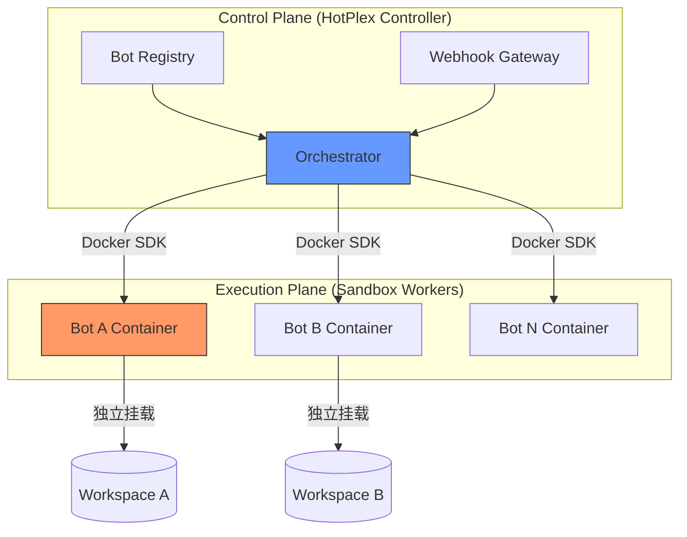

# HotPlex: "Bot-as-a-Container" (BaaC) Native Architecture Plan

> **Revision**: 3.0 | **Date**: 2026-03-06 | **Theme**: Zero-Config, Native Sandbox, Developer Friendly

## 1. 核心痛点与架构演进 (Motivation)

目前 HotPlex 采用的是 **进程级多租户模式 (Process-based Multi-tenancy)**。虽然在 Docker 内运行，但所有 Bot 共享同一个容器环境，安全依赖复杂的内核特性（Landlock/Cgroups）且配置繁琐。

**新目标**：将隔离级别从“代码硬编码”提升为“架构原生支持”，实现 **容器级多租户 (Container-based Multi-tenancy)**。

---

## 2. 核心架构：HotPlex 控制面与执行面分离

我们将架构拆分为两个独立的部分，实现真正的“即插即用、沙箱即服务”。

### 2.1 逻辑架构图



---

## 3. "Zero-Config" 开发者友好特性

### 3.1 声明式机器人配置 (Declarative Bots)
不再需要在 `main.go` 中手动 `RegisterAdapter`。只需一个 `bots.yaml`：

```yaml
# bot-registry.yaml
bots:
  - name: "research-bot"
    platform: "slack"
    secret_env: "SLACK_SECRET_A"
    sandbox:
      image: "hrygo/hotplex-worker:latest" # 自定义环境
      workdir: "/projects/research"
      cpu: 0.5
      memory: "1GB"

  - name: "autofix-bot"
    platform: "telegram"
    sandbox:
      image: "node:20-alpine" # 也可以使用普通镜像
```

### 3.2 动态沙箱编排 (Dynamic Sandboxing)
`hotplexd` 运行时不再直接调用 `exec.Command`。
- **底层机制**: 控制面通过 **Docker SDK for Go** 直接在同一 Docker Host（或通过 Socket 连接）为每个 Bot 实例启动一个兄弟容器。
- **优点**: 
    - **天然隔离**: 文件系统、网络空间、环境变量完全分属于不同容器。不需要在代码里写复杂的安全规则。
    - **资源可控**: 直接利用 Docker 原生的 `--cpus` 和 `--memory`。
    - **无环境冲突**: Bot A 可以用 Node 16，Bot B 可以用 Python 3.11。

---

## 4. 架构优势对比 (ROI Analysis)

| 维度           | 旧架构 (V2 - 进程隔离)    | 新架构 (V3 - BaaC 容器隔离) | 开发者收益                               |
| :------------- | :------------------------ | :-------------------------- | :--------------------------------------- |
| **安全性**     | 逻辑隔离 (WAF/Landlock)   | **物理隔离 (Container)**    | 内核级 Namespaces 隔离强度远超 Regex。   |
| **配置复杂度** | 高 (需逐一配置路径白名单) | **极低 (一键声明容器属性)** | 仅需关心 Docker 镜像和映射路径。         |
| **可扩展性**   | 受限于单机垂直扩展        | **水平扩展 (Distributed)**  | 控制面可伸缩，执行面可分布在不同节点。   |
| **环境依赖**   | 所有 Bot 共享宿主环境     | **独立镜像 (Custom Image)** | Bot A/B 可使用完全不同的技术栈和库版本。 |

---

## 5. 实现路径：模块化重构

### Phase 1: Sandbox 抽象层 (Abstraction)
重构 `internal/engine/pool.go`，引入 `SandboxProvider` 接口，解耦“进程启动”与“容器启动”。

### Phase 2: Docker Worker 协议 (Standardization)
定义控制面与沙箱容器间的轻量级协议，支持通过 Unix Socket 或 GRPC 进行指令下发与结果回收。

### Phase 3: 透明卷管理 (Automation)
自动管理容器间的挂载关系，确保 `WorkDir` 在沙箱启动时自动就绪且在结束后可选清理。

---

## 6. 开发者使用体验 (UX)

未来快捷开启带沙箱的机器人：

```bash
hotplex-cli create-bot \
  --name "security-guard" \
  --platform slack \
  --sandbox-image "hotplex/sec-worker:v1"
```

**系统将全自动完成：**
1. 更新 `bot-registry.yaml`。
2. 拉起并热启动对应的 Docker 隔离容器。
3. 建立安全加密的任务调度通道。

---

## 7. 总结

V3 架构的核心逻辑是 **“让 Docker 做它最擅长的事（隔离），让 HotPlex 做它最擅长的事（交互与控制）”**。这一架构不仅将安全风险物理化，更极大地降低了开发者在多 Bot 场景下的维护心智成本，是迈向产品化和规模化部署的关键一步。
