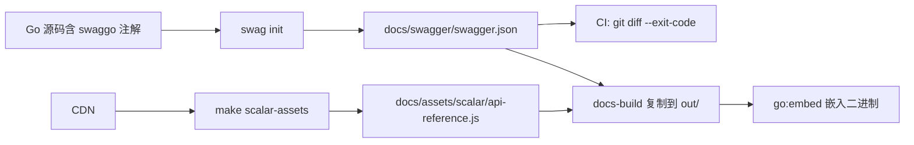

# API Documentation Hybrid Generation Spec

**Priority**: P2
**Status**: Proposed
**Author**: Sisyphus
**Date**: 2026-06-03

---

## 1. Background

HotPlex 自托管文档中心（`/docs/`）目前所有 API 参考文档均为手写 Markdown：

| 文档 | 维护方式 | 风险 |
|------|---------|------|
| `reference/admin-api.md` | 手写 | 35+ 端点，新增/变更端点易遗漏 |
| `reference/aep-protocol.md` | 手写 | AEP 协议稳定，低频变更 |
| `reference/events.md` | 手写 | Go 结构体与文档可能不一致 |

当开发者新增 Bot 管理端点、Cron 端点或 Session 端点时，文档更新是选做题而非强制要求。这导致 API 参考文档随时间漂移，不如代码本身可靠。

## 2. Problem Statement

### 2.1 当前痛点

1. **Admin API 文档与代码脱钩**：新增端点的开发者需要同时在 `handlers.go` 和 `admin-api.md` 两个地方维护信息，后者经常被跳过。
2. **缺少可交互的 API 控制台**：开发者测试 Admin API 只能用 `curl`，没有"Try It"能力。
3. **Gateway API（`/api/sessions`）缺少集中文档**：这部分 API 仅在 `websocket-integration.md` 中有片段式描述，没有完整的端点参考。
4. **AEP 事件类型未自动验证**：`pkg/events/events.go` 中定义的 Go 结构体与 `events.md` 中的 JSON 示例可能不一致。

### 2.2 范围界定

| API 面 | 端点数 | 适合 OpenAPI？ | 本 spec 覆盖？ |
|--------|--------|---------------|--------------|
| Admin API（`/admin/*`） | ~35 | ✅ REST | ✅ Phase 1 |
| Gateway API（`/api/sessions`） | 7 | ✅ REST 子集 | ✅ Phase 1 |
| WebSocket AEP（`/ws`） | N/A | ❌ 非 REST | ❌ 保留手写 Markdown |

## 3. Design Decisions

### 3.1 为什么选择 swaggo/swag（而非其他工具）

| 候选工具 | 否决原因 |
|---------|---------|
| go-swagger | Swagger 2.0 only，项目已进入维护模式，不再新增特性 |
| ogen | Spec-first 模式，需要额外维护 OpenAPI 文件，不适合改造现有代码 |
| go-specgen | 2026 年新项目（v1.2.2），生态不成熟，风险高 |
| kube-openapi | K8s 专用，架构过重，需要自定义代码生成器 |
| **swaggo/swag v2** | ✅ net/http 原生支持、Go 注释注解、生成 `docs.go` 可嵌入、10K stars |

**swaggo/swag 的局限**：当前 v2.0-rc5 仅支持 Swagger 2.0，不支持 OpenAPI 3.x。Swagger 2.0 对 HotPlex Admin API 的复杂程度完全足够。当 swaggo v2 正式版发布 OpenAPI 3.1 支持时，迁移仅需更新生成命令。

### 3.2 为什么选择 Scalar（而非 Redoc / Swagger UI）

| 维度 | Scalar | Redoc | Swagger UI |
|------|--------|-------|------------|
| 交互性 | ✅ 内建 API Client | ❌ 只读 | ✅ Try It |
| 体积 | 185KB（最轻） | 297KB | 352KB |
| OpenAPI 3.1 | ✅ | ✅ | 部分 |
| 代码生成 | ✅ 10+ 语言 | ❌ | ❌ |
| 主题 | 9 种内置 | 有限 | 1 种 |
| CDN | ✅ jsDelivr | ✅ | ✅ |

Scalar 是 2026 年新项目的最佳选择。HotPlex 允许 `https://cdn.jsdelivr.net` 的 CSP 策略已存在（用于 Mermaid），无需修改。

### 3.3 为什么不为 WebSocket 引入 AsyncAPI

| AsyncAPI 要求 | AEP 现状 | 结论 |
|--------------|---------|------|
| 多频道/多操作 | AEP 是单频道（`/ws`），仅有双向事件流 | AsyncAPI 过重 |
| 频道绑定语义 | AEP 用 JSON Envelope 复用同一连接 | 协议模型不同 |
| 发布/订阅模式 | AEP 是全双工请求/响应 | 映射不自然 |
| 工具链成熟度 | 比 OpenAPI 差 5+ 年 | 维护成本 > 收益 |

结论：AEP 协议已通过 `aep-protocol.md` + `events.md` 有效文档化。最佳改进是增加 **JSON Schema 自动提取**（从 `pkg/events/events.go`）和 **Mermaid 时序图**，而非引入 AsyncAPI 规范。

### 3.4 构建流水线集成决策



- **swagger.json 提交到仓库**：确保 `go:embed` 构建时不需要运行 swag init（仅 `make docs-build` 时生成）。`make check-swagger` 在 CI 中防止过期。
- **Scalar 通过 go:embed 内嵌**：下载 Scalar standalone bundle（~185KB）放入 `docs/assets/scalar/`，由 build-docs 复制到 `internal/docs/out/assets/scalar/`，再通过现有 `go:embed all:out` 打入二进制。**支持内网/离线部署**。
- **CSP 无需变动**：Scalar JS 从 `self` 加载（`script-src 'self' 'unsafe-inline'`），DefaultDocsCSP 已覆盖。原有 jsDelivr 豁免保留给 Mermaid。

## 4. Architecture

### 4.1 三层文档模型

```
┌──────────────────────────────────────────────────────┐
│           HotPlex 文档中心（/docs/）                   │
├──────────────────────────────────────────────────────┤
│                                                       │
│  第1层：REST API 参考 ── 自动生成 + 可交互             │
│  ┌───────────────────────────────────────────────┐   │
│  │  源：Go 注解（swaggo）                         │   │
│  │  产品：swagger.json → Scalar 交互式控制台       │   │
│  │  CI 强制：make check-swagger                  │   │
│  │  保持：admin-api.md（叙事上下文 / 认证流程）    │   │
│  └───────────────────────────────────────────────┘   │
│                                                       │
│  第2层：WebSocket 协议参考 ── 手写 Markdown（保持）   │
│  ┌───────────────────────────────────────────────┐   │
│  │  aep-protocol.md：Envelope 格式、事件流、背压  │   │
│  │  events.md：所有事件类型、Go 结构体、JSON 示例  │   │
│  │  未来增强：Mermaid 时序图、JSON Schema 自动提取 │   │
│  └───────────────────────────────────────────────┘   │
│                                                       │
│  第3层：指南/教程 ── 手写 Markdown（不变）            │
│  ┌───────────────────────────────────────────────┐   │
│  │  websocket-integration.md：对接流程、概念解释  │   │
│  │  guides/：集成模式、部署、安全                 │   │
│  │  tutorials/：Slack/飞书/定时任务               │   │
│  └───────────────────────────────────────────────┘   │
│                                                       │
└──────────────────────────────────────────────────────┘
```

### 4.2 文件变更地图

```
新增：
  docs/reference/api-console.html       ← Scalar 页面（引用本地 /docs/assets/scalar/api-reference.js）
  docs/assets/scalar/api-reference.js    ← Scalar standalone bundle（make scalar-assets 下载）
  docs/assets/scalar/style.css           ← Scalar standalone 样式（make scalar-assets 下载）
  docs/specs/API-Documentation-Hybrid-Generation-Spec.md  ← 本 spec

修改（Phase 1）：
  internal/admin/handlers.go            ← swaggo 注解（主端点）
  internal/admin/sessions.go            ← swaggo 注解（Session CRUD）
  internal/admin/cron_handlers.go       ← swaggo 注解（Cron 端点）
  internal/admin/apikey_handlers.go     ← swaggo 注解
  internal/admin/bot_handlers.go        ← swaggo 注解
  internal/admin/bot_config_handlers.go ← swaggo 注解
  internal/gateway/api.go               ← swaggo 注解（Gateway API 端点）
  cmd/hotplex/main.go                   ← @title @version 等顶层注解
  cmd/hotplex/routes.go                 ← serveSwaggerJSON 处理器（可选）
  Makefile                              ← swagger/check-swagger/docs-build 目标
  .github/workflows/ci.yml              ← 添加 check-swagger 步骤
  docs/index.md                         ← 添加 api-console.html 链接
  docs/reference/admin-api.md           ← 添加 Scalar 控制台链接，保留叙事内容
```

## 5. Implementation Plan

### Phase 1: REST API 自动生成（核心）

#### Task 1.1 — 安装 swaggo，编写顶层注解

```go
// cmd/hotplex/main.go
// @title           HotPlex Admin API
// @version         v1.24.1
// @description     HotPlex Gateway 管理与运行时 API
// @termsOfService  https://github.com/hrygo/hotplex

// @contact.name   HotPlex Team
// @contact.url    https://github.com/hrygo/hotplex

// @license.name  Apache 2.0
// @license.url   https://github.com/hrygo/hotplex/blob/main/LICENSE

// @host      localhost:9999
// @BasePath  /admin

// @securityDefinitions.apikey BearerAuth
// @in header
// @name Authorization
// @description 格式: "Bearer <token>"。Token 通过 admin.tokens 或 admin.token_scopes 配置。
func main() { ... }
```

```bash
go install github.com/swaggo/swag/v2/cmd/swag@latest
```

#### Task 1.2 — 对 Admin API 处理器添加 swaggo 注解

每个处理器按以下模板注解：

```go
// @Summary      列出活跃会话
// @Description  获取分页的 WebSocket 会话列表，支持按平台和用户过滤
// @Tags         sessions
// @Produce      json
// @Param        limit    query     int     false  "每页数量（默认 100）"         default(100)
// @Param        offset   query     int     false  "偏移量"                      default(0)
// @Param        platform query     string  false  "按平台过滤（slack/feishu/web）"
// @Param        user_id  query     string  false  "按用户 ID 过滤"
// @Success      200      {array}   SessionSummary
// @Failure      401      {object}  ErrorResponse  "未认证"
// @Failure      403      {object}  ErrorResponse  "Scope 不足"
// @Failure      429      {object}  ErrorResponse  "速率限制"
// @Security     BearerAuth
// @Router       /admin/sessions [get]
func (a *AdminAPI) ListSessions(w http.ResponseWriter, r *http.Request) { ... }
```

**覆盖端点清单**（~35 个）：

| 文件 | 端点类别 | 数量 |
|------|---------|------|
| `handlers.go` | Health、Stats、Metrics、Config、Logs、Debug、Restart | 9 |
| `sessions.go` | Session CRUD | 5 |
| `cron_handlers.go` | Cron Jobs CRUD + Trigger + History | 7 |
| `apikey_handlers.go` | API Key 用户管理 | 5 |
| `bot_handlers.go` | Bot 注册/状态/配置 | 8 |
| `bot_config_handlers.go` | Agent 配置文件读写 | 3 |
| `api.go`（gateway） | Gateway Session API | 5 |

#### Task 1.3 — 添加响应模型类型

当前处理器使用 `respondJSON(w, data)` 写任意 `any` 数据。Swagger 需要具体类型。创建 `internal/admin/models.go`：

```go
package admin

// --- 通用响应类型 ---

type ErrorResponse struct {
    Error   string `json:"error"   example:"insufficient scope"`
    Code    int    `json:"code"    example:"403"`
    Message string `json:"message" example:"need session:read scope"`
}

type StatusResponse struct {
    Status string `json:"status" example:"ok"`
}

// --- Session 响应类型 ---

type SessionSummary struct {
    ID         string `json:"id"          example:"sess_a1b2c3d4"`
    UserID     string `json:"user_id"     example:"U12345"`
    Platform   string `json:"platform"    example:"slack"`
    State      string `json:"state"       example:"active"`
    CreatedAt  string `json:"created_at"  example:"2026-06-03T10:00:00Z"`
    BotID      string `json:"bot_id"      example:"my-bot"`
    WorkerType string `json:"worker_type" example:"claude_code"`
}
```

> **原则**：仅为注解引入必要的类型别名，不强制重构现有 `respondJSON(w, any)` 处理器逻辑。

#### Task 1.4 — 配置 swag 生成命令

```makefile
# Makefile 新增

SWAG_DIR  := docs/swagger
SWAG_SPEC := $(SWAG_DIR)/swagger.json

.PHONY: swagger check-swagger

swagger:
	@echo "  $(CYAN)Swagger$(RESET)$(DIM) generating spec...$(RESET)"
	@mkdir -p $(SWAG_DIR)
	swag init \
		-g cmd/hotplex/main.go \
		-o $(SWAG_DIR) \
		--outputTypes json \
		--parseDependency \
		--parseInternal
	@echo "  $(GREEN)✓$(RESET) swagger.json generated"

check-swagger: swagger
	@if ! git diff --quiet -- $(SWAG_SPEC); then \
		echo "  $(RED)✗$(RESET) swagger.json is stale. Run 'make swagger' and commit the changes."; \
		git diff --stat -- $(SWAG_SPEC); \
		exit 1; \
	fi
	@echo "  $(GREEN)✓$(RESET) swagger.json is up-to-date"

docs-build: swagger scalar-assets
	@# ... existing build steps ...
	go run cmd/build-docs/main.go
	@# Copy swagger spec into embedded docs
	cp $(SWAG_SPEC) internal/docs/out/reference/swagger.json
	@# Copy Scalar standalone bundle into embedded docs
	cp -r docs/assets/scalar internal/docs/out/assets/scalar

scalar-assets:
	@if [ ! -f docs/assets/scalar/api-reference.js ]; then \
		echo "  $(CYAN)Scalar$(RESET)$(DIM) downloading standalone bundle...$(RESET)"; \
		mkdir -p docs/assets/scalar; \
		curl -sL https://cdn.jsdelivr.net/npm/@scalar/api-reference@1.25/dist/standalone.js \
			-o docs/assets/scalar/api-reference.js; \
		curl -sL https://cdn.jsdelivr.net/npm/@scalar/api-reference@1.25/dist/style.min.css \
			-o docs/assets/scalar/style.css; \
		echo "  $(GREEN)✓$(RESET) Scalar bundle downloaded"; \
	else \
		echo "  $(DIM)Scalar ✓ cached$(RESET)"; \
	fi
```

#### Task 1.5 — 创建 Scalar API 控制台页面（内嵌方案）

`docs/reference/api-console.html`：

```html
<!DOCTYPE html>
<html lang="zh-CN">
<head>
  <meta charset="UTF-8">
  <meta name="viewport" content="width=device-width, initial-scale=1.0">
  <title>HotPlex API Console</title>
  <style>
    body { margin: 0; padding: 0; }
    #api-reference { height: 100vh; }
  </style>
</head>
<body>
  <script src="/docs/assets/scalar/api-reference.js"></script>
  <div id="api-reference"></div>
  <script>
    Scalar.createApiReference('#api-reference', {
      url: '/docs/reference/swagger.json',
      hideDownloadButton: true,
      darkMode: true,
      defaultHttpClient: {
        targetKey: 'javascript',
        clientKey: 'fetch',
      },
      authentication: {
        preferredSecurityScheme: 'BearerAuth',
        apiKey: {
          token: 'your-api-key',
        },
      },
    })
  </script>
</body>
</html>
```

> **内嵌方案**：Scalar standalone bundle（`api-reference.js`，~185KB）由 Makefile 下载到 `docs/assets/scalar/`，构建时复制到 `internal/docs/out/assets/scalar/`，通过 `go:embed all:out` 打入二进制。完全脱离外部 CDN，支持内网/离线部署。CSP 无需变动——Scalar JS 从 `self` 加载，`DefaultDocsCSP` 的 `script-src 'self' 'unsafe-inline'` 已覆盖。

#### Task 1.6 — 从 index.md 链接 API 控制台

```markdown
<!-- docs/index.md 参考部分新增 -->
| [API 交互式控制台](reference/api-console.html)     | 可交互的 Admin + Gateway API 参考（Scalar） |
```

#### Task 1.7 — 更新 admin-api.md

在现有 `admin-api.md` 顶部添加链接，保留全部叙事内容：

```markdown
> 💡 **交互式 API 控制台**：访问 [API Console](api-console.html) 试用所有 Admin + Gateway 端点。
```

在底部添加说明：

```markdown
## 自动生成

本页的端点列表、参数和响应模型同时以 OpenAPI 2.0（Swagger）格式维护在 `docs/swagger/swagger.json`，通过 [Scalar](https://scalar.com) 提供可交互的 API 控制台。

`swagger.json` 由 `swaggo/swag` 从 Go 源码注解自动生成，CI 强制校验（`make check-swagger`），确保与代码实现保持一致。
```

### Phase 2: CI 强制校验

#### Task 2.1 — 在 CI 流水线中加入 check-swagger

```yaml
# .github/workflows/ci.yml
- name: Check Swagger freshness
  run: make check-swagger
```

#### Task 2.2 — 在 pre-push hook 中加入 check-swagger

```bash
# scripts/hooks/pre-push（在 make quality 目标中）
make check-swagger
```

### Phase 3: AEP 协议增强（未来，独立 spec）

以下项目不在本 spec 范围内，留作后续独立 spec：

- **Mermaid 时序图**：为 init 握手、Turn 生命周期、断线重连流程增加可视化
- **JSON Schema 自动提取**：从 `pkg/events/events.go` 的 Go 结构体生成 JSON Schema，嵌入 `events.md`
- **事件验证工具**：客户端 SDK 使用 JSON Schema 验证 AEP 消息

## 6. Governance

### 6.1 注解维护规则

| 规则 | 说明 |
|------|------|
| **新增端点 → 必须注解** | 所有 `HandleFunc` 注册的 Admin/Gateway API 端点必须有 swaggo 注解 |
| **修改端点 → 必须改注解** | 路径、参数、响应类型变更时，注解必须同步更新 |
| **注解类型驱动** | 响应类型应定义为具名 struct（带 `json` 和 `example` 标签），允许 `respondJSON` 接受具体类型 |
| **错误响应统一** | 所有端点统一使用 `ErrorResponse` 类型描述 401/403/429/500 错误 |

### 6.2 CI 门禁

```
make check
  ├── make quality
  │     ├── make fmt
  │     ├── make lint        ← golangci-lint
  │     ├── make test-short  ← -count=1 -race
  │     └── make check-swagger  ← [新增] git diff swagger.json
  └── make build
```

### 6.3 文档更新流程

```
开发者新增端点
  → 在 handler 上添加 swaggo 注解
  → 运行 make swagger（生成 swagger.json）
  → 运行 make check-swagger（本地验证）
  → git add docs/swagger/swagger.json
  → git commit（swagger.json 与代码变更在同一个 commit）
  → CI 运行 make check-swagger（自动门禁）

文档审阅者
  → 只审查 docs/reference/admin-api.md（叙事内容）
  → swagger.json 由工具保证一致性，不手动审查
```

### 6.4 回滚策略

- **swaggo 注解不影响运行时行为**：注解仅为静态文档生成用，移除/回滚注解不影响功能。
- **swagger.json 是生成产物**：如遇合并冲突，重新运行 `make swagger` 即可。
- **admin-api.md 双向维护过渡期**：Phase 1 完成后，admin-api.md 保留认证流程、安全模型、Scope 矩阵等叙事内容，端点列表和参数详情由 Scalar 控制台覆盖。

## 7. Non-Goals

以下明确排除：

- ❌ 不对 `websocket-integration.md`、`aep-protocol.md`、`events.md` 做自动生成
- ❌ 不为 WebSocket 引入 AsyncAPI 规范
- ❌ 不替换 `cmd/build-docs` 构建工具（仅在现有流水线上追加 swagger + scalar 步骤）
- ❌ 不添加 Swagger UI 或 Redoc（Scalar 是唯一选择）
- ❌ 不改变现有 `respondJSON(w, any)` 的宽松类型（仅新增模型类型供注解引用）

## 8. Success Criteria

- [ ] `make swagger` 从 Go 源码生成 `docs/swagger/swagger.json`
- [ ] `swagger.json` 覆盖全部 Admin API 端点（health/sessions/cron/bots/apikeys/config/logs/debug）
- [ ] `swagger.json` 覆盖 Gateway API 端点（`/api/sessions` 的 5 个操作）
- [ ] Scalar 控制台在 `/docs/reference/api-console.html` 可访问，可执行"Try It"请求
- [ ] Scalar standalone bundle 通过 `go:embed` 内嵌，断开公网后控制台仍正常工作
- [ ] `make check-swagger` 在 swagger.json 过期时失败
- [ ] CI 中 `make check-swagger` 阻止未同步的 API 变更合并
- [ ] `admin-api.md` 保留叙事内容，添加指向 Scalar 控制台的链接
- [ ] `docs/index.md` 参考部分添加 API 控制台入口
- [ ] 所有注解与处理器实际行为一致（无假阳性）

## 9. Open Questions & Future Work

| 问题 | 当前决策 | 重评估时机 |
|------|---------|-----------|
| swaggo/swag v2 正式版发布 OpenAPI 3.1 支持 | 保持 Swagger 2.0 | swaggo v2 稳定版发布后 |
| 响应类型系统化（替换 `any` → 具体类型） | 只加模型类型，不改处理器逻辑 | 单独的类型安全 refactor spec |
| JSON Schema 自动提取用于 AEP | 不在本 spec 范围内 | 评估 AEP 客户端 SDK 的验证需求时 |
| Mermaid 时序图添加到协议文档 | 不在本 spec 范围内 | AEP 协议文档审阅时 |
| Scalar standalone bundle 版本更新 | `make scalar-assets` 下载固定版本，缓存到 `docs/assets/scalar/`（纳入 git） | Scalar 大版本升级时手动更新 `scalar-assets` 目标中的 URL |
| Gateway API 独立页面 | 合并在 Admin API 的 Scalar 中 | Gateway API 端点超过 15 个时拆分 |
