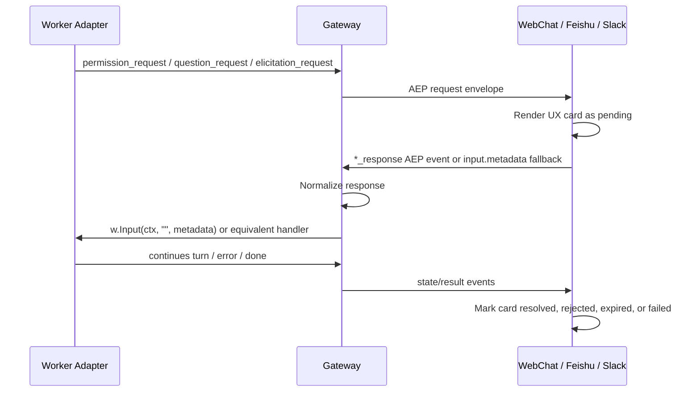

# Cross-Platform Interactive UX Spec

> GitHub Issue: #859
> 状态: Proposed
> 关键约束: 不改变任何权限默认值

## 1. 概述

HotPlex 已有三类结构化用户交互事件：

| 类型 | 请求事件 | 响应事件 | 场景 |
|------|----------|----------|------|
| Permission | `permission_request` | `permission_response` | Worker 请求执行工具授权 |
| Question | `question_request` | `question_response` | Worker 需要用户回答问题或选择方案 |
| Elicitation | `elicitation_request` | `elicitation_response` | MCP server 请求用户输入、打开 URL 或提交表单 |

飞书和 Slack 已有平台交互卡路径，WebChat 已能接收 AEP 交互请求并渲染简单按钮。但当前系统仍存在两个核心问题：

1. **WebChat/SDK 的正式 AEP response 回路不完整**：浏览器发送 `permission_response/question_response/elicitation_response` 后，Gateway 当前将这些事件按 session 透传处理，而不是送回当前 worker。
2. **UX 语义不足**：WebChat 把三类交互都包装成通用 `tool-call` 并复用 `PermissionCard`；飞书和 Slack 的 resolved/expired/failed 状态表达不完整，问题选择、多选、MCP schema 表单等能力没有成为一等 UI。

本 spec 目标是补齐协议回路并升级跨平台交互 UX，同时保持 worker 原生协议和平台 UI 解耦。

## 2. 硬约束

### 2.1 不改变权限默认值

本 spec **不得改变任何权限默认值**，包括但不限于：

- 不修改 `worker.claude_code.permission_prompt` 默认值。
- 不修改 `worker.claude_code.permission_auto_approve` 默认值。
- 不修改 `worker.codex_cli.approval_mode` 默认值。
- 不修改 `worker.codex_cli.sandbox` 默认值。
- 不修改 OpenCode Server 的 permission mode 默认映射。
- 不修改 `worker.default_permission_mode` 默认值。
- 不增加任何隐式开启 human-in-the-loop 的全局逻辑。

交互 UI 只在 worker 基于当前显式配置已经发出 `*_request` 时呈现。没有请求就没有交互 UI。

### 2.2 权限策略和交互通道解耦

权限策略决定 worker 是否需要询问用户；交互通道只负责：

1. 展示 worker 已发出的请求。
2. 收集用户响应。
3. 将响应可靠送回同一 session 的 worker。
4. 呈现 pending、submitting、resolved、expired、failed 等用户可理解状态。

因此，本设计不通过 UI 层主动改变 permission mode，不在 Gateway 中自动提升或收紧权限策略。

### 2.3 UI 不绑定 worker 私有协议

平台 UI 只理解 AEP 数据结构：

- `PermissionRequestData`
- `QuestionRequestData`
- `ElicitationRequestData`
- `PermissionResponseData`
- `QuestionResponseData`
- `ElicitationResponseData`

Claude Code、Codex CLI、OpenCode Server 的私有协议由各 worker adapter 独立处理。

## 3. 当前源码状态

### 3.1 AEP 数据结构已存在

`pkg/events/events.go` 已定义三类请求和响应数据：

- `PermissionRequestData` / `PermissionResponseData`
- `QuestionRequestData` / `QuestionResponseData`
- `ElicitationRequestData` / `ElicitationResponseData`

这说明协议层不需要新增事件类型，主要是路由、兼容转换和 UI 状态建模。

### 3.2 Gateway response 路由存在不一致

`internal/gateway/handler.go` 当前处理逻辑：

- `events.Input` 进入 `handleInput()`。
- `handleInput()` 只在 `input.data.metadata` 包含 `permission_response/question_response/elicitation_response` 时调用 `w.Input(ctx, content, metadata)`。
- `events.PermissionResponse`、`events.QuestionResponse`、`events.ElicitationResponse` 当前与 request 事件一起走 `passthroughToSession()`。

这导致两条响应路径行为不同：

| 来源 | 当前发送格式 | 当前结果 |
|------|--------------|----------|
| 飞书 / Slack 按钮 | `input.metadata.*_response` | 可通过 `tryInteractionResponse()` 到 worker |
| WebChat / SDK | 正式 AEP `*_response` | 被 Gateway 透传回 session，不能到 worker |

### 3.3 metadata dispatcher 存在 schema 兼容缺口

`internal/worker/base/metadata.go` 当前只读取：

- `permission_response.request_id`
- `question_response.id`
- `elicitation_response.id`

但正式 AEP `PermissionResponseData` 字段名是 `id`。因此要兼容：

- `permission_response.id`
- `permission_response.request_id`，保留历史平台路径

另外，WebSocket JSON 解码后 `answers` 常见类型是 `map[string]any`，而 dispatcher 当前直接断言 `map[string]string`，这会让正式 JSON response 丢失答案。

### 3.4 WebChat 当前 UX 语义不足

`webchat/lib/adapters/hotplex-runtime-adapter.ts` 当前将交互请求注入为 `tool-call` part：

- permission -> `toolName: "ask_permission"`
- question -> `toolName: "question_request"`
- elicitation -> `toolName: "elicitation"`

`webchat/components/assistant-ui/AssistantMessage.tsx` 将这三类都归入 `permission` category，并复用 `PermissionCard`。结果是：

- question 只能用 yes/no 响应，不能呈现选项、多选和自定义答案。
- elicitation 只能 accept/decline，不能按 `requested_schema` 渲染表单。
- 点击后缺少 submitting/failed/retry 状态。
- 卡片不会主动标记 expired。
- 响应成功后主要依赖本地删除 interaction map，缺少可恢复状态。

### 3.5 飞书和 Slack 已有交互卡基础

飞书：

- `internal/messaging/feishu/interaction.go` 负责发送 permission/question/elicitation 卡片。
- `internal/messaging/feishu/card_action.go` 负责卡片点击回调。
- `InteractionManager` 负责 pending map 和 5 分钟超时。

Slack：

- `internal/messaging/slack/interaction.go` 负责 Block Kit buttons 和 Socket Mode callback。
- 文本 fallback 支持 `allow <requestID>`、`deny <requestID>`、`accept <requestID>`、`decline <requestID>` 和 question raw text。

两者主要缺口是 resolved/expired/failed 状态表达、schema 丰富度和重复点击反馈。

### 3.6 Worker adapter 能力边界

| Worker | 请求来源 | 响应回写 | 注意点 |
|--------|----------|----------|--------|
| Claude Code | stdio `control_request` | stdio `control_response` | 是否产生 permission request 取决于显式 `permission_prompt` 和 permission mode，不改默认值 |
| Codex CLI | app-server server request JSON-RPC | JSON-RPC response | approval 和 MCP elicitation 已映射；question 是否由 app-server 发出需验收确认 |
| OpenCode Server | SSE `permission.asked` / `question.asked` / elicitation event | HTTP reply endpoint | permission mode 默认映射不变 |

## 4. 目标

### 4.1 功能目标

1. Gateway 支持正式 AEP `*_response` 事件回到 worker。
2. 保留现有 `input.metadata.*_response` 兼容路径。
3. WebChat 提供三类独立交互卡：
   - `PermissionApprovalCard`
   - `QuestionResponseCard`
   - `ElicitationFormCard`
4. 飞书和 Slack 提供 pending、resolved、expired 状态表达。
5. 交互响应失败时给用户明确反馈，允许重试不会重复提交已完成请求。
6. 所有 UI 使用同一套 AEP interaction state model。

### 4.2 非目标

- 不新增 worker permission mode。
- 不改变 worker permission 默认配置。
- 不实现跨 session 共享审批。
- 不实现管理员替用户审批。
- 不把平台 UI 与 Claude Code、Codex、OpenCode 的原生协议耦合。
- 不在本 spec 中重做消息历史存储模型。

## 5. 统一架构



关键边界：

- Gateway 是 response routing 的唯一中心。
- Worker adapter 是原生协议翻译的唯一中心。
- 平台 adapter 和 WebChat 只处理展示、用户输入和 AEP response。

## 6. Gateway 设计

### 6.1 新增正式 AEP response 路由

`Handler.Handle()` 应将以下事件交给新的 response handler，而不是 `passthroughToSession()`：

- `events.PermissionResponse`
- `events.QuestionResponse`
- `events.ElicitationResponse`

建议新增：

```go
func (h *Handler) handleInteractionResponseEvent(ctx context.Context, env *events.Envelope) error
```

职责：

1. 验证 session 存在。
2. 获取当前 worker。
3. 将正式 AEP response data 归一化为 metadata map。
4. 调用 `w.Input(ctx, "", metadata)`。
5. 捕获 inbound event，保持审计和历史一致。
6. 若 worker 不存在或响应失败，向客户端发送 `error`。

### 6.2 保留 metadata fallback

现有 `tryInteractionResponse()` 继续保留，用于飞书/Slack 已有路径：

```json
{
  "type": "input",
  "data": {
    "content": "",
    "metadata": {
      "permission_response": {
        "request_id": "req_x",
        "allowed": true
      }
    }
  }
}
```

这条路径用于平台 adapter 的 `PendingInteraction.SendResponse`，不在本 spec 中移除。

### 6.3 统一 response normalization

建议新增小型 helper，避免 WebChat/SDK 和平台路径分叉：

```go
func interactionResponseMetadata(kind events.Kind, data any) (map[string]any, error)
```

映射规则：

| AEP event | metadata key | ID 字段 |
|-----------|--------------|---------|
| `permission_response` | `permission_response` | 同时写入 `id` 和 `request_id` |
| `question_response` | `question_response` | `id` |
| `elicitation_response` | `elicitation_response` | `id` |

Permission 同时写 `id` 和 `request_id` 是为了兼容旧 dispatcher 和平台 helper。后续可在一次单独清理中统一为 `id`。

### 6.4 错误行为

| 场景 | Gateway 行为 | UI 行为 |
|------|--------------|---------|
| session 不存在 | `SESSION_NOT_FOUND` error | 卡片标记 failed，可提示刷新 |
| worker 不存在 | `SESSION_TERMINATED` 或 `SESSION_NOT_FOUND` | 卡片标记 failed |
| response schema 无效 | `INVALID_MESSAGE` | 卡片标记 failed，保留重试 |
| worker response 失败 | `INTERNAL_ERROR` 或 worker 分类错误码 | 卡片标记 failed |
| 重复 response | 若 worker/manager 报 no pending，返回可理解 error | 卡片显示已响应或已过期 |

## 7. Worker base metadata 兼容设计

### 7.1 Permission ID 兼容

`DispatchMetadata()` 应读取：

1. `permission_response.id`
2. `permission_response.request_id`

优先 `id`，没有时回退 `request_id`。

### 7.2 Question answers 转换

`question_response.answers` 应支持：

- `map[string]string`
- `map[string]any`

转换规则：

- string 值直接保留。
- 非 string 值使用 JSON marshal 后转字符串，或忽略并返回 schema error。推荐返回 schema error，避免隐藏 UI bug。

### 7.3 Elicitation content 转换

`elicitation_response.content` 应支持：

- `map[string]any`
- nil

`action` 仅允许：

- `accept`
- `decline`
- `cancel`

非法 action 返回 schema error，不发送到 worker。

## 8. WebChat UX 设计

### 8.1 交互 part 建模

当前使用 `ToolCallPart` 表达交互。为了避免破坏 assistant-ui 渲染，可先扩展 `ToolCallPart.args`，不立即引入新的 assistant-ui part 类型。

建议新增内部类型：

```ts
type InteractionKind = "permission" | "question" | "elicitation";
type InteractionStatus =
  | "pending"
  | "submitting"
  | "resolved"
  | "rejected"
  | "expired"
  | "failed";

interface InteractionState {
  kind: InteractionKind;
  requestId: string;
  status: InteractionStatus;
  createdAt: number;
  expiresAt?: number;
  response?: unknown;
  error?: string;
}
```

`interactionMapRef` 从只保存 `{ type }` 扩展为完整 state。消息 part 里也保存 `interaction` 字段，保证 React 重新渲染和历史合并时可恢复显示。

### 8.2 PermissionApprovalCard

展示内容：

- 工具名称。
- 描述。
- 参数摘要。
- 高风险提示，仅基于请求内容做展示，不改变权限策略。
- 操作按钮：
  - 允许
  - 拒绝
- 状态：
  - pending: 按钮可点击。
  - submitting: 按钮禁用，显示提交中。
  - resolved: 显示已允许。
  - rejected: 显示已拒绝。
  - expired: 显示已过期。
  - failed: 显示失败和重试按钮。

风险展示建议：

| 条件 | 展示 |
|------|------|
| tool_name 包含 bash/shell/command | Command execution |
| args 包含路径 | File/path scope |
| args 超长 | Collapsed JSON preview |
| args 包含 `.git`、shell profile、config 等字样 | Sensitive path hint |

这些都是 UX hint，不影响 worker permission decision。

### 8.3 QuestionResponseCard

支持：

- 单题单选：radio 或 segmented option。
- 单题多选：checkbox list 或 chips。
- 多题：每题一个分组。
- 自定义答案：文本输入。
- option preview：使用 `QuestionOption.Preview`。

响应格式：

```json
{
  "id": "req_q",
  "answers": {
    "question text or stable key": "selected label or custom text"
  }
}
```

当前 `QuestionResponseData.Answers` 是 `map[string]string`，key 注释为 question text。为了兼容旧路径，单题 raw answer 可继续写 `_`，但 WebChat 应优先用题目文本作为 key。

### 8.4 ElicitationFormCard

支持：

- `message` 文案展示。
- `mcp_server_name` 来源展示。
- `url` CTA：打开外部表单。
- `requested_schema` 简化渲染：
  - string -> input/textarea
  - boolean -> checkbox
  - enum -> select/radio
  - number/integer -> number input
  - object -> fieldset

第一阶段 schema 渲染可限制为 shallow object。复杂 schema 显示 JSON preview，并提供 accept/decline/cancel。

响应格式：

```json
{
  "id": "req_e",
  "action": "accept",
  "content": {
    "field": "value"
  }
}
```

### 8.5 WebChat 响应发送

`BrowserHotPlexClient` 可继续发送正式 AEP response：

- `sendPermissionResponse()`
- `sendQuestionResponse()`
- `sendElicitationResponse()`

Gateway 修复后这条路径应成为 WebChat 的主路径。

点击流程：

1. 用户点击允许/拒绝/提交。
2. 本地卡片状态变为 `submitting`。
3. 调用 client `send*Response()`。
4. 发送成功后本地状态变为 `resolved` 或 `rejected`。
5. 若 `_send()` 抛错，状态变为 `failed`，保留重试。

注意：WebSocket send 成功不是 worker 已接受成功。若 Gateway 返回 error，应将对应 requestId 卡片转为 failed。需要在 `handleError()` 里解析 error details 中的 request id；如果现有 error 没有 request id，第一阶段可将最近 submitting interaction 标为 failed。

### 8.6 超时 UX

平台层 `InteractionManager` 当前有 5 分钟 auto-deny。WebChat 直连没有共享这个 pending manager，因此需要前端基于 `createdAt + DefaultInteractionTimeout` 做展示倒计时，但最终真实状态仍以 worker/Gateway 后续事件为准。

第一阶段：

- 前端显示 5 分钟倒计时。
- 倒计时结束后禁用按钮并标记 expired。
- 如果用户刷新页面，历史中不恢复倒计时状态，仅显示已过期或不可操作。

第二阶段可引入 Gateway session-level pending interaction registry，让 WebChat 和平台共享 timeout authority。

## 9. 飞书 UX 设计

### 9.1 保留现有 callback 架构

继续使用：

- `sendPermissionRequest()`
- `sendQuestionRequest()`
- `sendElicitationRequest()`
- `handleCardActionTrigger()`
- `InteractionManager`

本 spec 不替换飞书 SDK 事件路径。

### 9.2 Pending card

Permission card:

- Header: 工具授权请求。
- Body: 工具名、描述、参数摘要。
- Actions: 允许、拒绝。
- Footer: 超时提示。

Question card:

- 每个问题独立 markdown section。
- options 用 button 展示。
- 多选题需明确提示可回复文本组合，或后续改用表单能力。

Elicitation card:

- MCP server 名称。
- message。
- URL 安全展示。
- accept/decline buttons。

### 9.3 Resolved card

点击后 `handleCardActionTrigger()` 返回 resolved card：

- 已允许 / 已拒绝 / 已回答 / 已接受 / 已取消。
- 操作人。
- 时间。
- 原请求摘要。

重复点击：

- 已响应或已过期时返回 resolved/expired card，不再次调用 `SendResponse`。

### 9.4 Text fallback

继续保留纯文本 fallback：

- `允许` / `拒绝`
- `accept` / `decline`
- question raw answer

Fallback 成功后可以发一条短 ack，但不要求更新原始卡片，因为原始卡片可能没有发送成功。

## 10. Slack UX 设计

### 10.1 保留 Block Kit callback 架构

继续使用：

- `handleInteractionEvent()`
- `sendPermissionRequest()`
- `sendQuestionRequest()`
- `sendElicitationRequest()`
- `checkPendingInteraction()`

### 10.2 Block Kit 结构

Permission:

- Section: 工具名和描述。
- Context: request id、超时提示。
- Actions: Allow / Deny。

Question:

- 单选题：button group 或 static select。
- 多选题：multi_static_select。若实现复杂，第一阶段保留 buttons + raw text fallback。
- 自定义答案：引导用户 thread reply。

Elicitation:

- Section: MCP server + message。
- URL: button link。
- Actions: Accept / Decline。
- 复杂 schema：打开 modal。

### 10.3 Message update

当前 Slack callback 会 `UpdateMessageContext()` 成纯文本 ack。应改为更新原始 message blocks：

- 保留原始请求摘要。
- 移除 action buttons。
- 添加 resolved context。

失败时：

- 如果 update message 失败，不影响 response 回传。
- 记录 debug 日志。

## 11. Worker adapter 验收要求

### 11.1 Claude Code

不改变默认值。仅验证以下现有能力：

- 当显式开启 `permission_prompt` 且 Claude Code 发出 `control_request` 时，mapper 输出正确 AEP request。
- `HandlePermissionResponse()` 写回 stdio control response。
- `HandleQuestionResponse()` 写回 AskUserQuestion response。
- `HandleElicitationResponse()` 写回 elicitation response。

### 11.2 Codex CLI

不改变默认 `approval_mode`。仅验证：

- app-server approval request 映射为 `permission_request`。
- MCP elicitation request 映射为 `elicitation_request`。
- response 通过 `RespondServerRequest()` 回写。
- 如果 app-server 支持 question-like server request，应映射为 `question_request`；如果当前不支持，文档标记为 unsupported，不在 UI 层伪造。

### 11.3 OpenCode Server

不改变默认 permission mode 映射。仅验证：

- `permission.asked` 映射为 `permission_request`。
- `question.asked` 映射为 `question_request`。
- elicitation event 映射为 `elicitation_request`，若 OCS 版本支持。
- response 调用对应 HTTP reply endpoint。

## 12. 实施计划

### Phase 1: Gateway response 路由

改动文件：

- `internal/gateway/handler.go`
- `internal/gateway/handler_test.go` 或新增 targeted test
- `internal/worker/base/metadata.go`
- `internal/worker/base/worker_test.go` 或新增 metadata test

内容：

1. `Handler.Handle()` 中将 `events.PermissionResponse`、`events.QuestionResponse`、`events.ElicitationResponse` 路由到新 handler。
2. 新 handler 将正式 AEP response 归一化为 metadata。
3. `DispatchMetadata()` 兼容 `id/request_id` 和 JSON answers。
4. 保留 `input.metadata` 路径。

### Phase 2: WebChat interaction state model

改动文件：

- `webchat/lib/types/message-parts.ts`
- `webchat/lib/adapters/hotplex-runtime-adapter.ts`
- `webchat/lib/ai-sdk-transport/client/types.ts`

内容：

1. 扩展 interaction state。
2. request handler 写入完整 state。
3. response callback 支持 permission/question/elicitation 不同 payload。
4. error handler 能将 submitting interaction 标记 failed。

### Phase 3: WebChat GenUI cards

改动文件：

- `webchat/components/assistant-ui/tools/PermissionApprovalCard.tsx`
- `webchat/components/assistant-ui/tools/QuestionResponseCard.tsx`
- `webchat/components/assistant-ui/tools/ElicitationFormCard.tsx`
- `webchat/components/assistant-ui/AssistantMessage.tsx`
- `webchat/lib/tool-categories.ts`
- `webchat/locales/zh-CN/chat.json`
- `webchat/locales/en/chat.json`
- `webchat/locales/zh-CN/common.json`
- `webchat/locales/en/common.json`

内容：

1. 三类 card 分开渲染。
2. 所有新增 UI 文案双语同步。
3. 按钮、输入、select、checkbox 保持可访问性。
4. 用现有设计 token 和 motion 风格，不引入新视觉体系。

### Phase 4: 飞书/Slack 状态增强

改动文件：

- `internal/messaging/feishu/card_template.go`
- `internal/messaging/feishu/card_action.go`
- `internal/messaging/slack/interaction.go`
- 对应测试文件

内容：

1. resolved card/block 保留请求摘要。
2. expired/double-click 反馈明确。
3. Slack update message 使用 blocks，而不是纯文本替换。
4. 保留 invalid_blocks 和文本 fallback。

### Phase 5: Worker parity tests

改动文件：

- `internal/worker/claudecode/*_test.go`
- `internal/worker/codexcli/*_test.go`
- `internal/worker/opencodeserver/*_test.go`

内容：

1. 三类 response handler targeted tests。
2. Codex app-server server request requestId 映射和 response id 消费测试。
3. OCS HTTP endpoint path 和 payload 测试。

## 13. 测试计划

### 13.1 Go unit tests

建议命令：

```bash
go test ./internal/gateway ./internal/worker/base ./internal/messaging/feishu ./internal/messaging/slack ./internal/worker/claudecode ./internal/worker/codexcli ./internal/worker/opencodeserver -count=1
```

关键用例：

- AEP `permission_response` event routes to worker.
- AEP `question_response` event routes to worker.
- AEP `elicitation_response` event routes to worker.
- `input.metadata.*_response` still routes to worker.
- `permission_response.id` and `permission_response.request_id` both work.
- `question_response.answers` handles JSON-decoded `map[string]any`.
- Duplicate response does not panic.
- No worker produces user-visible error.

### 13.2 WebChat tests

项目当前没有 unit test 框架，WebChat 验证以 build 和 Playwright/manual 为主：

```bash
cd webchat
pnpm build
pnpm exec playwright test
```

建议补充 mock WebSocket 场景：

- Receive permission_request -> render PermissionApprovalCard -> click allow -> send `permission_response`.
- Receive question_request with options -> select option -> send `question_response`.
- Receive question_request multi_select -> select multiple -> send string answer.
- Receive elicitation_request with schema -> fill form -> send `elicitation_response`.
- Send failure -> card enters failed state and can retry.

### 13.3 Platform callback tests

飞书：

- owner click resolves request。
- non-owner click does not consume request。
- expired request returns expired card。
- double click does not send duplicate response。

Slack：

- block action allow/deny sends metadata response。
- question option sends answers。
- text fallback remains compatible。
- message update failure does not block response。

## 14. 风险和缓解

| 风险 | 影响 | 缓解 |
|------|------|------|
| WebChat 正式 AEP response 与平台 metadata response 产生两套语义 | 高 | Gateway 统一 normalization，worker 只接收 metadata handler |
| UI 标记 resolved 但 worker response 失败 | 中 | 提交后先 `submitting`，Gateway error 时转 failed |
| Question 多题答案 key 不稳定 | 中 | 优先使用 question text，单题 fallback `_` 保留 |
| Slack/Feishu card update 失败 | 低 | response 已先发送或独立发送，update 失败只记日志 |
| Codex question 能力不稳定 | 中 | 单独验收，不支持则标记 unsupported，不在 UI 层伪造 |
| 误改权限默认值 | 高 | 测试和 review 明确检查 config/default 相关 diff |

## 15. 验收标准

- [ ] 不改变任何权限默认值或默认配置行为。
- [ ] Gateway 正式 AEP `permission_response` 能送回当前 worker。
- [ ] Gateway 正式 AEP `question_response` 能送回当前 worker。
- [ ] Gateway 正式 AEP `elicitation_response` 能送回当前 worker。
- [ ] 现有飞书/Slack `input.metadata.*_response` 路径仍通过。
- [ ] `permission_response.id` 和历史 `request_id` 都兼容。
- [ ] WebChat 三类交互卡分离，不再全部复用 yes/no PermissionCard。
- [ ] WebChat question 支持选项、多选和自定义答案。
- [ ] WebChat elicitation 支持 URL CTA 和基础 schema 表单。
- [ ] 飞书点击后返回 resolved/expired 卡片。
- [ ] Slack 点击后更新原始 message blocks。
- [ ] Claude Code、Codex CLI、OpenCode Server 的 response handler 均有 targeted tests。
- [ ] `go test` targeted packages 通过。
- [ ] `webchat/pnpm build` 通过，或明确记录已有 unrelated lint/build 问题。

## 16. 回滚策略

如果发布后发现交互响应异常：

1. WebChat 可临时隐藏新 GenUI card，回退到旧 `PermissionCard` 展示，但保留 Gateway response routing。
2. 飞书/Slack 可回退 resolved card/block 更新，仅保留原有按钮响应。
3. Gateway AEP response routing 如出现问题，可保留 metadata fallback 路径，WebChat 临时改为发送 `input.metadata.*_response`。

不得通过放宽权限默认值来规避 UI 或 response routing 问题。

