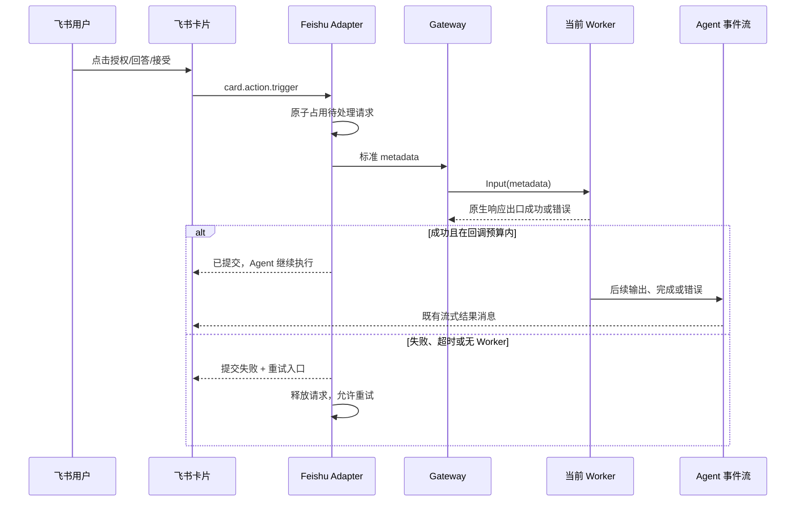

# 飞书交互式卡片 UX 与跨 Worker 闭环设计

日期：2026-07-10

## 背景与目标

当前飞书的授权、问题和 MCP 信息收集卡片将工具名或原始命令直接用作标题，并把参数直接暴露在正文。用户难以快速判断动作、目的和影响。更严重的是，卡片按钮在响应尚未成功交给 Worker 时就显示“已允许”，而交付闭包只记录错误；网关、会话或 Worker 失败会被误报为成功。

本设计统一三类交互卡片的 UX，并保证响应能以各 Worker 的原生协议成功提交，随后将 Agent 的实际执行过程和结果通过既有事件流展示出来。

### 目标

- 让用户先看懂“做什么、为什么、影响什么”，不把命令或 JSON 放在标题和主内容区。
- 为授权、问答、信息收集提供一致的状态、权限和失败恢复体验。
- 对 Claude Code、Codex CLI、OpenCode Server、ACP 采用同一飞书到 Gateway 的响应契约。
- 只有 Worker 原生响应出口成功接受响应时，才显示“已提交，Agent 继续执行”。
- 为失败、超时、过期、重复点击和非发起人点击提供可见、可恢复、可审计的路径。

### 非目标

- 不在卡片回调中等待命令或 Agent 任务完成；飞书回调需在 3 秒内响应。
- 不改变 Worker 各自的原生授权协议或审批枚举。
- 不将飞书卡片作为跨重启持久化的任务队列；会话终止后的交互继续按“已过期”处理。

## 设计决策

采用“决策优先卡”信息架构。

- 标题是人可读的动作，如“修改项目配置”“需要你的输入”“外部服务请求”，而非工具名、命令或 JSON。
- 主内容按目的、影响、目标组织；当 Worker 只提供原始命令时，生成简短可读摘要，原文仅保留为技术详情。
- `collapsible_panel`（CardKit JSON 2.0）承载原始命令、参数和 request ID。动作按钮始终在折叠面板外，避免将表单或回传交互嵌入其中。
- 卡片均使用 JSON 2.0；回调仍使用 SDK 的 raw-card 响应包装，以避免 200672 格式错误。

## 三类卡片

### 工具执行授权

- 标题：动作摘要，例如“修改项目配置”。
- 副标题：状态“待你确认”。
- 主内容：目的、影响等级/受影响对象、目标资源；无法可靠推断时明确标记“影响信息有限”。
- 操作：`允许并继续`、`拒绝`，以及可选说明输入框。
- 技术详情：原始工具名、命令/参数、request ID；默认折叠，限制长度并标明截断。

### 问题与选项回答

- 标题：`需要你的输入`，正文清晰显示问题、单选/多选约束和选项说明。
- 选项直接是回传交互按钮；自定义回答使用表单输入与提交按钮。
- 选中后显示“正在提交”；成功后显示“已提交，Agent 继续执行”。

### MCP 信息收集

- 标题：`外部服务请求`，正文展示 MCP 服务名、请求目的、涉及的数据和外部链接；未提供数据范围时明确标记“数据范围未说明”。
- 操作：`接受并继续`、`拒绝`，可附带可选评论。
- 详细 schema、参数和原始消息放入技术详情。

## 交互生命周期

### 状态机

`pending → submitting → submitted` 是成功路径。`submitting → pending` 仅发生在提交错误、超时或上下文取消时；`pending/submitting → expired` 发生在交互超时、会话终止或取消时。`submitted` 为终态，重复点击返回“已提交或已过期”，不会再次投递。

`InteractionManager` 必须以原子 claim/finish/release 管理状态，以阻止按钮点击、文本回复和超时 goroutine 的竞态。成功提交前不可调用最终 `Complete`。

## 跨 Worker 契约

飞书和 Gateway 始终传递既有的 `permission_response`、`question_response`、`elicitation_response` metadata；所有内置 Worker 已在 `Input` 中通过 `base.DispatchMetadata` 消费该协议。

| Worker | 原生交付出口 | “已提交”判定 |
|---|---|---|
| Claude Code | 控制响应写入 stdin | `Send*Response` 返回 nil |
| Codex CLI | app-server JSON-RPC server response | 正确 request ID 的响应帧成功写入 |
| OpenCode Server | permission/question/elicitation HTTP reply | HTTP 请求成功 |
| ACP | JSON-RPC `RespondRequest` | 请求响应成功写入 |

每个 Worker 只负责把标准 metadata 映射为其原生协议；飞书 Adapter 不含 Worker 类型分支。未来 Worker 若未支持 `MetadataHandler`，Gateway 必须把交付失败返回到卡片，而不能显示成功。

Codex CLI 需要保持所有审批请求家族的 canonical request ID 与 JSON-RPC frame ID 映射：`approvalId → itemId → requestId → callId`。对不同方法使用各自的决定枚举；仅在响应帧写入成功后清除请求映射，避免写入失败造成不可重试的授权丢失。

## 错误处理、权限与观测

- 非发起人点击：不改变 pending 请求；返回说明其无权决定的卡片或 toast。
- 未知、失效或重复请求：返回中性“已过期或已响应”状态，不再次调用 Worker。
- Bridge、Gateway、无 Worker、协议映射或 Worker 原生出口失败：返回失败卡片、简短原因和重试入口；请求回到 `pending`。
- 回调交付使用不超过 2 秒的内部预算，确保飞书 3 秒回调约束；不等待 Agent 后续执行。
- 记录结构化日志、审计和指标：`request_id`、`session_id`、`worker_type`、交互类型、状态转换、失败类别和耗时。不得记录完整敏感参数。
- JSON 2.0 卡片的更新/交互窗口为 14 天；窗口之外和会话已结束均显示过期状态。

## 验收与测试

### 自动化测试

- 卡片模板：三类卡片均为 JSON 2.0；标题不包含原始命令；技术详情可折叠；按钮 payload 完整且安全截断。
- 卡片动作：成功、失败可重试、重复点击、超时、未知请求、非所有者点击和文字回复竞争。
- 交付链：飞书点击 → metadata → Gateway → Worker `Input`；断言仅在 `Input` 返回 nil 时渲染 submitted。
- Worker 矩阵：为 Claude Code、Codex CLI、OpenCode Server、ACP 分别断言原生出口的成功与失败路径。
- Codex 专项：请求 ID 字段优先级、`conversationId` fallback、方法对应的 decision 枚举、写失败不丢失 pending 映射。
- Worker 继续输出：每种 Worker 的成功交付后发出一条后续事件，断言现有飞书输出路径可见，从而验证“提交 → 继续执行”而非仅回调成功。

### 人工验证

在用户指定的安全飞书测试会话中，分别触发三类交互并至少选择一次允许/回答/接受，确认卡片状态、Agent 后续输出和最终结果；拒绝、重试和过期路径也各验证一次。不得向生产群或未指定会话发送测试卡片。

## 实施范围

- `internal/messaging/interaction.go`：可返回错误的响应交付契约和原子交互状态。
- `internal/messaging/feishu/interaction.go`、`card_template.go`、`card_action.go`：统一 CardKit v2 模板、回调状态和失败恢复。
- `internal/gateway/handler.go`：将交付错误明确回传给 Adapter，维持审计捕获。
- `internal/worker/codexcli/*`：只修复其专有 ID/写入原子性和协议决定枚举。
- 各 Worker 的测试与飞书端到端测试：补足成功、失败和继续执行的证据。

不改动 Claude Code、OpenCode Server 和 ACP 的原生业务协议，除非测试证明其中某个实现未能把已有标准 metadata 成功投递。
