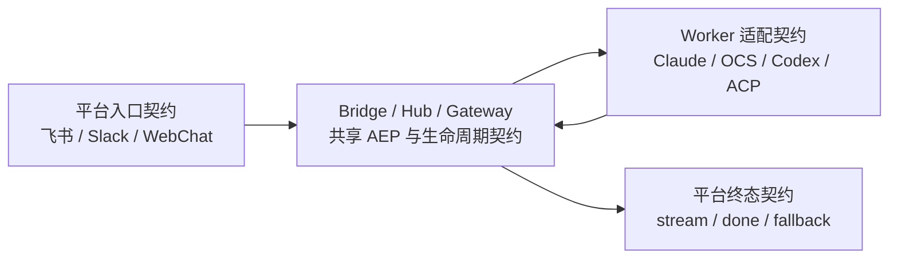

# 飞书、Slack、WebChat × 四 Worker E2E 可靠性与能力契约设计

**状态**：Approved，Implementation-ready

**日期**：2026-08-05

**Epic**：[#954](https://github.com/hrygo/hotplex/issues/954)

**基线**：`origin/main@8482cfae`

**参考实现**：[#941](https://github.com/hrygo/hotplex/issues/941) / [#943](https://github.com/hrygo/hotplex/pull/943)

## 1. 目标

以“飞书 × Claude Code”E2E 加固为参考、模板和起点，为三个接入平台与四种 Worker 建立统一但不虚假同质化的可靠性契约：

- 平台：飞书、Slack、WebChat；
- Worker：`claude_code`、`opencode_server`、`codex_cli`、`acp`；
- 普通 CI：12/12 确定性组合必须执行；
- 真实环境：12/12 组合必须由人工逐一验证并保存脱敏证据。

本设计的完成标准不是“循环里出现了 12 个名字”，而是每个组合都穿过该平台和 Worker 的真实 HotPlex 边界，且测试、人工验收和能力声明可以相互核对。

## 2. 已批准决策

1. 普通 CI 使用平台 API fake 与 Worker 协议 fake，确定性运行全部 12 个组合，不使用外部凭证。
2. 真实 12 组合由人工验证；不纳入普通 CI，不用定时自动任务替代人工验收。
3. 证据按 Source、Test、Live 分级。Test 证据不得表述为真实 E2E，Live 证据不得只引用测试结果。
4. 能力语义使用 `Native`、`GatewayFallback`、`Unsupported`、`NotApplicable`；不要求四个 Worker 具备相同的原生机制。
5. `control.stop` 只停止当前 turn、保留 session，至多产生一个 `done.reason="stopped_by_user"`，且不得触发 crash fallback。
6. 不修改 AEP wire contract。如实现中发现必须修改 Kind、Data 或 JSON tag，必须从本 Epic 拆出独立协议变更并执行完整兼容性门禁。
7. 不在普通日志、execution 指纹记录或人工证据中保存 prompt 原文、metadata 值、凭证或原始 Worker 错误。

## 3. 当前事实与差距

### 3.1 已有可复用基线

- PR #943 已把飞书链路的 dedup rollback、ChatQueue 生命周期、10 MiB 流式媒体上限、`0700/0600` 临时文件权限、终态错误传播与 stop 闭环固化为实现和测试。
- Gateway 的 `handleControl` 已统一调用 `Worker.StopCurrentTurn`，收敛 execution runtime 并生成 `stopped_by_user` terminal。
- WebChat 的 `BrowserHotPlexClient.stopCurrentTurn` 已合并并发 stop waiter，发送 `control.stop` 后等待 `Done`。
- 四种 Worker 都实现 `StopCurrentTurn`、`ResetContext` 和 interaction response 接口；具体中止机制不同。

### 3.2 已确认差距

| ID | 差距 | 已验证位置 | 目标 |
| --- | --- | --- | --- |
| G1 | Slack 下载信任声明大小，读取过程没有统一 10 MiB 硬上限；目录/文件权限未对齐 | `internal/messaging/slack/converter.go` | 有界流式读取、失败清理、`0700/0600` |
| G2 | Slack dedup 在过滤、媒体转换和 Bridge 投递成功前即提交，失败无法安全重试 | `internal/messaging/slack/adapter.go` | 使用条件 handle，失败路径 rollback，成功后保留 |
| G3 | Slack stream writer close 和 terminal fallback 的错误传播不完整 | `internal/messaging/slack/conn_events.go`、`adapter.go` | 错误上浮、计量、静态文本兜底，禁止静默成功 |
| G4 | OCS stop 仅执行 `MarkStopped`、关闭 SSE 并 `release()` | `internal/worker/opencodeserver/worker.go:StopCurrentTurn` | 调用远端 session abort，超时有界且保持幂等 |
| G5 | 现有 3 × 4 × 3 interaction 测试只走 Gateway mock 与 metadata dispatch | `internal/gateway/interaction_matrix_test.go` | 改名为准确证据等级；另建真实边界组合测试 |
| G6 | WebChat E2E 场景主要固定 `codex_cli` | `webchat/e2e/` | 四 Worker 参数化的 ACK、stream、stop、terminal、next-turn |
| G7 | 缺少跨四 Worker 的 stop 单终态、重复 stop、下一轮复用统一契约 | 四个 `StopCurrentTurn` 实现 | 能力声明与实际协议行为一致 |
| G8 | WebChat queue 重设计后丢失 `region/list/listitem` 与 indexed action aria-label；现有 Playwright 2026-08-05 实测仅 2/12 PASS，且 CI 未运行该套件 | `FollowUpQueue.tsx`、`chat.spec.ts`、`ci.yml` | 先恢复 12/12 绿色 browser baseline，再扩矩阵并接入 CI |
| G9 | 四 Worker `MarkStopped()` 后没有在下一主 turn 清零；重复 stop 的 Gateway 路径也没有 per-turn fence | `base/worker.go`、`commands.go`、四个 `Input` | stopped marker 限定当前 turn；重复 stop 只产生一次有效中止/terminal |

OpenCode Server 官方文档定义了 `POST /session/:id/abort`，因此 G4 是 HotPlex 适配层缺口，而不是上游无能力。实现时以[官方 Server API 文档](https://dev.opencode.ai/docs/server/)和当前依赖版本为准，禁止猜测 URL 或响应语义。

## 4. 证据模型

| 等级 | 含义 | 可替换边界 | 可宣称内容 |
| --- | --- | --- | --- |
| Source | 源码、调用图、协议文档和配置事实 | 无运行行为 | “实现/接口当前如何定义” |
| Test | HotPlex 真实边界 + 外部 fake 的确定性测试 | 只替换 SaaS 和 Worker 进程 | “12 个组合的 HotPlex 合同在 CI 中通过” |
| Live | 真实 SaaS + 真实 Worker + 真实 Gateway 的人工操作 | 不替换链路组件 | “该 commit 的真实 12 组合经人工验证” |

规则：

- 文件名、测试名、CI job 名和文档用语必须携带或明确映射证据等级。
- `mock` metadata dispatch 测试只能是 Gateway 单元/集成证据，不能命名为完整 E2E matrix。
- Live 记录必须绑定精确 commit；后续代码变更不会自动继承旧 Live 结论。

## 5. 分层架构



### 5.1 平台入口契约

飞书和 Slack 必须通过各自真实 adapter、converter、dedup、queue/connection 与 Bridge 边界；WebChat 必须通过真实 AEP WebSocket client/transport 与 Hub 边界。平台 API fake 只能替换飞书/Slack HTTP 或 SDK 外呼以及浏览器网络对端，不能绕过平台适配代码。

共同保证：

- 输入具有稳定 request/message ID；
- 重复输入不重复执行；
- 转换或投递失败不会永久吃掉可安全重试的输入；
- ACK、错误和 terminal 对平台调用方可观察；
- 媒体大小、路径和权限边界在读取过程中生效。

### 5.2 Gateway 共享契约

- 输入按 durable accept → ACK → Worker delivery 前进，不把 `unknown` 当作可安全重投。
- per-session Seq 单调；旧 forwarder 不处理替换连接的新事件。
- 背压可丢弃 `message.delta`，不可丢弃 `state`、`done`、`error`。
- stop ownership 校验通过后只中断当前 turn；runtime 与 terminal 只能收敛一次。
- Worker 原生 mid-turn input 不可用时，Gateway pending buffer 的行为必须显式标记为 `GatewayFallback` 并在下一可用边界重放。

### 5.3 Worker 适配契约

每种 Worker 维护一份测试可读的能力 manifest。manifest 不是新的 wire 字段，可先作为测试 fixture 或 Worker package 内部描述，至少覆盖：

| 能力 | 可选语义 | 必须验证的行为 |
| --- | --- | --- |
| `start` | Native | 启动成功、启动失败不伪造可用状态 |
| `stream` | Native / Unsupported | 事件映射、顺序和 terminal |
| `stop` | Native / GatewayFallback / Unsupported | 幂等、超时、单 terminal、next-turn |
| `reset` | Native / GatewayFallback | 旧 forwarder fencing、generation 更新 |
| `resume` | Native / GatewayFallback / Unsupported | session ID 恢复与声明一致 |
| `interaction` | Native / GatewayFallback / Unsupported | permission/question/elicitation response 映射 |
| `mid_turn_input` | Native / GatewayFallback / Unsupported | Native 注入或 pending buffer，不丢输入 |

当前预期：Claude Code 和 Codex CLI 的 mid-turn input 为 `Native`；OCS 和 ACP 为 `GatewayFallback`。实现者必须先以当前接口和协议测试复核，若事实变化则更新 manifest 与本 spec 的实施记录，而不是为满足表格强行降级实现。

### 5.4 平台终态契约

- 正常完成、错误、人工 stop 都有一个且仅一个用户可见 terminal 结果。
- 增量更新失败时尝试独立的静态文本兜底；兜底失败必须返回错误、计量并记录结构化日志。
- 终态错误不得被 goroutine 隔离后静默丢弃。
- 展示失败不得回滚已经完成的 Worker turn，也不得导致重复执行。

## 6. 12 组合矩阵

| 组合 ID | 平台 | Worker | 确定性 CI | 真实人工验收 |
| --- | --- | --- | --- | --- |
| F-C | 飞书 | `claude_code` | 必须 | 必须 |
| F-O | 飞书 | `opencode_server` | 必须 | 必须 |
| F-X | 飞书 | `codex_cli` | 必须 | 必须 |
| F-A | 飞书 | `acp` | 必须 | 必须 |
| S-C | Slack | `claude_code` | 必须 | 必须 |
| S-O | Slack | `opencode_server` | 必须 | 必须 |
| S-X | Slack | `codex_cli` | 必须 | 必须 |
| S-A | Slack | `acp` | 必须 | 必须 |
| W-C | WebChat | `claude_code` | 必须 | 必须 |
| W-O | WebChat | `opencode_server` | 必须 | 必须 |
| W-X | WebChat | `codex_cli` | 必须 | 必须 |
| W-A | WebChat | `acp` | 必须 | 必须 |

每个 CI subtest 名称必须包含组合 ID、平台、Worker 和场景 ID；任何 skip 都必须给出 capability 语义和原因。矩阵聚合结果必须区分 pass、expected unsupported 与 unexpected failure，禁止把 skip 计为 pass。

## 7. 确定性场景合同

### 7.1 Core 场景：12/12 必跑

| 场景 ID | 步骤 | 断言 |
| --- | --- | --- |
| C01 Basic turn | 建 session → 输入 → ACK → delta/state → done | ACK 一次、Seq 单调、done 一次、内容可呈现 |
| C02 Duplicate input | 相同 ID 重放 | Worker 只收到一次；payload 冲突返回稳定错误 |
| C03 Delivery failure | 在 adapter/Bridge/Worker delivery 分别注错 | 生命周期状态正确；仅可安全阶段允许重试 |
| C04 Stop | 活跃 turn 中连续两次 stop | Worker stop 至多调用一次有效中止；一个 `stopped_by_user` |
| C05 Next turn | C04 terminal 后发送新输入 | session 保留，下一轮成功，不触发 crash fallback |
| C06 Reset/reconnect | 活跃或刚完成后 reset/替换连接 | generation/turn 正确；旧 forwarder 被 fence |
| C07 Terminal failure | 增量/terminal/静态兜底依次注错 | 错误可观察、计量，无重复 Worker 执行 |
| C08 Backpressure | 填满 delta 队列并发送 state/done/error | 只允许 delta 丢弃，控制/终态保留 |

### 7.2 Capability 场景：按 manifest 判定

| 场景 ID | 能力 | Native 断言 | GatewayFallback 断言 | Unsupported 断言 |
| --- | --- | --- | --- | --- |
| K01 Permission | interaction | 真实 mapper 收发 | Gateway 显式转换/缓存 | 明确拒绝，不挂起 |
| K02 Question | interaction | answer list 保真 | 同左且标记 fallback | 明确拒绝 |
| K03 Elicitation | interaction | schema/response 映射 | 同左且标记 fallback | 明确拒绝 |
| K04 Mid-turn input | mid-turn | 当前 turn 接收 | pending buffer 在后续边界交付一次 | 明确拒绝且不丢失状态 |
| K05 Resume | resume | 复用原生 session | Gateway 恢复到声明边界 | 明确创建新语义或报错 |

测试 fixture 必须控制时钟和事件推进，不使用 `time.Sleep` 等待异步结果；使用 channel 信号或 `require.Eventually`，单模块 `-count=1 -race` 目标不超过 5 秒。

## 8. Harness 设计

### 8.1 平台 fake

- 飞书：fake IM/CardKit/media API，保留真实 handler、converter、ChatQueue、PlatformConn 和 terminal writer。
- Slack：fake socket/API/file download/stream writer，保留真实 adapter、converter、dedup、PlatformConn 和 terminal writer。
- WebChat：内存 WebSocket/AEP peer，保留真实 browser client transport 的 TypeScript 单测，并在 Playwright 中使用真实页面/runtime adapter。

fake 需要提供确定性 fault points：ACK、媒体中途超限、Bridge 投递、delta patch、terminal close、静态 fallback。

### 8.2 Worker fake

Worker fake 位于各 Worker 协议边界之外：

- Claude Code：fake stream-json 子进程；
- OCS：fake HTTP/SSE server，包含 `/session/:id/abort`；
- Codex CLI：fake app-server JSON-RPC peer；
- ACP：fake ACP JSON-RPC peer。

禁止用同一个通用 `mockWorker` 替代四种协议 fake 来宣称 12 组合通过。共享场景驱动可以复用，协议编码、取消动作和事件 mapper 必须走各自实现。

### 8.3 建议落点

具体文件可在实施计划中按依赖再拆分，设计边界如下：

- `internal/e2econtract/`：纯场景 manifest、能力语义、组合 ID 与共享断言，不反向依赖 Gateway；
- `internal/gateway/platform_worker_matrix_test.go`：以外部测试 package 组装 Bridge/Hub、平台 harness 与 Worker harness；
- `internal/messaging/{feishu,slack}/*_contract_test.go`：平台特有 media/dedup/terminal fault injection；
- `internal/worker/{claudecode,opencodeserver,codexcli,acp}/*_contract_test.go`：协议级生命周期与 capability 合同；
- `webchat/e2e/platform-worker-matrix.spec.ts`：四 Worker 参数化页面/transport 场景；
- `docs/guides/developer/platform-worker-e2e-validation.md`：真实 12 组合人工 runbook；
- `docs/assets/e2e/platform-worker-matrix-template.md`：脱敏验收记录模板。

若 `internal/e2econtract` 导致 import cycle，保持其只依赖标准库和 `pkg/events`/稳定公共类型；Gateway 组合测试使用 `gateway_test` package。不得通过把生产内部实现导出为公共 API 来迁就测试。

## 9. 优先实施切片

### Slice 1：证据口径与矩阵骨架

- 把现有 interaction matrix 改名为 Gateway metadata dispatch matrix，保留其单元价值。
- 引入组合 ID、capability manifest 和 core scenario runner。
- 先接入一条纵向样板，再扩展至确定性 12/12，保证失败定位维度稳定。

### Slice 2：Slack 平台可靠性对齐

- 媒体读取使用 `io.LimitReader(max+1)` 或等价机制，不信任声明大小。
- 临时目录 `0700`、文件 `0600`；失败路径关闭并删除部分文件。
- dedup 改用 `TryRecordWithHandle`，在转换、gate、媒体与 enqueue/Bridge 失败时条件 rollback。
- terminal close、fallback send 错误返回调用链并接入低基数指标。

### Slice 3：OCS abort 与四 Worker 生命周期

- OCS client 增加有界的 session abort 调用，验证 URL、状态码、超时和 session ID。
- `StopCurrentTurn` 先快照必要状态，再调用 abort；保留 SSE、singleton ref 和远端 session，重复 stop 不重复生成 terminal。
- Gateway 增加 per-turn stop fence；四 Worker 只在下一次 primary Input 前清除 stopped marker，metadata/mid-turn 不清除。
- 四 Worker 运行 C04/C05/C06 与 capability 场景。

### Slice 4：WebChat 四 Worker 参数化

- 先恢复 queue 的可访问 DOM contract，使现有 `chat.spec.ts` 从已知 2/12 回到 12/12；
- 参数化 worker selection 和 fake backend；
- 覆盖 ACK、stream、交互、stop waiter、Done、next-turn；
- 保留浏览器层断言，不把 Go Gateway 测试重复包装成 Playwright。

### Slice 5：人工 12 组合验收

- runbook 定义环境准备、脱敏采证、失败恢复和收口规则；
- 人工逐项执行 12 个组合；
- 证据表 12/12 完成且失败项已关联 issue/PR 后，方可关闭 Epic。

## 10. 真实 12 组合人工验收协议

每个组合至少执行：

1. 创建或选择隔离测试会话，记录 commit、版本、平台、Worker 和脱敏配置摘要；
2. 发送无敏感信息的唯一 probe，确认平台接收、Gateway ACK、首个 stream 事件和正常 terminal；
3. 发起长 turn，在有可见增量后执行 stop，确认一个 `stopped_by_user` terminal；
4. 在同一 session 发送下一轮 probe，确认 session 可继续使用；
5. 执行一个该 Worker 支持的 interaction；若为 fallback/unsupported，按 manifest 验证预期行为；
6. 保存时间戳、request/session 的短指纹、终态类型和截图/结构化日志引用；
7. 清理测试会话和临时资源，记录清理结果。

验收表的每一项状态只能是：`PASS`、`FAIL(issue/PR)`、`BLOCKED(reason)`。`BLOCKED` 和未执行均不计通过。真实 12 组合只有 12 项均为 `PASS` 才算完成。

人工证据禁止包含：token、cookie、租户/用户真实标识、prompt 原文、metadata 值、原始 Worker 错误、未脱敏路径。使用 SHA-256 短指纹关联日志与运行记录。

## 11. 可观测性

新增或复用指标必须使用 lazy `sync.Once` accessor，并记录在 `docs/reference/metrics.md`。标签仅允许低基数字段：

- `platform`：`feishu|slack|webchat`；
- `worker_type`：四个注册值；
- `phase`：`ingress|delivery|stream|terminal|stop`；
- `result`：受控枚举。

禁止以 session、request ID、错误文本或文件名作为 label。结构化日志可记录短指纹、事件 Kind、Seq、阶段和错误分类，不记录正文或原始远端错误。

## 12. 兼容性与非目标

- 不改变 AEP Kind、Data 或 JSON tag。
- 不把外部 SaaS/Worker 凭证引入普通 CI。
- 不要求 Worker 伪装成具备不存在的原生能力。
- 不重写 Gateway、Bridge、Hub 或 session 状态机。
- 不把 `unknown` 输入状态视为可安全重投。
- 不把平台展示失败转换为 Worker turn 重放。
- 不修改现有 audit 原文明文治理决策。

## 13. 验证门禁

实施提交至少执行以下验证；最终命令由实施计划按切片细化：

```bash
rtk go test ./internal/messaging/... ./internal/gateway/... ./internal/worker/... -count=1 -race
rtk make check
rtk make docs-build
rtk pnpm --dir webchat test
rtk pnpm --dir webchat exec playwright test e2e/platform-worker-matrix.spec.ts
```

普通 CI 还必须输出 12 个组合的可审计汇总，证明每个组合实际运行。Live 验收不由上述命令替代。

## 14. 验收标准

- [ ] 确定性 CI 12/12 组合全部运行，失败可按组合和场景独立定位。
- [ ] 测试输出准确区分 Source/Test/Live 和 Native/fallback/unsupported。
- [ ] 现有误导性 interaction E2E 测试已改为准确名称和证据说明。
- [ ] Slack 的媒体上限、权限、失败清理、dedup rollback 和 terminal 错误传播均有 race-safe 回归测试。
- [ ] OCS stop 调用远端 session abort，并验证超时、重复 stop、单 terminal 与 next-turn。
- [ ] 四 Worker 的 stop/reset/resume/interaction/mid-turn manifest 与协议测试一致。
- [ ] WebChat 四 Worker 参数化场景覆盖 ACK、stream、stop、Done 和 next-turn。
- [ ] 现有 WebChat queue Playwright 基线 12/12 通过，语义 role/aria-label 与 UI 一致，并由 CI 执行。
- [ ] 指标、日志与人工证据满足低基数和敏感数据边界。
- [ ] 人工 runbook 与验收模板落库，真实 12/12 均为绑定当前 commit 的 `PASS`。
- [ ] Go race、全量 `make check`、WebChat test/Playwright 和文档门禁通过。

## 15. 开始实施前的门禁

本文件已完成书面确认并进入 `writing-plans`；总计划与五份子计划位于 `docs/superpowers/plans/2026-08-05-*.md`。实施不得把真实 12 组合改回自动 CI，也不得降低为抽样人工验证。
