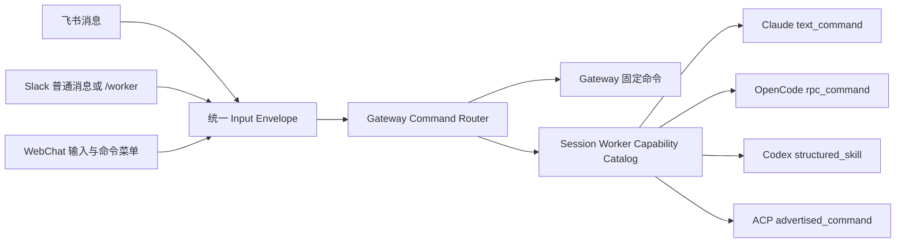

# 飞书、Slack、WebChat × 四 Worker 原生命令分发设计

**状态**：Approved，Live-validated，Implementation-ready

**日期**：2026-08-06

**代码基线**：`feat/957-native-skill-dispatch-3x4@f3abfe77`

**Live 验证工具**：`scripts/verify_worker_native_commands.py`

## 1. 结论

HotPlex 可以让飞书、Slack、WebChat 向当前会话 Worker 发送其真实支持的命令，但不能把四种 Worker 简化成同一种“把 `/name` 当普通文本转发”的能力。

目标方案由 Gateway 统一完成命令发现、冲突消解、权限校验、生命周期登记与结果映射；平台只负责输入和展示，Worker adapter 负责各自的原生协议：

- Claude Code：stream-json 用户帧中的原生 `/skill args` 文本命令；
- OpenCode Server：`GET /command` 发现，`POST /session/{id}/command` 调用；
- Codex CLI：app-server `skills/list` 发现，`turn/start` 发送结构化 `skill` item，路径必须采用 Codex 返回值；
- ACP：消费 session-scoped `available_commands_update`，只允许调用 Agent 已广告的 `/command`。

三个平台的普通文本最终都进入 Gateway `handleInput`，因此共享同一分发逻辑。Slack 的平台原生 Slash Command 事件当前只支持固定的 `/reset`、`/disconnect`；动态 Worker 命令默认走普通消息输入，或后续只注册一个稳定的 `/worker` 入口，不能假设 Slack 会自动注册 Worker catalog 中的每个命令。

## 2. 目标与非目标

### 2.1 目标

1. 三个平台对同一 session、同一 Worker 呈现一致的可调用命令集合。
2. 只调用 Worker 明确支持、发现或可确定解析的命令，未知命令不得静默降级为 LLM prompt。
3. 保留已有 Gateway 控制命令、可移植 Worker 命令和动态 Skill 的兼容性。
4. 按 Worker 原生协议调用，不丢失 Codex 路径、ACP session catalog 等专属语义。
5. 命令执行遵守 durable input、busy/pending、stop fence、crash replay 和单 terminal 契约。
6. 飞书、Slack、WebChat 使用同一能力状态和错误语义。

### 2.2 非目标

- 不承诺四个 Worker 支持相同命令。
- 不把未认证、无配额或上游不可用解释为 Worker 不支持。
- 不动态创建大量 Slack App Slash Command 配置。
- 不允许用户提交任意路径、任意 RPC method 或任意 HTTP endpoint。
- 本 spec 不改变 AEP wire contract；若实施需要新增 Kind、Data 或 JSON 字段，必须单独执行 AEP 全链路兼容性门禁。

## 3. 当前命令体系

### 3.1 三层命令

| 层级 | 示例 | 当前解析者 | 语义 |
| --- | --- | --- | --- |
| Gateway 会话控制 | `/gc`、`/reset`、`/stop`、`/cd` | `messaging.ParseControlCommand` | 改变 HotPlex session/turn 生命周期 |
| Gateway 可移植 Worker 命令 | `/context`、`/skills`、`/model`、`/compact` | `messaging.ParseWorkerCommand` | 映射到 `ControlRequester`、`WorkerCommander` 或兼容 fallback |
| Worker 原生 Skill/命令 | `/oracle-dba ...`、ACP 广告命令 | Skill catalog + Worker capability | 按 Worker 原生协议启动或控制 Worker |

`handleInput` 当前顺序是：interaction response → 固定命令 → 动态 Skill → 普通输入。这个顺序必须保留，否则同名 Skill 可覆盖 `/reset`、`/stop` 等安全边界。

### 3.2 当前已存在的原生 Skill 接口

当前分支已有：

- `worker.SkillInvoker.InvokeSkill`；
- `worker.SkillCatalogProvider.ListInvokableSkills`；
- `SkillInvocation{Name, Args, Path, Mode}`；
- `text_command`、`rpc_command`、`structured_skill`、`advertised_command` 四种模式；
- `/skills` 的 `callable`、`discoverable`、`unavailable` 状态；
- WebChat 动态 Skill 菜单，以及飞书、Slack 的 Skill 列表展示。

但当前 catalog 仍以 HotPlex 文件系统 Skill 为中心，不能完整表达 ACP 只存在于 session 广告中的命令，也没有把 OpenCode `/command` 作为统一的 Worker 命令目录。固定帮助中还列出了 `/effort`、`/commit`，实际 handler 会返回 `NotSupported`；WebChat 菜单中的 `/status` 也没有对应的共享解析项。菜单和帮助不能继续作为能力事实源。

### 3.3 当前基线的关键缺口

| ID | 缺口 | 影响 |
| --- | --- | --- |
| G1 | Gateway 以文件系统路径构造 Codex invocation；catalog 只按名称校验 | macOS `/var` 与 `/private/var`、符号链接或扫描根差异可导致结构化 Skill 路径不可解析 |
| G2 | OpenCode adapter 可调用 `/command`，但未通过该 endpoint 提供统一 catalog | 平台只能看到磁盘 Skill，不能以 OCS 实际目录为准 |
| G3 | ACP catalog 是 session-scoped 命令，但 `/skills` 只枚举磁盘 Skill | ACP 原生命令不可发现；磁盘 Skill 可能显示为 unavailable |
| G4 | 固定命令表是全局静态表，Worker 支持差异在执行时才报错 | 用户先看到可用、执行后才失败 |
| G5 | busy 输入若把原生 Skill 当普通 mid-turn 文本注入，会丢失结构化/RPC 语义 | Codex、OCS 等路径可能退化或错误重放 |
| G6 | 三个平台展示来源不同，Slack 原生 slash handler 还是固定白名单 | “平台可见”与“Worker 可调用”可能不一致 |

## 4. 2026-08-06 Live 事实

验证脚本创建隔离临时目录和随机 nonce Skill，调用真实安装的 Worker CLI/Server，只输出 marker 是否出现、HTTP/协议状态、字节数和短哈希，不保存 prompt、凭证或原始模型回复。状态定义：

- `PASS`：原生 catalog/调用链完成并观察到预期终态；
- `BLOCKED`：协议路径可进入，但认证、模型、配额或本机安装阻止完成；
- `FAIL`：环境具备条件时协议或断言失败。

| Worker | 版本 | Live 路径 | 结果 | 已确认事实 |
| --- | --- | --- | --- | --- |
| `claude_code` | 2.1.223 | stream-json `/hotplex-native-probe` | `BLOCKED` | 命令以规范 slash 文本发送；本机未登录，进程返回 1，不能宣称模型执行通过 |
| `opencode_server` | 1.18.14 | `GET /command` + `POST /session/{id}/command` | `BLOCKED` | catalog 200、临时 Skill 已广告、invoke 200；provider 身份验证失败，未观察到模型 marker |
| `codex_cli` | 0.146.1 | `skills/list` + structured `turn/start` | `PASS` | catalog 已广告；使用 descriptor 权威路径；真实模型返回唯一 marker |
| `acp` | Hermes ACP 0.20.0 | `available_commands_update` + `/context` | `PASS` | 广告 9 个命令；`/context` 以 `end_turn` 完成；临时文件系统 Skill 未被广告 |

Live 退出码：Codex、ACP 为 0；Claude、OpenCode 为 2；没有最终产品 `FAIL`。脚本修复了 OpenCode `/health` 返回 HTML 和中文认证错误分类两个实测问题，最终运行无残留 Worker 进程。

这些事实支持“统一分发可行”，但只对 Codex 和 ACP 构成当前环境的完整成功证据；Claude、OpenCode 在有效凭证环境仍需补跑 marker 验收。

## 5. 目标架构



### 5.1 统一描述模型

在 Worker 内部能力层引入通用描述，不把 Worker 私有路径暴露给平台：

```go
type NativeCommandDescriptor struct {
	Name        string
	Description string
	Kind        NativeCommandKind // skill | control
	Mode        SkillInvocationMode
	StartsTurn  bool
	AcceptsArgs bool
	Path        string // 仅 adapter/Gateway 内部使用
}

type NativeCommandCatalogProvider interface {
	ListNativeCommands(ctx context.Context, workDir string) ([]NativeCommandDescriptor, error)
}

type NativeCommandInvoker interface {
	InvokeNativeCommand(ctx context.Context, invocation NativeCommandInvocation) error
}
```

现有 `SkillCatalogProvider`、`SkillInvoker` 可以作为第一阶段兼容适配层；迁移完成前不得同时走两条路径重复执行。`Path` 只能来自可信 catalog 或 HotPlex 已解析的 Skill 根，不能由客户端提供。

### 5.2 Session 级能力目录

目录合并三类来源：

1. Gateway 固定命令：最高优先级，带明确的 Worker capability 条件；
2. Worker 权威 catalog：Codex `skills/list`、OpenCode `/command`、ACP `available_commands_update`；
3. HotPlex 文件系统 Skill：Claude 等无权威 catalog 的 Worker 标记为 `discoverable`，不能伪装成已验证 `callable`。

合并键为大小写敏感的规范名称；重复名称按固定命令 > Worker 权威 catalog > 文件系统 Skill 消解。Worker/session 替换、`/reset`、`/cd` 后目录必须失效并重新获取；ACP 的广告不得跨 session 复用。

### 5.3 调用语法与冲突规则

- 保留 `/skill-name [args]` 作为无冲突 Skill 的短语法。
- 新增稳定显式入口 `/worker <name> [args]`，用于调用与 Gateway 固定命令同名的 Worker 原生命令，也可作为 Slack 平台原生 Slash Command 的唯一注册点。
- `/worker` 只接受当前 session catalog 中的精确名称；未知、不可用、歧义或 stale catalog 均返回 `NOT_SUPPORTED`，不得退化为普通输入。
- `/reset`、`/stop` 等 Gateway 安全命令永远优先；只有显式 `/worker reset` 才可能请求 Worker 的同名原生命令。
- 参数作为不透明字符串交给 adapter，但必须受输入长度、审计脱敏和现有 owner 校验约束。

### 5.4 生命周期分类

`StartsTurn` 是必要事实，不能由平台猜测：

- `StartsTurn=true`：进入 durable accept → ACK → active gate → Worker delivery → terminal；busy 时保留原生 invocation 后再 replay，禁止转成 mid-turn 普通文本。
- `StartsTurn=false`：走有界 control request；成功发送 synthetic ACK/明确响应，不创建虚假 execution turn。
- 任何调用错误都使用现有错误分类，原始 Worker 错误只进脱敏结构化日志，不写入 execution payload。
- crash replay 保存 `NativeCommandInvocation`，不能只保存 `/name args` 文本；完成、stop 或 Worker replacement 后按当前 fencing 规则清理。

## 6. 四 Worker 适配要求

| Worker | Catalog | Invoke | 特殊约束 |
| --- | --- | --- | --- |
| Claude Code | 文件系统 Skill；未来若 CLI 提供稳定 catalog 再切换 | stream-json user frame，`/name args` | 无 catalog 时只能 `discoverable`；认证 Live 补跑后才能标记环境验证通过 |
| OpenCode Server | `GET /command` | `POST /session/{id}/command`，body 必含 `command`、`arguments` | HTTP 200 不等于模型成功；必须消费 session 事件/错误并等待 terminal |
| Codex CLI | app-server `skills/list` | structured `skill` item + text item | `name`、`path` 均取 catalog descriptor；不得继续使用仅文件系统扫描得到的别名路径 |
| ACP | 当前 session 的 `available_commands_update` | `session/prompt` 发送 `/name args` | catalog 为空/未广告即拒绝；文件系统 Skill 不自动成为 ACP 命令 |

## 7. 平台行为

### 7.1 飞书

- 普通文本 `/skill`、`/worker ...` 进入共享 Gateway router。
- `/skills` 或后续 `/commands` 卡片展示名称、类型、Worker、状态和参数提示。
- unavailable 项不可生成可点击调用动作；卡片 action 必须携带原始 session owner 上下文，不携带本地路径。

### 7.2 Slack

- 普通消息与飞书一致。
- Socket Mode 原生 Slash Command 保持固定白名单；若需要原生入口，只新增 `/worker`，`cmd.Text` 作为名称和参数送入共享 parser。
- 不为动态 Skill 逐个注册 Slack command；catalog 更新无需修改 Slack App 配置。

### 7.3 WebChat

- Command Menu 从 session capability 数据构建，不能维护一份与 Gateway 脱节的静态“可用”列表。
- `callable` 可选择，`discoverable` 明确提示未确认，`unavailable` 禁用。
- 选择 Skill 后保留尾随空格以继续输入参数；固定菜单不得再展示无 parser/handler 的 `/status`。

## 8. 安全与可靠性

1. 先做 owner/session active 校验，再查 catalog 和调用。
2. catalog 设 5 秒有界查询；invoke 使用 Worker/turn 既有 deadline，所有子进程最终 terminate → kill。
3. 只允许 catalog 精确命中，不允许任意文件路径、HTTP 路径、JSON-RPC method 或 shell 拼接。
4. 日志只记录 Worker 类型、命令名、状态、耗时和错误类别；参数、Skill 正文、凭证、模型原文不进入普通日志和证据。
5. catalog 获取失败是“无法确认”，不能自动当作 callable；显式调用返回稳定错误。
6. 同一 client message ID 保持幂等；busy buffer 合并后若内容改变，不能错误重放其中某一个 Skill invocation。
7. Worker catalog 是 session 事实；reset、resume、worker replacement 后旧 catalog 和旧 forwarder 一并 fence。

## 9. 实施切片

### Slice 1：当前 Skill 分发可靠性闭环

- Codex 使用 catalog descriptor 的权威路径。
- busy/pending 与 crash replay 保存原生 invocation，不降级为普通文本。
- 补齐 Claude、OCS、Codex、ACP adapter 单元与 Gateway contract 测试。

### Slice 2：统一 Worker catalog

- 引入 `NativeCommandDescriptor` 与兼容适配层。
- OpenCode 接入 `GET /command`；ACP 直接复用 session advertisement。
- `/skills` 展示 catalog 合并状态，删除静态帮助中的虚假可用声明。

### Slice 3：三端发现与显式 `/worker`

- Gateway parser 加 `/worker <name> [args]` 与冲突规则。
- 飞书/Slack 展示统一状态；Slack 可选注册单一 `/worker`。
- WebChat 菜单由 session capability 驱动，删除 `/status` 漂移。

### Slice 4：完整验证

- CI：3 平台 × 4 Worker 的 parser、catalog、invoke、busy、replay、terminal 合同测试；协议边界使用各自 fake，不用一个通用 mock 冒充 12 组合。
- Live：在有效 Claude/OpenCode 凭证环境补跑脚本；随后通过真实 Gateway 分别从飞书、Slack、WebChat 验收四 Worker。
- Live 证据绑定 commit，状态必须区分 `PASS`、`FAIL`、`BLOCKED`。

## 10. 验收标准

1. 三个平台对同一 session 返回相同的命令名称、类型和状态。
2. Gateway 固定命令不可被 Worker Skill 覆盖；显式 `/worker` 可以无歧义访问同名原生命令。
3. Claude、OpenCode、Codex、ACP 分别命中 `text_command`、`rpc_command`、`structured_skill`、`advertised_command`，测试断言真实 wire shape。
4. Codex invocation path 与 `skills/list` descriptor 完全一致。
5. ACP 未广告命令和文件系统临时 Skill 被拒绝，不作为普通 prompt 发送。
6. OpenCode catalog 发现与 invoke 分开断言；provider 认证失败归类为 `BLOCKED`/上游错误，不误报协议成功。
7. busy、retry、crash replay 和重复 client message 不造成重复调用或语义降级。
8. WebChat 不再列出无实现 `/status`；固定帮助不再把 `/effort`、`/commit` 宣称为普遍可用。
9. 验证证据不包含 prompt、参数原文、凭证、绝对用户路径或原始模型文本。
10. `scripts/verify_worker_native_commands.py` 单测、语法检查和四 Worker Live 探测完成，且运行后无残留进程。

## 11. Live 验证命令

```bash
python -m unittest scripts/test_verify_worker_native_commands.py -v
python scripts/verify_worker_native_commands.py --worker claude_code --timeout 75
python scripts/verify_worker_native_commands.py --worker opencode_server --timeout 75
python scripts/verify_worker_native_commands.py --worker codex_cli --timeout 120 --codex-model gpt-5.6-sol
python scripts/verify_worker_native_commands.py --worker acp --timeout 75
```

仓库开发环境执行时继续遵守项目约定，为每条 shell 命令添加 `rtk` 前缀。脚本退出码为：0 全部通过，1 存在产品/协议失败，2 无失败但存在环境阻塞。
