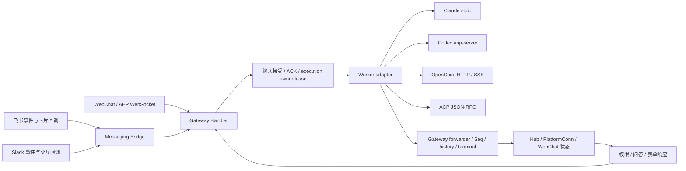

# 四 Worker 与三端功能对齐复核

调查日期：2026-09-05。源码基线：`9721ecac`。目标分支：`fix/platform-worker-parity`。

## 目标与验收边界

用户确认采用“公共能力行为一致，原生差异明确提示”的标准。范围是 `claude_code`、`codex_cli`、`opencode_server`、`acp` 与 WebChat、飞书、Slack 的组合。修复已有行为中的断链与错误反馈，保留各 Worker 原生协议及平台呈现方式。

证据分三级：Source 是当前源码及调用链；Test 是本地协议替身、数据库和浏览器测试；Live 是真实 Worker 与平台账号组合操作。本次普通测试不访问真实消息平台、不读取凭据，不将 Test 标成 Live。

不修改 AEP Kind、Data 或 JSON tag，不引入数据库迁移，不变更运行实例配置。需要这些变更的发现应单列设计与影响范围。回退以独立修复提交为单位，保留既有数据与会话记录。

## 端到端边界

交互响应走专用响应通道，不创建普通 execution；补充输入依 Worker 能力注入当前轮或进入网关缓冲。三端需要共享成功、失败、停止和下一轮可用的语义。

## 当前基线

| 验证 | 结果 | 边界 |
| --- | --- | --- |
| `make test-contract-matrix` | 12 组合、96 核心场景通过，0 skip / fail | 平台与 Worker 协议替身 |
| `go test ./internal/worker/... ./internal/gateway/... ./internal/messaging/... -count=1 -race -shuffle=on` | 21 包通过 | 保留既有受环境约束测试；不作为 Live 证据 |
| `pnpm --dir webchat test` | 16 文件、224 测试通过 | Vitest |
| WebChat Chromium 矩阵 | Claude / OpenCode / Codex 通过；ACP stop 后光标断言失败 | 已安装 Chrome，fake WebSocket；待根因复现 |
| 真实 12 组合 | 未执行 | 不得标记 PASS |

Playwright 默认浏览器缓存缺失属于环境问题；采用配置中已有的 `PLAYWRIGHT_CHROMIUM_EXECUTABLE_PATH` 指向已安装浏览器后执行，不改项目依赖。旧设计所列 `docs/guides/developer/platform-worker-e2e-validation.md` 与 `docs/assets/e2e/` 在本次基线不存在。

## 已核实的恢复差异

| 能力 | Claude Code | Codex | OpenCode | ACP |
| --- | --- | --- | --- | --- |
| 流式文本 / 工具事件 | adapter 支持 | adapter 支持 | adapter 支持 | 依 agent 实际事件 |
| 停止当前轮 | 原生中断 | 原生 turn interrupt | HTTP session abort | session cancel |
| 下一轮 | 同一会话 | 同一线程 | 同一远端 session | 同一 agent session |
| 当前轮补充 | 原生注入 | 原生 steer | Gateway 缓冲 | Gateway 缓冲 |
| 恢复上下文 | 会话文件；缺失时 fresh fallback | 新线程与文本历史回填 | 远端 session；缺失时 fresh fallback | 动态 loadSession；不可用时回填现有文本历史并提示 |
| 终止态原生恢复 | 支持 | 不支持 | 支持 | 依 agent |
| 图片 | 声明支持 | 声明支持 | 声明支持 | 声明支持；实际依 agent |

“声明支持图片”不等于附件已经穿过三端上传、转换和 Worker 消费闭环。“支持恢复”也不等于完整恢复原生工具状态。`internal/e2econtract/manifest.go` 的粗粒度 Native 标签仅能解释测试 profile，不能替代上述运行时边界。

## 当前已确认问题

以下发现描述源码基线的行为，修复状态以“已集成记录”为准。P1 表示可能破坏访问控制、审批意图或持久化顺序；P2 表示交互、上下文或能力反馈不正确。

| 优先级 | 发现 | 影响范围 | 可观察后果 |
| --- | --- | --- | --- |
| P1 | R1 序号恢复失败仍启动 | 共享 Gateway，四 Worker | 事件序号冲突、旧 Worker 被提前替换 |
| P1 | R5 文本审批目标回退 | Slack × 四 Worker 交互能力 | 显式错误 ID 可能批准另一个请求 |
| P1 | R7 访问检查晚于媒体处理 | 飞书 × 四 Worker | 拒绝消息仍下载、落盘或转写 |
| P2 | R2 / R3 ACP 历史降级断链 | 三端 × ACP | 恢复后缺上下文且未准确反馈 |
| P2 | R4 OpenCode 静默新建 | 三端 × OpenCode | 原生上下文丢失却被记作 resumed |
| P2 | R6 问答数组移位 | 三端 × OpenCode | 多题部分回答被写入错误题号 |
| P2 | R8 ACP 扩展未规范化 | 三端 × 发出该扩展的 ACP agent | 问答、表单请求没有标准卡片 |
| P2 | R9 终态残留交互 | WebChat × 四 Worker | 旧卡片仍能提交、迟到回执污染状态 |
| P2 | R10 命令目录过度声明 | 三端共享目录 | 菜单可见能力与实际执行不一致 |
| P2 | R11 停止后的旧消息快照回写 | WebChat × 四 Worker | 已完成回复丢失文本或重新显示流式光标 |

WebChat stop 光标失败已通过确定性事件顺序复现为共享前端竞态，不能归因给 ACP。网页附件上传是功能缺口，需要独立设计，未算作已修复问题。

### R1：平台恢复在 Seq hydration 失败后仍启动 Worker

`internal/gateway/bridge.go:resumeWithOpts` 先处理旧 Worker 和会话状态，随后调用 `EnsureSeqHydrated`；错误仅记录警告，继续启动。`internal/gateway/conn_test.go` 已测试 WebChat hydration 失败时阻止启动。消息平台恢复可能在持久化最大 Seq 未读取成功时分配低序号，导致持久化冲突。

修复：在终止旧 Worker、状态迁移及启动新 Worker之前确保 hydration 成功；失败返回包装错误。测试覆盖四 Worker profile、原状态和旧 Worker保留、不分配 Seq、不调用工厂；恢复读取成功后的重试仍可用。已有正常恢复测试必须保持通过。

### R2：ACP 文本历史回填未接通真实 Gateway 路径

`internal/worker/acp/worker.go` 在 loadSession 失败后读取 `SessionInfo.ConversationHistory`，但 `internal/gateway/bridge.go:prepareWorkerInfo` 只给 Codex 填充该字段。ACP 的注入 helper 单测直接设置 pendingHistory，不能发现调用链断开。

修复：复用现有有界 turns 查询和历史压缩，为 ACP 提供历史；ACP 仅在原生恢复不可用时使用，不重复注入成功恢复的原生会话。测试同时覆盖真实 prepareWorkerInfo 输入和 ACP 协议握手分支。

### R3：ACP 未声明 loadSession 时绕过历史降级

已知 WorkerSessionID 且 agent 不声明 loadSession 时，Start 创建新 session，却未设置 historyLost；已有历史既不注入，也不触发现有恢复提示。

修复：把该路径归入已有历史降级分支，验证第一次 prompt 带历史、下一次不重复；原生 loadSession 成功保持原行为。真正新会话不能误报历史丢失。

### R4：OpenCode 远端会话消失后静默返回恢复成功

`internal/worker/opencodeserver/worker.go:Resume` 已正确区分远端查询失败与不存在；但不存在后创建新会话仍返回 nil。Claude 和 Codex 使用既有 `ErrFellBackToFreshStart` 通知 Gateway 调整 resumed bookkeeping。OpenCode 需要采用相同语义，并让三端知道原生上下文未恢复。不能在查询错误时擅自新建会话。

### R5：Slack 文本交互解析丢失自由文本并误匹配审批目标

`internal/messaging/slack/interaction.go:checkPendingInteraction` 把所有多词文本解释为 action/requestID。`use postgres` 无法作为 question 答案回传；`allow nonexistent-id` 则在显式查找失败后回退最新 pending 审批，可能批准另一个请求。原实现还把 request ID 小写化。

修复：仅识别 allow/deny/accept/decline 动作，保持 request ID 原样；显式 ID 查找失败必须提示且不回退；自由文本问答保留全文。权限所有者检查和投递失败可重试保持不变。

### R6：OpenCode 多问题回答省略空题后发生位置错配

两平台表单允许部分问题留空；`answerOptionsToOrderedArrays` 和 `answersToOrderedArrays` 却跳过 questionOrder 中没有答案的题。第二题回答会变成远端第一题回答。

修复：为每个 questionOrder 项保留位置；未答题编码为空数组 `[]`，不能省略或编码为 null。额外 key 保持现有确定性排序；字符串答案和多选数组两条路径均需 HTTP 请求体回归。

### R7：飞书访问控制晚于附件下载与转写

`internal/messaging/feishu/handler.go:handleMessage` 在 Gate 检查前调用 processMediaAttachments；Slack 在媒体处理前检查 Gate。被拒绝的飞书发送者仍能触发下载、磁盘写入及可能的转写调用。

修复：路由字段与 Gate 检查提前到任何媒体 I/O 之前；保持拒绝时 dedup rollback。以被拒绝的图片与语音事件证明下载和 STT 调用为零，再证明获准消息继续进入原处理路径。

### R11：停止后的旧消息快照回写覆盖终态

基线最先在 ACP Chromium 场景看到停止后发送按钮恢复，而 `.streaming-cursor` 仍为 1。后续在其他 Worker 标签下复现：`assistant-ui` 的 cancelRun 定时回写旧消息快照，可能覆盖适配器已经完成的回复。另外，React updater 延后执行时读取已清空的 pending ID，也会误判消息目标。修复捕获该轮消息 ID 并阻止取消快照回退终态。最终测试冻结浏览器时钟，分别验证多 delta 的旧快照在 done 前回写，以及空输出停止后立即开始下一轮再回写，确认文本、终态和新输入均被保留；没有延长超时或隐藏光标。

### R8：ACP 已有问答扩展只发送 Raw，无法接通三端标准卡片

`handleServerRequest` 只规范化 permission，仓库已有测试使用的 `session/request_question` 和 `session/request_elicitation` 被转成 Raw。对应 response 方法却已实现。WebChat 只监听标准 QuestionRequest/ElicitationRequest，造成请求与响应断链。这是仓库已有扩展方法的适配问题，不代表所有 ACP agent 原生支持这两个方法。

修复：对这两个明确方法，将已知参数规范化为已有 AEP 类型并保留原始 JSON-RPC request ID。支持现有测试中的单 question 字符串及标准 questions 数组；elicitation 使用现有 schema 字段。未知方法保持原策略，非法已知参数明确报错，不伪造成功。标准卡片链路与 Worker 写回都要验证。

### R9：WebChat 终态后仍可能保留可提交的交互卡片

`handleDone` 完成消息及 tool status，却没有结束对应 interaction 状态；QuestionResponseCard 仍允许 pending/failed 状态提交。修复应在真正的 turn/session 终态过期未完成交互、清理 timer 与索引，成功交互状态保持原样。临时断线仍可能恢复同一 Worker，不能一概把断线当永久会话终止。

### 功能边界：WebChat 附件输入尚未实现

当前 WebChat Composer 没有上传入口，输入只提取文本；Gateway ServerCaps 的 text/code 描述的是当前网页可用输入。四 Worker 的 image 声明不能证明网页存在上传闭环。飞书/Slack 通过下载文件并传本地路径提供平台媒体能力，不能把占位文本算作已读取附件。

本轮保留“公共能力一致、原生差异明确提示”的标准，将网页附件上传标为未实现。补齐上传需要单独设计认证、工作区文件隔离、大小限制、存储清理和输入引用，涉及新增接口与持久化输入边界，不能仅把 ServerCaps 改成 image 就宣称支持。

### R10：命令目录以接口存在代替实际子命令支持

`native_catalog.go` 只通过 ControlRequester / WorkerCommander 接口展示固定命令。当前 Codex 的 set_model、set_permission_mode，ACP 的 compact、rewind，以及 Claude 的 Clear 明确不支持，却可能出现在可调用目录中。应为这些已知原生差异提供准确目录，手工执行仍返回 NOT_SUPPORTED，保留 reset 等公共命令。不能为隐藏命令开放同名 filesystem skill 或把控制词退化为普通 prompt。

## 已集成记录

| 修复 | 提交 | 验证 |
| --- | --- | --- |
| R1 Seq hydration 失败阻断所有恢复旁路 | `66ad556` | 主 Agent 13 项定向 race/shuffle 通过；子代理 Gateway 整包 race/shuffle 通过；提交 hook 通过 |
| R2 Gateway 向 ACP 提供有界历史 | `2f28297` | 主 Agent 5 项 prepareWorkerInfo race/shuffle 通过；提交 hook 通过 |
| R3 ACP 恢复降级、历史首轮注入与信息提示 | `dc0324c` | 主 Agent 9 项定向 race/shuffle 通过，含协议 fake；提交 hook 通过 |
| R4 OpenCode 新建恢复降级显式反馈 | `9895e67` | 主 Agent 8 项 Resume race/shuffle 通过；子代理 OpenCode 整包通过；提交 hook 通过 |
| R5 Slack 文本回答与精确审批目标 | `7943eee` | 主 Agent 定向 race/shuffle 20 项通过；子代理 Slack 整包 race/shuffle 通过；提交 hook 通过 |
| R6 OpenCode 保留未答题位置 | `e633863` | 主 Agent 15 项定向 race/shuffle 通过，含 HTTP 请求体；子代理 OpenCode 整包通过；提交 hook 通过 |
| R7 飞书访问检查先于媒体 I/O | `542d171` | 主 Agent 3 项入口 race/shuffle 通过；子代理飞书整包通过；测试使用私有临时目录；提交 hook 通过 |
| R8 ACP 已知问答、表单扩展规范化 | `7abddc3` | 主 Agent ACP 210 项及追加 4 项回程测试通过；另一子代理只读审查 APPROVED；提交 hook 通过 |
| R9 WebChat 未完成交互过期且忽略迟到回执 | `da108c9`、`f961414` | 不可变 helper 5 项单测；主 Agent 合并浏览器回归含四 Worker 的 16 项终态交互测试；生产构建和提交 hook 通过 |
| R10 命令目录反映原生能力，保留名称占用 | `4b3de98` | 主 Agent Gateway 25 项、Codex 1 项定向 race/shuffle 通过；提交 hook 通过 |
| R11 停止后的旧快照不回退消息状态 | `d6dc1d8` | 主 Agent 四 Worker Chromium 矩阵 5 项通过；含冻结 timer 的多 delta 与空输出边界；提交 hook 通过 |

## 实施选择

采用现有契约上的定点修复：每个原子任务包含复现测试、最小实现与精准回归。相比重建统一能力框架，此方案不扩大接口和迁移成本；相比仅更新能力文档，它能修复实际上下文丢失和恢复风险。

开发由 `luna_worker` 执行。主 Agent 负责证据复核、方案、文件所有权和最终测试。共享文件串行修改；每个任务仅交付一个可独立验收的行为。R1–R11 均已集成，网页附件作为需独立接口设计的剩余缺口记录。

## 最终验证

每个原子任务提供复现与修复后的验证；Go 目标包运行 race/shuffle，三端矩阵不跳过组合；WebChat 运行 Vitest、TypeScript、Chromium 矩阵及构建。每项保留 Source/Test/Live 边界。

最终本地验证日期：2026-09-05（Asia/Shanghai），代码集成至 `f961414`。主 Agent 验证 `make test-contract-matrix`：12 组合、96 核心场景，0 skip / fail；`make quality`：全仓 Go race/shuffle 和 lint 通过。合并 Chromium 回归 21/21 通过，包括 1 项矩阵标识检查、4 项 Worker 核心流和 16 项终态交互；Vitest 17 文件、229/229 通过。`make build` 完成文档、WebChat 生产构建（含 TypeScript）及 Go 二进制编译。子代理另验证改动前端文件 ESLint 通过。

初次质量门禁发现文档 BFS 测试仍固定为 58，新增手册和模板后更新为精确 60，并保留历史 spec 及本轮设计/计划不可从当前文档入口到达的检查（`36a7c97`）。`make docs-lint` 通过 60 文档、2 资源的构建与链接校验。一次早期构建的 Scalar 离线资源下载超时，不能用文档链接检查推断离线依赖始终可用。

| 组合 | 平台 | Worker | 8 项协议核心场景 | 浏览器核心回归 | Live |
| --- | --- | --- | --- | --- | --- |
| F-C | 飞书 | Claude Code | 8/8 通过 | 不适用 | NOT_RUN |
| F-O | 飞书 | OpenCode | 8/8 通过 | 不适用 | NOT_RUN |
| F-X | 飞书 | Codex | 8/8 通过 | 不适用 | NOT_RUN |
| F-A | 飞书 | ACP | 8/8 通过 | 不适用 | NOT_RUN |
| S-C | Slack | Claude Code | 8/8 通过 | 不适用 | NOT_RUN |
| S-O | Slack | OpenCode | 8/8 通过 | 不适用 | NOT_RUN |
| S-X | Slack | Codex | 8/8 通过 | 不适用 | NOT_RUN |
| S-A | Slack | ACP | 8/8 通过 | 不适用 | NOT_RUN |
| W-C | WebChat | Claude Code | 8/8 通过 | 核心流 + 4 项终态交互通过 | NOT_RUN |
| W-O | WebChat | OpenCode | 8/8 通过 | 核心流 + 4 项终态交互通过 | NOT_RUN |
| W-X | WebChat | Codex | 8/8 通过 | 核心流 + 4 项终态交互通过 | NOT_RUN |
| W-A | WebChat | ACP | 8/8 通过 | 核心流 + 4 项终态交互通过 | NOT_RUN |

这里的通过仅指列出的 Test 场景。平台使用本地 API 替身，Worker 使用协议替身；浏览器使用真实 Chrome 与模拟 WebSocket。附件、语音、动态模型和真实原生会话状态不包含在“8/8”内，不能据此把整组 Live 或全部功能标记为通过。
