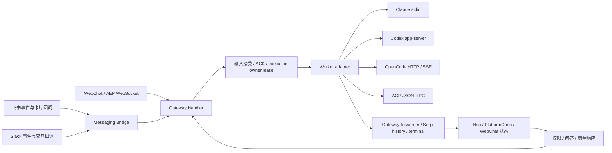

# 四 Worker 与三端功能对齐复核

调查日期：2026-09-05。源码基线：`9721ecac`。目标分支：`fix/platform-worker-parity`。

## 目标与验收边界

用户确认采用“公共能力行为一致，原生差异明确提示”的标准。范围是 `claude_code`、`codex_cli`、`opencode_server`、`acp` 与 WebChat、飞书、Slack 的组合。修复已有行为中的断链与错误反馈，保留各 Worker 原生协议及平台呈现方式。

证据分三级：Source 是当前源码及调用链；Test 是本地协议替身、数据库和浏览器测试；Live 是真实 Worker 与平台账号组合操作。本次普通测试不访问真实消息平台、不读取凭据，不将 Test 标成 Live。

不修改 AEP Kind、Data 或 JSON tag，不引入数据库迁移，不变更运行实例配置。需要这些变更的发现应单列设计与影响范围。回退以独立修复提交为单位，保留既有数据与会话记录。

## 端到端边界

交互响应走专用响应通道，不创建普通 execution；补充输入依 Worker 能力注入当前轮或进入网关缓冲。三端需要共享成功、失败、停止和下一轮可用的语义。

## 当前基线

| 验证 | 结果 | 边界 |
| --- | --- | --- |
| `make test-contract-matrix` | 12 组合、96 核心场景通过，0 skip / fail | 平台与 Worker 协议替身 |
| `go test ./internal/worker/... ./internal/gateway/... ./internal/messaging/... -count=1 -race -shuffle=on` | 21 包通过 | 保留既有受环境约束测试；不作为 Live 证据 |
| `pnpm --dir webchat test` | 16 文件、224 测试通过 | Vitest |
| WebChat Chromium 矩阵 | Claude / OpenCode / Codex 通过；ACP stop 后光标断言失败 | 已安装 Chrome，fake WebSocket；待根因复现 |
| 真实 12 组合 | 未执行 | 不得标记 PASS |

Playwright 默认浏览器缓存缺失属于环境问题；采用配置中已有的 `PLAYWRIGHT_CHROMIUM_EXECUTABLE_PATH` 指向已安装浏览器后执行，不改项目依赖。旧设计所列 `docs/guides/developer/platform-worker-e2e-validation.md` 与 `docs/assets/e2e/` 在本次基线不存在。

## 已核实的恢复差异

| 能力 | Claude Code | Codex | OpenCode | ACP |
| --- | --- | --- | --- | --- |
| 流式文本 / 工具事件 | adapter 支持 | adapter 支持 | adapter 支持 | 依 agent 实际事件 |
| 停止当前轮 | 原生中断 | 原生 turn interrupt | HTTP session abort | session cancel |
| 下一轮 | 同一会话 | 同一线程 | 同一远端 session | 同一 agent session |
| 当前轮补充 | 原生注入 | 原生 steer | Gateway 缓冲 | Gateway 缓冲 |
| 恢复上下文 | 会话文件；缺失时 fresh fallback | 新线程与文本历史回填 | 远端 session；缺失时 fresh fallback | 动态 loadSession；失败时计划采用文本回填 |
| 终止态原生恢复 | 支持 | 不支持 | 支持 | 依 agent |
| 图片 | 声明支持 | 声明支持 | 声明支持 | 声明支持；实际依 agent |

“声明支持图片”不等于附件已经穿过三端上传、转换和 Worker 消费闭环。“支持恢复”也不等于完整恢复原生工具状态。`internal/e2econtract/manifest.go` 的粗粒度 Native 标签仅能解释测试 profile，不能替代上述运行时边界。

## 当前已确认问题

### R1：平台恢复在 Seq hydration 失败后仍启动 Worker

`internal/gateway/bridge.go:resumeWithOpts` 先处理旧 Worker 和会话状态，随后调用 `EnsureSeqHydrated`；错误仅记录警告，继续启动。`internal/gateway/conn_test.go` 已测试 WebChat hydration 失败时阻止启动。消息平台恢复可能在持久化最大 Seq 未读取成功时分配低序号，导致持久化冲突。

修复：在终止旧 Worker、状态迁移及启动新 Worker之前确保 hydration 成功；失败返回包装错误。测试覆盖四 Worker profile、原状态和旧 Worker保留、不分配 Seq、不调用工厂；恢复读取成功后的重试仍可用。已有正常恢复测试必须保持通过。

### R2：ACP 文本历史回填未接通真实 Gateway 路径

`internal/worker/acp/worker.go` 在 loadSession 失败后读取 `SessionInfo.ConversationHistory`，但 `internal/gateway/bridge.go:prepareWorkerInfo` 只给 Codex 填充该字段。ACP 的注入 helper 单测直接设置 pendingHistory，不能发现调用链断开。

修复：复用现有有界 turns 查询和历史压缩，为 ACP 提供历史；ACP 仅在原生恢复不可用时使用，不重复注入成功恢复的原生会话。测试同时覆盖真实 prepareWorkerInfo 输入和 ACP 协议握手分支。

### R3：ACP 未声明 loadSession 时绕过历史降级

已知 WorkerSessionID 且 agent 不声明 loadSession 时，Start 创建新 session，却未设置 historyLost；已有历史既不注入，也不触发现有恢复提示。

修复：把该路径归入已有历史降级分支，验证第一次 prompt 带历史、下一次不重复；原生 loadSession 成功保持原行为。真正新会话不能误报历史丢失。

### R4：OpenCode 远端会话消失后静默返回恢复成功

`internal/worker/opencodeserver/worker.go:Resume` 已正确区分远端查询失败与不存在；但不存在后创建新会话仍返回 nil。Claude 和 Codex 使用既有 `ErrFellBackToFreshStart` 通知 Gateway 调整 resumed bookkeeping。OpenCode 需要采用相同语义，并让三端知道原生上下文未恢复。不能在查询错误时擅自新建会话。

### 待根因确认的浏览器失败

ACP Chromium 场景在停止后发送按钮恢复，而 `.streaming-cursor` 仍为 1。定位应验证事件处理和待刷新的增量批次，不通过延长超时或弱化断言掩盖失败。

## 实施选择

采用现有契约上的定点修复：每个原子任务包含复现测试、最小实现与精准回归。相比重建统一能力框架，此方案不扩大接口和迁移成本；相比仅更新能力文档，它能修复实际上下文丢失和恢复风险。

开发由 `luna_worker` 执行。主 Agent 负责证据复核、方案、文件所有权和最终测试。共享文件串行修改；每个任务仅交付一个可独立验收的行为。交互及附件审计结果按相同证据标准补入具体任务后再实施。

## 最终验证

新增行为先观察断言失败再修复；Go 目标包运行 race/shuffle，三端矩阵不得跳过组合；WebChat 运行 Vitest、TypeScript、Chromium 矩阵及构建。更新文档后执行文档检查。每项报告 Source/Test/Live 边界以及未验证的外部能力。
