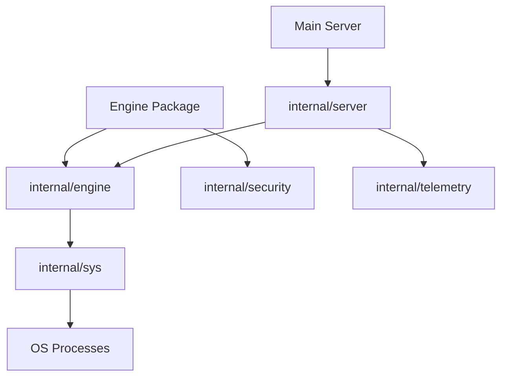

# HotPlex Internal: Core Subsystems & Utilities

The `internal` directory contains the foundational subsystems of HotPlex. These packages are not accessible outside of the HotPlex codebase (per Go's `internal` conventions), ensuring a clean boundary between public APIs and implementation details.

## 🏛 Architecture Overview

The `internal` layer provides the critical infrastructure that supports the Engine, ChatApps, and CLI providers.

### Key Subsystems

-   **`internal/engine` (Session Lifecycle)**: Implements the `SessionPool` and `Session` logic. It handles the low-level management of hot-multiplexed processes, including process group (PGID) cleanup and asynchronous I/O piping.
-   **`internal/security` (WAF & Audit)**: The core security engine. It features the **Danger Detector**, which uses high-performance regex matching to prevent commands like `rm -rf /` or credential exfiltration before they are executed.
-   **`internal/server` (Transport Layer)**: Contains the core HTTP/WebSocket handlers. It bridges web clients to the HotPlex Engine and provides specific endpoints for OpenCode-style HTTP compatibility.
-   **`internal/telemetry` (Observability)**: Manages Prometheus metrics and internal tracing. It tracks session duration, token usage, and security blocks globally.
-   **`internal/sys` (System Utils)**: Provides low-level OS utilities for signal handling, terminal emulation, and process management.

---

## 🛠 Developer Guide for Internal Packages

### 1. Modifying the Session Pool (`internal/engine`)

If you need to change how CLI processes are recycled or how stdout is parsed asynchronously:
1.  Look at `pool.go` for the `SessionPool` implementation.
2.  `session.go` handles individual process lifecycle and I/O wait-loops.
3.  **Important**: Always ensure `PGID` is killed to avoid zombie processes when a session times out.

### 2. Updating Security Rules (`internal/security`)

To add new protection patterns to the regex firewall:
1.  Navigate to `internal/security/detector.go` or the relevant `rules/` subdirectory.
2.  Define a new detection regex and specify its severity (Warning vs. Block).
3.  Verify your rule using the extensive test suite in `detector_test.go`.

### 3. Adding New Metrics (`internal/telemetry`)

HotPlex uses Prometheus for real-time monitoring:
1.  Register new counters or histograms in `telemetry.go`.
2.  Invoke the tracking methods from the Engine or Internal Server.
3.  The metrics are automatically exposed via the server's telemetry endpoint.

---

## ⚙️ Design Principles

-   **Process Graceful Shutdown**: All internal components must respect contexts and termination signals.
-   **No Zombie Guarantee**: The `internal/sys` and `internal/engine` packages work together to ensure that even if a parent process crashes, the underlying CLI agents (and their children) are swept.
-   **Zero Allocation Paths**: Critical paths like regex scanning in `internal/security` are optimized to minimize garbage collection overhead.

---

**Package Path**: `github.com/hrygo/hotplex/internal`  
**Core Components**: `SessionPool`, `DangerDetector`, `WebSocketHandler`, `TelemetrySystem`
