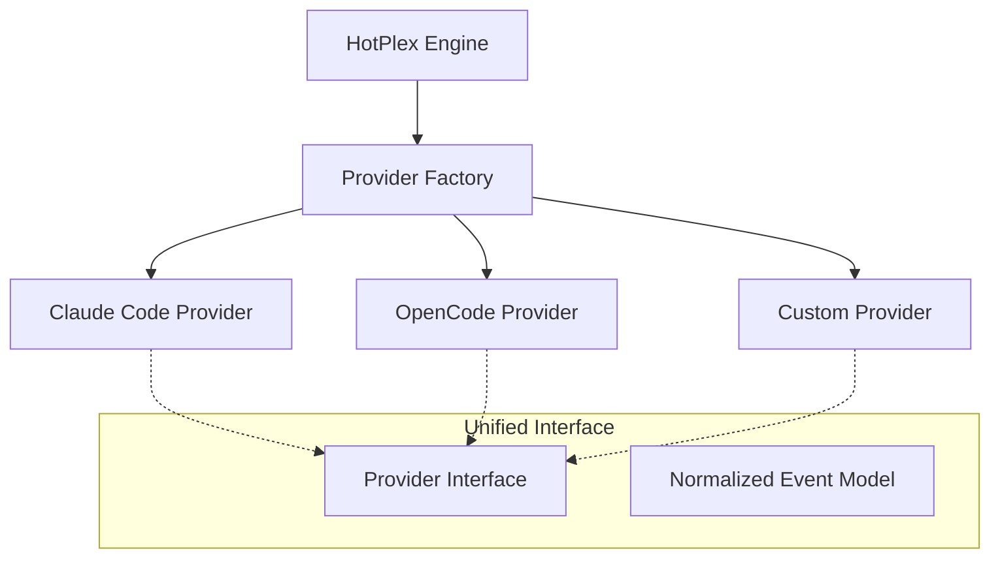

# HotPlex Providers: AI Agent Abstraction Layer

The `provider` package defines the bridge between HotPlex and various AI CLI agents (e.g., Claude Code, OpenCode). It abstracts platform-specific CLI protocols, event formats, and execution models into a unified interface.

## 🏛 Architecture Overview

The Providers act as **Strategy Adapters** in the HotPlex ecosystem. They handle the low-level details of interacting with different AI agents while exposing a consistent API to the Engine.



### Key Architectural Concepts

-   **`Provider` (Interface)**: The core contract that defines how to start a CLI, send user input, and parse the resulting stream of events.
-   **Normalized Event Model**: Regardless of the provider's native output (JSON, SSE, plain text), this package converts it into a standard `ProviderEvent` stream (e.g., `thinking`, `tool_use`, `answer`, `error`).
-   **Factory Pattern**: The `ProviderFactory` allows for dynamic registration and creation of providers based on configuration, enabling easy extension without modifying the core Engine.
-   **Protocol Translation**: Each provider implementation handles the specific "dialect" of its underlying CLI (e.g., Claude's `stream-json` vs. OpenCode's reasoning parts).

---

## 🛠 Developer Guide

### 1. Implementing a New Provider

To support a new AI CLI tool, implement the `Provider` interface:

```go
type MyNewProvider struct {
    provider.ProviderBase // Optional: provides common functionality
}

func (p *MyNewProvider) Name() string { return "my-new-ai" }

func (p *MyNewProvider) BuildCLIArgs(sessionID string, opts *ProviderSessionOptions) []string {
    // Construct command line arguments (e.g., --session-id, --model)
}

func (p *MyNewProvider) BuildInputMessage(prompt string, taskInst string) (map[string]any, error) {
    // Format the stdin payload for the CLI
}

func (p *MyNewProvider) ParseEvent(line string) ([]*ProviderEvent, error) {
    // Convert a raw line of stdout to normalized events
}
```

### 2. Registering with the Factory

In your package's `init()` or an initialization function, register your provider with the global factory:

```go
provider.GlobalProviderFactory.Register("my-new-ai", func(cfg ProviderConfig, logger *slog.Logger) (Provider, error) {
    return &MyNewProvider{...}, nil
})
```

### 3. Using the Provider

The Engine typically uses the factory to create the configured provider:

```go
pCfg := provider.ProviderConfig{Type: "claude-code", Enabled: true}
prv, err := provider.CreateProvider(pCfg)
if err != nil {
    // handle error
}

// engine then uses prv to build CLI commands and parse output
```

---

## 🏗 Event Normalization Mapping

Each provider must map its internal events to these standard types:

| Standard Type        | Description                                        |
| :------------------- | :------------------------------------------------- |
| `thinking`           | AI is reasoning (e.g., Claude's `thinking` block). |
| `tool_use`           | AI is about to execute a local tool.               |
| `tool_result`        | The result of a tool execution.                    |
| `answer`             | Final or streaming text response.                  |
| `permission_request` | AI needs user approval for a sensitive action.     |
| `error`              | A provider-level or tool-level error.              |

---

## ⚙️ Configuration

Providers are configured via the `ProviderConfig` struct, which can be loaded from YAML/JSON:

```yaml
provider:
  type: "claude-code"
  enabled: true
  default_model: "claude-3-5-sonnet"
  allowed_tools: ["ls", "cat"]
  extra_args: ["--verbose"]
```

---

**Package Path**: `github.com/hrygo/hotplex/provider`  
**Core Components**: `Provider`, `ProviderFactory`, `ProviderEvent`, `ClaudeCodeProvider`, `OpenCodeProvider`
