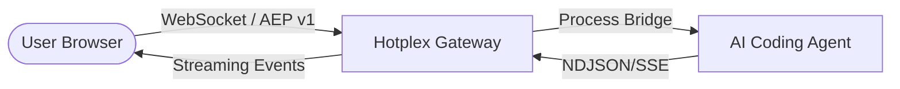

# 🌐 Hotplex Web Chat

<p align="center">
  <strong>Premium Web Interface for Hotplex Worker Gateway</strong>
</p>

<p align="center">
  
  
  
  
</p>

---

Hotplex Web Chat is a state-of-the-art frontend implementation designed to showcase the full capabilities of the **Hotplex Worker Gateway**. Built with a focus on performance and developer experience, it provides a seamless browser-based interface for interacting with any AI coding agent.

## 🧱 Architecture

The Web Chat acts as a thin, reactive client that communicates with the Gateway over the Agent Event Protocol (AEP v1).



## 🚀 Core Features

- 🔹 **Real-time Streaming**: Instant feedback for message deltas and tool call events.
- 🔹 **AEP v1 Native**: Full support for status synchronization, user permissions, and MCP elicitation.
- 🔹 **Adaptive UI**: Built with `@assistant-ui/react` and Tailwind 4 for a premium, responsive experience.
- 🔹 **Session Persistence**: Seamlessly resumes active sessions upon gateway reconnection.
- 🔹 **Modern Tooling**: Next.js 15 App Router, TypeScript, and Playwright E2E testing.

## ⚡ Quick Start

### 1. Requirements
Ensure the **Hotplex Gateway** is running locally:
```bash
# In the project root
make dev
```

### 2. Setup Web Chat
```bash
cd webchat
pnpm install
cp .env.example .env.local
pnpm dev
```

Visit [http://localhost:3000](http://localhost:3000) to start chatting.

## 🛠️ Configuration

Configure the application via `.env.local`:

| Variable | Description | Example |
|:---|:---|:---|
| `HOTPLEX_WS_URL` | Gateway WebSocket endpoint | `ws://localhost:8888/ws` |
| `HOTPLEX_WORKER_TYPE` | Default worker to spawn | `claude_code` |
| `HOTPLEX_AUTH_TOKEN` | JWT for authenticated access | `eyJhbGci...` |

## 💎 Development

### Available Scripts

- `pnpm dev`: Start the development server with hot-reload.
- `pnpm build`: Create a production-ready build of the application.
- `pnpm lint`: Run ESLint and TypeScript checks.
- `pnpm test:e2e`: Run end-to-end integration tests using Playwright.

### Testing
We use Playwright to ensure the WebSocket handshake and message streaming are working correctly.
```bash
pnpm test:e2e
```

## 📜 License
Distributed under the Apache License 2.0.
