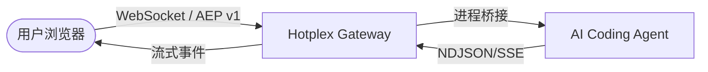

# 🌐 Hotplex Web Chat (网页客户端)

<p align="center">
  <strong>Hotplex Worker 网关的高级网页界面</strong>
</p>

<p align="center">
  
  
  
  
</p>

---

Hotplex Web Chat 是一个顶级的前端实现，旨在全面展示 **Hotplex Worker 网关** 的核心能力。该项目专注于高性能与开发者体验，为用户提供了一个无缝的浏览器界面，用于与各种 AI Coding Agent 进行交互。

## 🧱 系统架构

网页客户端作为轻量级的响应层，通过 Agent Event Protocol (AEP v1) 协议与网关通信。



## 🚀 核心特性

- 🔹 **实时流式输出**: 即时反馈消息增量 (deltas) 和工具调用 (tool call) 事件。
- 🔹 **原生支持 AEP v1**: 完整支持状态同步、用户权限确认和 MCP 启发式交互。
- 🔹 **适配性 UI**: 基于 `@assistant-ui/react` 和 Tailwind 4 构建，提供极简且高级的交互体验。
- 🔹 **会话持久化**: 当网关重连时，能够自动恢复活跃会话。
- 🔹 **现代开发工具链**: 使用 Next.js 15 App Router、TypeScript 和 Playwright 端到端测试。

## ⚡ 快速开始

### 1. 前置条件
确保 **Hotplex 网关** 正在本地运行：
```bash
# 在项目根目录执行
make dev
```

### 2. 启动 Web Chat
```bash
cd webchat
pnpm install
cp .env.example .env.local
pnpm dev
```

访问 [http://localhost:3000](http://localhost:3000) 开始对话。

## 🛠️ 配置说明

通过 `.env.local` 文件进行个性化配置：

| 变量名 | 描述 | 示例 |
|:---|:---|:---|
| `HOTPLEX_WS_URL` | 网关 WebSocket 终端地址 | `ws://localhost:8888/ws` |
| `HOTPLEX_WORKER_TYPE` | 默认启动的 Worker 类型 | `claude_code` |
| `HOTPLEX_AUTH_TOKEN` | 用于验证访问的 JWT 令牌 | `eyJhbGci...` |

## 💎 开发指南

### 常用脚本

- `pnpm dev`: 启动热重载开发服务器。
- `pnpm build`: 构建生产环境版本。
- `pnpm lint`: 执行代码和类型检查。
- `pnpm test:e2e`: 使用 Playwright 执行端到端集成测试。

### 自动化测试
我们使用 Playwright 确保 WebSocket 握手和消息流收发的正确性。
```bash
pnpm test:e2e
```

## 📜 开源协议
采用 Apache License 2.0 协议。
